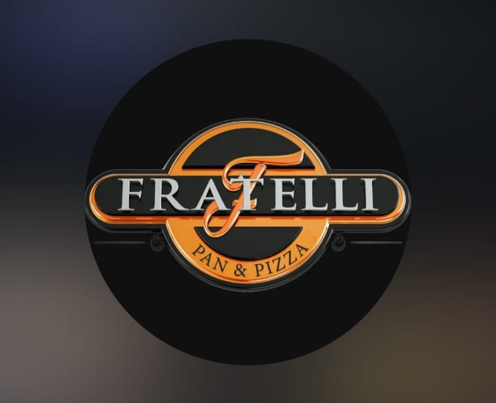

<p align="center">
  
</p>

<h1 align="center">Restaurant System — Fratelli</h1>

<p align="center">
  Sistema web responsive para centralizar la gestión operativa y administrativa del restaurante Fratelli.
</p>

## Sobre el proyecto

Restaurant System — Fratelli es una aplicación web creada para reunir en una única plataforma procesos clave del restaurante. Facilita la gestión de operaciones diarias mediante una experiencia web responsive y un acceso controlado por roles, de modo que cada persona visualice y ejecute las capacidades que le corresponden.

## Funcionalidades principales

- **Autenticación y autorización:** inicio, renovación y cierre de sesión; acceso protegido según los roles asignados.
- **Usuarios y roles:** administración de cuentas internas, roles múltiples, contraseñas y estado activo o inactivo.
- **Catálogo:** consulta y gestión de categorías, unidades y productos según autorización.
- **Proveedores:** consulta y administración de proveedores.
- **Inventario:** visualización de existencias, historial y registro de movimientos manuales.
- **Pedidos:** creación, consulta, detalle, asignación, toma, entrega y cancelación de pedidos.
- **Cocina:** seguimiento de comandas y actualización de estados para la operación de cocina.
- **Gastos:** gestión de categorías y registro de gastos operativos.
- **Asistencia:** registro de entrada y salida, gestión diaria e historial personal según el rol.

## Roles

El sistema controla los módulos y las acciones disponibles según los roles asignados al usuario:

- `ADMINISTRADOR`
- `ENCARGADO`
- `MESERO`
- `COCINA`
- `CONTADORA`
- `EMPLEADO`

Una misma cuenta puede tener varios roles. Las capacidades efectivas y la navegación se determinan por la unión de los roles asignados, sin incluir una matriz de permisos extensa en esta portada.

## Experiencia de usuario

La aplicación ofrece navegación autenticada centralizada y adaptada a cada rol. En escritorio utiliza una barra lateral; en dispositivos móviles, una barra superior con panel lateral desplegable. Las rutas están protegidas y el menú muestra únicamente las capacidades implementadas y permitidas para el usuario.

## Arquitectura

El proyecto adopta un enfoque de **monolito modular**. El backend se organiza con **Clean Architecture** —dominio, aplicación, infraestructura y API—, mientras que el frontend combina módulos por funcionalidad con componentes reutilizables. La comunicación entre ambas capas se basa en un contrato OpenAPI, del que se generan tipos TypeScript para el cliente.

## Tecnologías

### Backend

- .NET 10 y ASP.NET Core Web API
- Entity Framework Core con Npgsql y PostgreSQL
- ASP.NET Core Identity y JWT Bearer
- SignalR para Cocina/KDS
- OpenAPI y Swagger en entorno de desarrollo
- xUnit

### Frontend

- React y TypeScript
- Vite y Tailwind CSS
- React Router y TanStack Query
- Lucide React
- Vitest y Testing Library
- Tipos TypeScript generados desde OpenAPI

## Estructura del repositorio

```text
Fratelli-s-System/
├── backend/          API, dominio, aplicación, infraestructura y pruebas
├── frontend/         Aplicación web React
├── docs/             Documentación funcional, técnica y de Scrum
├── .github/          Configuración relacionada con GitHub
├── openspec/         Unión de compatibilidad local para OpenSpec
└── README.md         Presentación general del proyecto
```

## Documentación

La documentación detallada se encuentra en [`docs/`](docs/). Incluye requisitos, reglas de negocio, historias de usuario, Product Backlog, arquitectura, ADR, diagramas, evidencia, sprints y artefactos OpenSpec.

Enlaces principales:

- [Guía del backend](backend/README.md)
- [Guía del frontend](frontend/README.md)
- [Documentación del proyecto](docs/)
- [Sprints](docs/sprints/)

## Ejecución local

### Requisitos previos

- .NET 10 SDK
- PostgreSQL disponible localmente
- Node.js `>=20.19.0`
- pnpm `11.18.0`

### Backend

Desde la raíz del repositorio:

```bash
cd backend
dotnet restore RestaurantSystem.slnx
dotnet build RestaurantSystem.slnx
dotnet run --project src/RestaurantSystem.Api
```

La API se inicia en `http://localhost:5057`. Para configurar la base de datos y los valores locales requeridos, consultá la [guía del backend](backend/README.md).

### Frontend

Desde la raíz del repositorio:

```bash
cd frontend
pnpm install --frozen-lockfile
pnpm run dev
```

La aplicación se inicia en `http://localhost:8087`. Para variables de entorno, proxy y generación del contrato OpenAPI, consultá la [guía del frontend](frontend/README.md).

## Calidad y pruebas

### Backend

```bash
cd backend
dotnet test RestaurantSystem.slnx --no-build
```

### Frontend

```bash
cd frontend
pnpm run format:check
pnpm run typecheck
pnpm run lint
pnpm test
pnpm run build
```

## Metodología de trabajo

El proyecto se desarrolla con Scrum, mediante trabajo iterativo e incremental organizado en Sprints, historias de usuario y Product Backlog. La planificación, seguimiento y retrospectivas se documentan en [`docs/sprints/`](docs/sprints/).

## Estado del proyecto

El Sprint 1 ya integra funcionalidades reales de backend y frontend para autenticación, usuarios, catálogo, proveedores, inventario, pedidos, cocina, gastos y asistencia. El desarrollo continúa de forma incremental de acuerdo con el Product Backlog y los Sprints posteriores.

## Equipo

- Alex Saúl Fernandez Valdez
- Ana Paola Viscarra Chambi
- Miguel Angel Colque Calizaya
- Josué Matias Arroyo Reynoso

## Idioma de la documentación

Salvo identificadores técnicos, nombres propios, código y comandos, la documentación del repositorio está en español.
