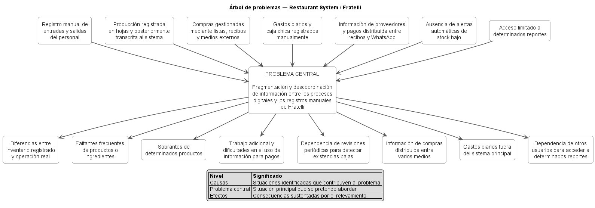

# 03 — Hallazgos y Necesidades

## 1. Propósito

Este documento consolida los hallazgos obtenidos mediante las tres técnicas de relevamiento aplicadas en **Restaurant System** y los transforma en necesidades trazables para **Fratelli**.

Cadena documental:

```text
Evidencia
   ↓
Hallazgo H-XXX
   ↓
Necesidad N-XXX
   ↓
Objetivos
   ↓
MVP / Requisitos
   ↓
Product Backlog
```

Los hallazgos describen hechos o interpretaciones sustentadas. Las necesidades expresan qué debe poder lograr, controlar o conocer el restaurante sin imponer todavía una tecnología específica.

---

## 2. Estado documental

| Campo | Valor |
|---|---|
| **Documento** | `03-hallazgos-y-necesidades.md` |
| **Proyecto** | Restaurant System |
| **Organización** | Restaurante Fratelli |
| **Versión actual** | `0.2` |
| **Fecha** | 21 de agosto de 2026 |
| **Estado** | Consolidado tras tres técnicas y ENT-02 |
| **Product Owner** | Ana Paola Viscarra Chambi |
| **Scrum Master** | Alex Saúl Fernandez Valdez |

---

# 3. Fuentes utilizadas

## FU-01 — Análisis de antecedentes

```text
docs/evidence/relevamiento/analisis-antecedentes/
├── README.md
├── analisis-antecedentes.md
└── detalle-de-la-manera-de-trabajo.pdf
```

Documento previo que describe actores, atención, comandas, producción, inventario, compras, clientes, planillas y caja.

---

## FU-02 — ENT-01

```text
docs/evidence/relevamiento/entrevistas/entrevista-01-trabajadora/
```

Entrevista semiestructurada del 19 de agosto de 2026, realizada de forma virtual mediante Discord por Josué Matias Arroyo Reynoso a Ana Paola Viscarra Chambi.

Aporta diagnóstico y prioridades.

---

## FU-03 — ENT-02

```text
docs/evidence/relevamiento/entrevistas/entrevista-02-trabajadora/
```

Entrevista semiestructurada de refinamiento, con audio de aproximadamente 14 min 17 s.

Aporta reglas específicas de:

- unidades;
- producción;
- bajas/mermas;
- compras/recepción;
- turnos;
- cierre;
- múltiples responsabilidades.

Los metadatos personales de la sesión que no están presentes en la evidencia se mantienen pendientes de consignar.

---

## FU-04 — Análisis de sistemas similares

```text
docs/evidence/relevamiento/analisis-sistemas-similares/
├── README.md
└── analisis-sistemas-similares.md
```

Benchmarking de seis sistemas gastronómicos.

Se utiliza para contrastar patrones del dominio, no para definir por sí solo reglas internas de Fratelli.

---

# 4. Criterios de consolidación

## 4.1. Confianza

| Nivel | Significado |
|---|---|
| **Alto** | Afirmado de forma directa y/o respaldado por varias evidencias internas |
| **Medio** | Interpretación sustentada pero con menor detalle o alcance limitado |
| **Referencia externa** | Patrón observado en sistemas similares, no regla de Fratelli |
| **Pendiente** | Evidencia insuficiente |

## 4.2. Impacto

Se utilizan niveles cualitativos porque no existen métricas históricas suficientes:

```text
ALTO
MEDIO/ALTO
MEDIO
BAJO
```

## 4.3. Regla de benchmarking

```text
Función de sistema externo
        ≠
Requisito confirmado de Fratelli
```

El benchmarking puede apoyar una pregunta, una alternativa o una decisión de diseño, pero una regla del negocio requiere evidencia/validación propia.

---

# 5. Hallazgos consolidados

## H-001 — Asistencia y horarios se registran manualmente

**Fuentes:** `FU-01`, `FU-02`  
**Confianza:** Alto  
**Impacto:** Alto

Los trabajadores utilizan planillas físicas con información como fecha, entrada, salida, función y firma.

La Product Owner identificó este proceso como fuente de errores o pérdida de tiempo.

---

## H-002 — El cálculo administrativo depende de trasladar horas desde planillas

**Fuentes:** `FU-01`, `FU-02`  
**Confianza:** Alto  
**Impacto:** Alto

La contadora utiliza Excel para calcular pagos, pero las horas de entrada/salida provienen de registros manuales.

El problema principal es la confiabilidad y transferencia de la información de asistencia.

---

## H-003 — La producción tiene doble captura

**Fuentes:** `FU-02`  
**Confianza:** Alto  
**Impacto:** Alto

```text
Producción
→ hoja manual
→ transcripción por encargado
→ sistema
```

Este flujo genera un punto de descoordinación.

---

## H-004 — Existen diferencias frecuentes de inventario

**Fuentes:** `FU-01`, `FU-02`  
**Confianza:** Alto  
**Impacto:** Alto

Se reportaron faltantes, sobrantes y diferencias entre hojas de producción y sistema.

---

## H-005 — No existe alerta automática de stock bajo

**Fuentes:** `FU-01`, `FU-02`, `FU-04` como contraste  
**Confianza:** Alto  
**Impacto:** Alto

La revisión depende actualmente de reportes y controles periódicos. Los sistemas similares muestran que alertas de mínimo son un patrón frecuente, pero la necesidad ya estaba confirmada por Fratelli.

---

## H-006 — Un faltante puede obligar a esperar reabastecimiento

**Fuentes:** `FU-02`  
**Confianza:** Alto  
**Impacto:** Medio/Alto

Cuando falta un ingrediente, se solicita al proveedor y se espera su llegada.

---

## H-007 — Las compras están distribuidas en múltiples medios

**Fuentes:** `FU-01`, `FU-02`  
**Confianza:** Alto  
**Impacto:** Alto

Se utilizan listas, recibos, WhatsApp, QR y registros externos.

---

## H-008 — La responsabilidad de compra depende del tipo de producto

**Fuentes:** `FU-02`, `FU-03`  
**Confianza:** Alto  
**Impacto:** Medio/Alto

`ENT-02` precisa:

```text
COCINA
→ ingredientes de preparación

ENCARGADO
→ bebidas, limpieza y otros insumos generales
```

Cocina puede realizar compras directas de su ámbito y debe conservar respaldo mediante recibo para el pago.

---

## H-009 — La información de pagos/cuentas de proveedores no está totalmente centralizada

**Fuentes:** `FU-01`, `FU-02`  
**Confianza:** Alto  
**Impacto:** Medio/Alto

Existen recibos, fotografías, totales y QR distribuidos en medios externos.

---

## H-010 — Gastos diarios y caja chica se registran manualmente

**Fuentes:** `FU-01`, `FU-02`, `FU-03`  
**Confianza:** Alto  
**Impacto:** Alto

Los gastos quedan fuera del sistema principal y existe una caja chica diferenciada para gastos.

---

## H-011 — Determinados reportes requieren intermediario

**Fuentes:** `FU-02`  
**Confianza:** Alto  
**Impacto:** Medio

Un usuario que necesita información depende de otro usuario para generar determinados reportes.

---

## H-012 — El sistema actual posee capacidades útiles que deben preservarse dentro del alcance

**Fuentes:** `FU-01`, `FU-02`  
**Confianza:** Alto  
**Impacto:** Alto

Entre las capacidades conocidas aparecen ventas, pedidos, comandas, inventario, clientes, cierres, reportes y usuarios.

---

## H-013 — Fratelli desea reemplazar el sistema actual

**Fuentes:** `FU-02`  
**Confianza:** Alto  
**Impacto:** Alto

La intención expresada es construir un sistema nuevo e independiente.

---

## H-014 — No existe una integración técnica conocida con el sistema anterior

**Fuentes:** `FU-02`  
**Confianza:** Alto  
**Impacto:** Medio/Alto

No se conoce API, exportación, base de datos ni arquitectura interna disponible para el equipo.

---

## H-015 — La operación utiliza responsabilidades diferenciadas y acumulables

**Fuentes:** `FU-01`, `FU-02`, `FU-03`  
**Confianza:** Alto  
**Impacto:** Alto

`ENT-02` confirma que:

- el encargado puede cubrir funciones de mesero;
- un mesero puede actuar también como barista y manejar caja.

Por tanto, una persona puede necesitar más de un rol efectivo.

---

## H-016 — Existen unidades de compra y uso diferentes

**Fuentes:** `FU-03`  
**Confianza:** Alto para el caso indicado  
**Impacto:** Alto en composición/inventario

Se confirmó el caso:

```text
Carne: compra en kg
→ uso/registro en g
```

También se indicó manejo de líquidos en litros.

No se generalizan conversiones adicionales sin evidencia.

---

## H-017 — Producción se controla por cantidad final, no por rendimiento esperado formal

**Fuentes:** `FU-03`  
**Confianza:** Alto  
**Impacto:** Alto

La entrevistada indicó que interesa registrar **solo la cantidad final** obtenida.

Esto permite evitar una fórmula de rendimiento no utilizada en el MVP.

---

## H-018 — Las pérdidas/bajas se registran separadamente con motivo

**Fuentes:** `FU-03`  
**Confianza:** Alto  
**Impacto:** Medio/Alto

Cuando existe una salida/baja relevante, se registra separadamente desde almacén y se conserva el motivo.

No es necesario inventar un catálogo complejo de mermas para el MVP.

---

## H-019 — No se necesita separar operativamente múltiples lotes de una misma preparación en el MVP

**Fuentes:** `FU-03`  
**Confianza:** Alto  
**Impacto:** Alto para simplificación del modelo

Si se produce el mismo preparado más de una vez, basta conocer la **cantidad total disponible**.

Cada producción sí debe conservar trazabilidad de fecha, cantidad y responsable.

No se confirmó necesidad de vencimiento exacto en el sistema.

La participante también mencionó la firma del responsable de la producción. Se toma como evidencia de necesidad de **trazabilidad del responsable**, pero no como confirmación de una función de captura de firma manuscrita/digital, ya que su formato y obligatoriedad no fueron definidos.

---

## H-020 — La recepción de compras requiere verificación antes de afectar inventario

**Fuentes:** `FU-03`, `FU-04` como contraste  
**Confianza:** Alto  
**Impacto:** Alto

Para bebidas, el ingreso puede realizarse después de recibirse/verificarse.

Para insumos de cocina, puede requerirse pesaje y porcionado antes de ingresar al inventario.

El benchmarking también muestra el patrón compra → recepción → stock, pero la regla concreta proviene de `ENT-02`.

---

## H-021 — Las compras incompletas se coordinan/devolucionan y no son el caso ordinario

**Fuentes:** `FU-03`  
**Confianza:** Alto  
**Impacto:** Medio

Se indicó que una compra incompleta se coordina con el proveedor y se devuelve, y que ocurre de vez en cuando.

Esto permite mantener recepción parcial fuera del flujo básico del MVP.

---

## H-022 — Dos turnos comparten una caja y existe un único cierre final

**Fuentes:** `FU-02`, `FU-03`  
**Confianza:** Alto  
**Impacto:** Alto

Se confirmó:

- dos turnos;
- una misma caja;
- un monto fijo que queda para el inicio de la mañana;
- traspaso/verificación entre turnos;
- un único cierre final.

---

## H-023 — El cierre distingue componentes y requiere trazabilidad de diferencias

**Fuentes:** `FU-03`, `FU-04` como referencia  
**Confianza:** Alto  
**Impacto:** Alto

El cierre considera información de:

- efectivo;
- QR;
- gastos;
- caja chica separada;
- PedidosYa controlado por separado;
- diferencia entre efectivo esperado/registrado y físico cuando exista.

Si hay diferencia, se deja observación y se consulta al turno correspondiente.

El encargado realiza el cierre y la contadora revisa después sin aprobarlo formalmente.

---

# 6. Resumen de hallazgos

| ID | Hallazgo | Confianza | Impacto |
|---|---|---:|---:|
| `H-001` | Asistencia/horarios manuales | Alto | Alto |
| `H-002` | Pagos dependen de datos trasladados desde planillas | Alto | Alto |
| `H-003` | Producción con doble captura | Alto | Alto |
| `H-004` | Diferencias frecuentes de inventario | Alto | Alto |
| `H-005` | Sin alertas automáticas de stock bajo | Alto | Alto |
| `H-006` | Faltantes generan dependencia del proveedor | Alto | Medio/Alto |
| `H-007` | Compras distribuidas | Alto | Alto |
| `H-008` | Compras diferenciadas por responsabilidad | Alto | Medio/Alto |
| `H-009` | Pagos/cuentas de proveedores distribuidos | Alto | Medio/Alto |
| `H-010` | Gastos/caja chica manuales | Alto | Alto |
| `H-011` | Reportes requieren intermediario | Alto | Medio |
| `H-012` | Capacidades útiles a preservar | Alto | Alto |
| `H-013` | Decisión de reemplazo | Alto | Alto |
| `H-014` | Sin integración técnica conocida | Alto | Medio/Alto |
| `H-015` | Responsabilidades diferenciadas/acumulables | Alto | Alto |
| `H-016` | Unidades de compra/uso diferentes | Alto en caso confirmado | Alto |
| `H-017` | Producción usa cantidad final | Alto | Alto |
| `H-018` | Bajas con motivo | Alto | Medio/Alto |
| `H-019` | No se requieren lotes separados en MVP | Alto | Alto |
| `H-020` | Recepción verificada antes de stock | Alto | Alto |
| `H-021` | Compra incompleta se devuelve/coordina | Alto | Medio |
| `H-022` | Dos turnos, una caja, un cierre | Alto | Alto |
| `H-023` | Cierre diferenciado y diferencias trazables | Alto | Alto |

---

# 7. Necesidades consolidadas

## N-001 — Registrar entradas y salidas de forma confiable

Fratelli necesita un registro central de asistencia que reduzca la dependencia de planillas físicas.

**Fuentes:** `H-001`, `H-002`  
**Prioridad:** ALTA  
**Estado:** Validada

---

## N-002 — Disponer de datos confiables de asistencia para procesos de pago

La contadora necesita utilizar información consistente de horas trabajadas sin transcribir manualmente la fuente primaria.

**Fuentes:** `H-001`, `H-002`  
**Prioridad:** ALTA  
**Estado:** Validada en términos generales

Las reglas de nómina completa siguen fuera del MVP.

---

## N-003 — Registrar producción sin doble captura

Cocina/encargado necesitan registrar directamente la producción y su cantidad final, conservando fecha y responsable.

**Fuentes:** `H-003`, `H-017`, `H-019`  
**Prioridad:** ALTA  
**Estado:** Validada y refinada

---

## N-004 — Mantener inventario consistente con la operación real

Las existencias deben representar productos e ingredientes realmente disponibles y reflejar producción, compras, ventas y bajas trazables.

**Fuentes:** `H-003`, `H-004`, `H-006`, `H-016`, `H-018`, `H-020`  
**Prioridad:** ALTA  
**Estado:** Validada

---

## N-005 — Detectar oportunamente existencias bajas

Los responsables necesitan saber cuándo una existencia alcanza un nivel que requiere reposición o producción.

**Fuentes:** `H-005`, `H-006`  
**Prioridad:** ALTA  
**Estado:** Validada

El umbral se configura por elemento; canales externos de notificación no son obligatorios en el MVP.

---

## N-006 — Centralizar compras y recepción

Fratelli necesita registrar compras, responsables, respaldo básico, recepción y efecto sobre inventario.

**Fuentes:** `H-007`, `H-008`, `H-020`, `H-021`  
**Prioridad:** ALTA  
**Estado:** Validada y refinada para el flujo básico

Quedan fuera del flujo básico cuentas por pagar avanzadas y pagos parciales.

---

## N-007 — Mantener trazabilidad de responsables de compra

El sistema debe distinguir el ámbito de compra y quién registra/recibe.

**Fuentes:** `H-008`, `H-020`  
**Prioridad:** MEDIA  
**Estado:** Validada para el MVP

Baseline:

```text
COCINA → ingredientes de preparación
ENCARGADO → bebidas, limpieza y otros insumos generales
```

---

## N-008 — Controlar información de obligaciones y pagos a proveedores

Fratelli necesita centralizar información útil de proveedores y comprobantes.

**Fuentes:** `H-007`, `H-009`  
**Prioridad:** MEDIA/ALTA  
**Estado:** Validada en términos generales; funciones financieras avanzadas Post-MVP

---

## N-009 — Centralizar gastos diarios, caja chica y datos necesarios para el cierre

El restaurante necesita registrar gastos y mantener información operativa suficiente para el traspaso entre turnos y el cierre diario.

**Fuentes:** `H-010`, `H-022`, `H-023`  
**Prioridad:** ALTA  
**Estado:** Validada y refinada

---

## N-010 — Permitir acceso directo a reportes según autorización

Los usuarios responsables deben consultar los reportes que correspondan a sus funciones sin depender innecesariamente de intermediarios.

**Fuentes:** `H-011`, `H-015`  
**Prioridad:** MEDIA  
**Estado:** Validada

---

## N-011 — Preservar capacidades operativas útiles del sistema existente

El reemplazo no debe eliminar accidentalmente capacidades necesarias que formen parte del alcance aprobado.

**Fuentes:** `H-012`, `H-013`, `H-022`, `H-023`  
**Prioridad:** CRÍTICA para el producto  
**Estado:** Validada

---

## N-012 — Construir el sistema sin depender técnicamente de la plataforma anterior

**Fuentes:** `H-013`, `H-014`  
**Prioridad:** ALTA  
**Estado:** Confirmada como restricción

---

## N-013 — Diferenciar acceso y responsabilidades por usuario

El sistema necesita roles/permisos compatibles con personas que pueden tener más de una responsabilidad.

**Fuentes:** `H-008`, `H-011`, `H-015`  
**Prioridad:** ALTA  
**Estado:** Validada

---

## N-014 — Mantener trazabilidad de operaciones relevantes por usuario

Ventas, compras, producción, bajas, gastos y cierres deben conservar al responsable cuando corresponda.

**Fuentes:** `H-012`, `H-015`, `H-018`, `H-020`, `H-023`  
**Prioridad:** MEDIA/ALTA  
**Estado:** Validada

---

# 8. Resumen de necesidades

| ID | Necesidad | Prioridad | Estado |
|---|---|---:|---|
| `N-001` | Entradas/salidas confiables | ALTA | Validada |
| `N-002` | Datos de asistencia para pagos | ALTA | Validada; nómina avanzada fuera |
| `N-003` | Producción sin doble captura | ALTA | Validada y refinada |
| `N-004` | Inventario consistente | ALTA | Validada |
| `N-005` | Stock bajo oportuno | ALTA | Validada |
| `N-006` | Compras/recepción centralizadas | ALTA | Validada y refinada |
| `N-007` | Responsables de compra | MEDIA | Validada para MVP |
| `N-008` | Información de proveedores/pagos | MEDIA/ALTA | Flujo básico validado |
| `N-009` | Gastos/caja/traspaso/cierre | ALTA | Validada y refinada |
| `N-010` | Reportes según autorización | MEDIA | Validada |
| `N-011` | Preservar capacidades útiles | CRÍTICA | Validada |
| `N-012` | Independencia del sistema anterior | ALTA | Confirmada |
| `N-013` | Roles/responsabilidades | ALTA | Validada |
| `N-014` | Trazabilidad por usuario | MEDIA/ALTA | Validada |

---

# 9. Trazabilidad hallazgo → necesidad

| Hallazgo | Necesidades |
|---|---|
| `H-001` | `N-001`, `N-002` |
| `H-002` | `N-001`, `N-002` |
| `H-003` | `N-003`, `N-004` |
| `H-004` | `N-003`, `N-004` |
| `H-005` | `N-005` |
| `H-006` | `N-004`, `N-005` |
| `H-007` | `N-006`, `N-008` |
| `H-008` | `N-006`, `N-007`, `N-013` |
| `H-009` | `N-006`, `N-008` |
| `H-010` | `N-009` |
| `H-011` | `N-010`, `N-013` |
| `H-012` | `N-011`, `N-014` |
| `H-013` | `N-011`, `N-012` |
| `H-014` | `N-012` |
| `H-015` | `N-010`, `N-013`, `N-014` |
| `H-016` | `N-003`, `N-004` |
| `H-017` | `N-003` |
| `H-018` | `N-004`, `N-014` |
| `H-019` | `N-003`, `N-004` |
| `H-020` | `N-004`, `N-006`, `N-007` |
| `H-021` | `N-006`, `N-007` |
| `H-022` | `N-009`, `N-011` |
| `H-023` | `N-009`, `N-010`, `N-011`, `N-014` |

---

# 10. Priorización preliminar

## Crítica

```text
N-011 Preservar capacidades operativas útiles
```

## Alta

```text
N-001
N-002
N-003
N-004
N-005
N-006
N-009
N-012
N-013
```

## Media / media-alta

```text
N-007
N-008
N-010
N-014
```

---

# 11. Propuestas de solución y referencias, no requisitos automáticos

## PS-001 — Biométrico

Origen: `ENT-01`.

Se mantiene como integración futura. El MVP debe permitir asistencia sin hardware.

## PS-002 — Alertas internas de stock bajo

Alineada directamente con `N-005`. El mecanismo inicial será interno a la aplicación.

## REF-001 — Mesas / división de cuenta / delivery integrado

Encontradas en sistemas similares. No ingresan al MVP sin validación específica.

## REF-002 — Costeo avanzado de recetas

Patrón de sistemas especializados. No constituye requisito del MVP actual.

---

# 12. Áreas que permanecen deliberadamente fuera o pendientes

- crédito a clientes;
- cuentas por cobrar;
- promociones/descuentos avanzados;
- cuentas por pagar completas;
- nómina completa;
- migración histórica;
- facturación fiscal;
- integración automática con PedidosYa;
- hardware biométrico real;
- impresión térmica;
- lotes/vencimientos avanzados si una versión posterior los necesita;
- nuevas conversiones de unidades no evidenciadas.

Estas áreas no mantienen bloqueadas las seis historias refinadas por `ENT-02`.

---

# 13. Restricciones derivadas

## RST-01 — Tiempo

Aproximadamente 15 días.

## RST-02 — Reemplazo

El sistema final pretende sustituir la plataforma actual.

## RST-03 — Sin integración conocida

No existe acceso técnico suficiente al sistema anterior.

## RST-04 — Preservación funcional

Las capacidades útiles incluidas en alcance no deben perderse accidentalmente.

## RST-05 — Relevamiento posterior dirigido

La baseline ya utiliza tres técnicas. Las dudas nuevas se resolverán mediante aclaraciones puntuales con Product Owner/Fratelli cuando afecten una decisión concreta.

## RST-06 — Evidencia cualitativa

No se inventarán métricas de impacto.

## RST-07 — Benchmarking no normativo

Los sistemas externos proporcionan referencias, no reglas obligatorias del restaurante.

---

# 14. Historias refinadas por ENT-02

| HU | Antes | Después del análisis |
|---|---|---|
| `HU-004` | Refinamiento requerido | `CANDIDATA A READY` |
| `HU-007` | Refinamiento requerido | `CANDIDATA A READY` |
| `HU-017` | Refinamiento requerido | `CANDIDATA A READY` |
| `HU-025` | Refinamiento requerido | `CANDIDATA A READY` |
| `HU-026` | Refinamiento requerido | `CANDIDATA A READY` |
| `HU-027` | Refinamiento requerido | `CANDIDATA A READY` |

Esto permite moverlas en GitHub Projects:

```text
Blocked → Backlog
```

La transición `Backlog → Ready` dependerá de la Definition of Ready formal.

---

# 15. Árbol de problemas



> **Fuente editable:** [`puml/arbol-problemas.puml`](puml/arbol-problemas.puml)

El árbol conserva la formulación causal general. `ENT-02` agrega precisión operativa, pero no cambia el problema central.

---

# 16. Control de cambios

| Versión | Fecha | Descripción | Estado |
|---|---|---|---|
| `0.1` | 20/08/2026 | Hallazgos y necesidades iniciales | Sustituida |
| `0.2` | 21/08/2026 | Incorporación de tres técnicas, ENT-02, H-016–H-023 y refinamiento de necesidades | Vigente |
