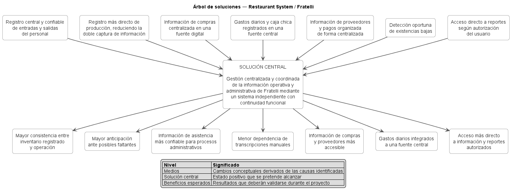

# 04 — Objetivos y Propuesta de Valor

## 1. Propósito del documento

Este documento define los objetivos del proyecto **Restaurant System** y formula la propuesta de valor inicial para el restaurante **Fratelli** a partir del diagnóstico, los hallazgos y las necesidades consolidadas durante el relevamiento.

Su propósito es mantener la continuidad documental:

```text
Problema
   ↓
Hallazgos
   ↓
Necesidades
   ↓
Objetivos
   ↓
Propuesta de valor
   ↓
Alcance y MVP
```

Este documento todavía **no determina el alcance definitivo del producto, el contenido exacto del MVP ni la arquitectura técnica**.

Las capacidades concretas que se implementarán en la primera entrega serán delimitadas posteriormente en:

```text
docs/05-alcance-y-mvp.md
```

---

## 2. Estado documental

| Campo                              | Valor                                  |
| ---------------------------------- | -------------------------------------- |
| **Documento**                      | `04-objetivos-y-propuesta-valor.md`    |
| **Proyecto**                       | Restaurant System                      |
| **Organización objetivo**          | Restaurante Fratelli                   |
| **Versión actual**                 | `0.2`                                  |
| **Estado**                         | Revalidado tras relevamiento complementario |
| **Fecha**                          | 21 de agosto de 2026                   |
| **Product Owner**                  | Ana Paola Viscarra Chambi              |
| **Scrum Master**                   | Alex Saúl Fernandez Valdez             |
| **Documento de entrada principal** | `03-hallazgos-y-necesidades.md`        |

---

# 3. Problema de referencia

La formulación consolidada proveniente del diagnóstico y los hallazgos es:

> **Fratelli presenta fragmentación y descoordinación en determinados procesos operativos y administrativos debido a la coexistencia del sistema actual con registros manuales y medios externos, lo que contribuye a diferencias frecuentes de inventario, faltantes y sobrantes, dificultades en el control de asistencia y cálculo de pagos, y una gestión distribuida de compras, proveedores, gastos y continuidad de caja entre turnos.**

Adicionalmente, la Product Owner expresó la decisión de sustituir el sistema actual, conservando las capacidades que resultan útiles para la operación del restaurante.

Por tanto, el proyecto debe responder simultáneamente a dos necesidades generales:

1. reducir la fragmentación y el doble manejo de información;
2. mantener continuidad funcional durante la sustitución del sistema existente.

---

# 4. Objetivo general

> **Mejorar la gestión operativa y administrativa de Fratelli mediante el diseño, implementación y validación de un sistema de información independiente que centralice procesos actualmente fragmentados, favorezca la consistencia y disponibilidad de la información y preserve las capacidades operativas necesarias para el funcionamiento del restaurante.**

## 4.1. Relación con el problema

El objetivo general responde directamente a:

- la fragmentación entre registros digitales y manuales;
- la duplicación o transferencia posterior de información;
- las diferencias de inventario;
- el control manual de asistencia;
- la dispersión de compras, proveedores, gastos y datos utilizados para la continuidad/cierre de caja;
- la necesidad de reemplazar el sistema actual sin perder capacidades útiles.

El objetivo no se formula simplemente como “crear un sistema”, sino en términos del cambio que el proyecto pretende producir en la gestión del restaurante.

---

# 5. Objetivos específicos

## OE-01 — Consolidar la información prioritaria del negocio

**Centralizar la información correspondiente a los procesos priorizados para reducir la dependencia de planillas físicas, hojas, cuadernos, recibos y otros medios externos cuando estos generan fragmentación o doble registro.**

### Necesidades relacionadas

- `N-001`
- `N-003`
- `N-006`
- `N-008`
- `N-009`

### Verificación esperada

Los procesos incluidos finalmente en el MVP deberán disponer de una fuente digital definida para registrar y consultar su información principal.

---

## OE-02 — Mejorar la confiabilidad del control de personal

**Proporcionar un mecanismo de registro de entradas y salidas que permita disponer de información de asistencia consistente para apoyar posteriormente el cálculo y control de pagos al personal.**

### Necesidades relacionadas

- `N-001`
- `N-002`

### Verificación esperada

El flujo seleccionado deberá permitir registrar y consultar entradas y salidas sin depender como fuente principal de una planilla física.

### Observación

El uso de un biométrico es una propuesta de solución expresada por la Product Owner, pero la tecnología concreta se evaluará posteriormente.

---

## OE-03 — Mejorar la consistencia y control del inventario

**Reducir los puntos de descoordinación entre producción, existencias y movimientos registrados, facilitando además la identificación oportuna de productos o ingredientes con niveles bajos.**

### Necesidades relacionadas

- `N-003`
- `N-004`
- `N-005`

### Verificación esperada

Los flujos incluidos en alcance deberán registrar los movimientos relevantes de manera consistente y permitir identificar existencias que requieran atención según las reglas que posteriormente se definan.

---

## OE-04 — Organizar la gestión de compras, proveedores y gastos operativos

**Centralizar la información esencial de compras, obligaciones con proveedores y gastos diarios que actualmente se encuentra distribuida entre listas, recibos, WhatsApp, cuadernos y registros posteriores.**

### Necesidades relacionadas

- `N-006`
- `N-007`
- `N-008`
- `N-009`

### Verificación esperada

Las operaciones incluidas en el alcance deberán poder quedar registradas y ser consultables dentro de una fuente de información definida.

---

## OE-05 — Garantizar acceso controlado a la información

**Diferenciar las capacidades de los usuarios de acuerdo con sus responsabilidades y permitir que los roles autorizados accedan directamente a la información y reportes que correspondan a su función.**

### Necesidades relacionadas

- `N-010`
- `N-013`
- `N-014`

### Verificación esperada

Las operaciones protegidas deberán respetar los permisos definidos para cada rol y conservar, cuando corresponda, la identificación del usuario responsable.

---

## OE-06 — Preservar la continuidad funcional durante la sustitución

**Diseñar el nuevo producto como un sistema independiente del sistema actual, conservando dentro del alcance aprobado las capacidades existentes que Fratelli necesita para continuar su operación.**

### Necesidades relacionadas

- `N-011`
- `N-012`

### Verificación esperada

Las capacidades críticas incluidas en el alcance deberán funcionar sin depender técnicamente de la plataforma actual.

---

## OE-07 — Validar la solución con la Product Owner

**Validar los procesos y flujos implementados con la Product Owner para comprobar que responden a las necesidades priorizadas y que las interpretaciones realizadas por el equipo son coherentes con el funcionamiento esperado del restaurante.**

### Necesidades relacionadas

Transversal a las necesidades incluidas en el MVP.

### Verificación esperada

Las funcionalidades consideradas terminadas deberán contar con criterios de aceptación y evidencia de revisión durante las iteraciones correspondientes.

---

# 6. Relación objetivos → necesidades

| Objetivo | Necesidades principales                     |
| -------- | ------------------------------------------- |
| `OE-01`  | `N-001`, `N-003`, `N-006`, `N-008`, `N-009` |
| `OE-02`  | `N-001`, `N-002`                            |
| `OE-03`  | `N-003`, `N-004`, `N-005`                   |
| `OE-04`  | `N-006`, `N-007`, `N-008`, `N-009`          |
| `OE-05`  | `N-010`, `N-013`, `N-014`                   |
| `OE-06`  | `N-011`, `N-012`                            |
| `OE-07`  | Necesidades seleccionadas para el MVP       |

---

# 7. Criterios de calidad de los objetivos

Los objetivos fueron formulados procurando que:

- respondan al problema consolidado;
- deriven de necesidades documentadas;
- describan resultados esperados y no únicamente tareas técnicas;
- sean verificables mediante los futuros requisitos y criterios de aceptación;
- cubran análisis, diseño, implementación y validación;
- no impongan una tecnología que todavía no haya sido decidida;
- no incluyan métricas cuantitativas inventadas.

Debido a que el relevamiento no proporcionó una línea base numérica suficiente, no se establecen afirmaciones como:

```text
“reducir errores en un 50 %”
“disminuir faltantes en un 30 %”
“ahorrar 10 horas semanales”
```

Esos valores no disponen actualmente de evidencia que los sustente.

---

# 8. Indicadores de éxito

Los indicadores de éxito iniciales se definen de manera verificable, pero principalmente cualitativa, debido a la ausencia de métricas históricas suficientes.

## 8.1. Éxito para el usuario y el negocio

| Indicador                                                                                                        | Evidencia esperada                                    |
| ---------------------------------------------------------------------------------------------------------------- | ----------------------------------------------------- |
| Los flujos prioritarios implementados responden a necesidades documentadas                                       | Validación de la Product Owner                        |
| Los procesos incluidos reducen la necesidad de recurrir a registros manuales paralelos como fuente principal     | Demostración del flujo y revisión de la Product Owner |
| La información prioritaria puede registrarse y consultarse desde el nuevo sistema                                | Pruebas funcionales                                   |
| Los usuarios autorizados pueden acceder a las funciones correspondientes a su responsabilidad                    | Pruebas de roles y permisos                           |
| Las funciones existentes consideradas necesarias y seleccionadas para la entrega mantienen continuidad funcional | Validación funcional                                  |

---

## 8.2. Éxito técnico

| Indicador                                                                                         | Evidencia esperada                                             |
| ------------------------------------------------------------------------------------------------- | -------------------------------------------------------------- |
| El sistema funciona independientemente de la plataforma anterior                                  | Ejecución y demostración sin integración con el sistema previo |
| Los datos principales del MVP tienen una fuente persistente definida                              | Modelo de datos y pruebas                                      |
| Los flujos principales pueden completarse sin errores críticos                                    | Casos de prueba aprobados                                      |
| Los permisos definidos restringen operaciones según rol                                           | Pruebas de autorización                                        |
| Los componentes incluidos en el MVP están documentados y son reproducibles en el entorno definido | Repositorio, configuración y documentación                     |

---

## 8.3. Éxito académico y documental

| Indicador                                                                              | Evidencia esperada                                  |
| -------------------------------------------------------------------------------------- | --------------------------------------------------- |
| Existe trazabilidad desde evidencia hasta necesidades, requisitos, historias y pruebas | Matriz de trazabilidad                              |
| El alcance y MVP derivan de necesidades priorizadas                                    | `05-alcance-y-mvp.md`                               |
| Las historias incluidas en desarrollo cumplen Definition of Ready                      | Backlog refinado                                    |
| Las funcionalidades terminadas cumplen Definition of Done                              | Evidencia de Sprint                                 |
| Las decisiones relevantes quedan documentadas                                          | SRS, ADR y documentación técnica cuando corresponda |

---

# 9. Árbol de soluciones

El árbol de soluciones transforma las causas principales del árbol de problemas en **medios de mejora** y sus efectos negativos en **beneficios esperados**.

No representa todavía un catálogo definitivo de funcionalidades.



> **Fuente editable:** [`puml/arbol-soluciones.puml`](puml/arbol-soluciones.puml)

## 9.1. Solución central

> **Gestión centralizada y coordinada de la información operativa y administrativa de Fratelli mediante un sistema independiente que mantenga continuidad funcional.**

Esta formulación constituye la contraparte positiva del problema central identificado en `03-hallazgos-y-necesidades.md`.

---

## 9.2. Medios principales

A partir de las causas identificadas se plantean los siguientes medios:

- disponer de un registro central y confiable de entradas y salidas;
- registrar la producción reduciendo la doble captura de información;
- centralizar la información principal de compras;
- incorporar los gastos diarios y movimientos de caja chica a una fuente digital;
- organizar la información relevante de proveedores y pagos;
- detectar oportunamente existencias bajas;
- proporcionar acceso directo a reportes según autorización.

Estos medios expresan **qué situación debe mejorarse**, no necesariamente la tecnología exacta que se utilizará.

---

## 9.3. Beneficios esperados

Si los medios anteriores son implementados y validados adecuadamente, se esperan beneficios como:

- mayor consistencia entre inventario registrado y operación;
- mejor capacidad para anticipar faltantes;
- información de asistencia más confiable para procesos administrativos;
- menor dependencia de transcripciones manuales;
- información de compras y proveedores más accesible;
- gastos diarios integrados a una fuente central;
- acceso más directo a información y reportes autorizados.

Estos beneficios son **resultados esperados que deberán validarse**. No se presentan como mejoras cuantitativas ya demostradas.

---

# 10. Visión del producto

> **Para el personal operativo y administrativo de Fratelli, Restaurant System es un sistema de información para la gestión del restaurante que busca centralizar procesos e información actualmente distribuidos entre una plataforma existente y medios manuales. A diferencia de la situación actual, pretende proporcionar un entorno independiente y coordinado que preserve las capacidades útiles del negocio e incorpore mejoras en los procesos prioritarios identificados durante el relevamiento.**

## 10.1. Usuario principal

No existe un único tipo de usuario para todo el producto.

Entre los perfiles relevantes conocidos se encuentran:

- meseros;
- cocina;
- encargado;
- contadora;
- administración o propietario/responsable.

El alcance posterior determinará cuáles participan directamente en el MVP.

## 10.2. Problema atendido

Fragmentación, doble tratamiento y acceso distribuido a información operativa y administrativa.

## 10.3. Beneficio principal

Disponer de información más centralizada, consistente y accesible para apoyar la operación diaria y la administración del restaurante.

## 10.4. Diferencial frente a la situación actual

El valor propuesto no consiste únicamente en digitalizar funciones existentes.

La propuesta busca:

```text
conservar capacidades útiles
+
integrar procesos actualmente externos/manuales
+
mejorar consistencia y acceso
+
operar independientemente del sistema anterior
```

---

# 11. Propuesta de valor

## 11.1. Valor para trabajadores

- reducir la dependencia de planillas y registros manuales en los procesos que entren en alcance;
- disponer de mecanismos más claros para registrar operaciones;
- evitar transferencias innecesarias de información cuando sea posible;
- acceder únicamente a las capacidades correspondientes a su función.

## 11.2. Valor para encargado y administración

- consultar información operativa desde una fuente central;
- mejorar el seguimiento de inventario;
- disponer de información de compras y gastos cuando estos procesos formen parte del alcance;
- acceder directamente a reportes autorizados;
- identificar responsables de operaciones relevantes.

## 11.3. Valor para la contadora

- disponer de información de asistencia más consistente;
- reducir la dependencia de datos provenientes de planillas físicas cuando el control de asistencia sea incorporado;
- consultar información correspondiente a sus responsabilidades según permisos.

## 11.4. Valor para Fratelli como organización

- sustituir gradualmente la dependencia del sistema anterior por una solución propia e independiente;
- preservar las capacidades necesarias para operar;
- centralizar procesos hoy distribuidos;
- disponer de una base sobre la cual puedan incorporarse futuras mejoras.

---

# 12. Es / No es / Hace / No hace

## 12.1. Es

Restaurant System se plantea como:

- un sistema de información para la gestión operativa y administrativa de Fratelli;
- una solución independiente de la plataforma actual;
- un producto con múltiples tipos de usuario;
- una solución iterativa cuyo primer alcance será delimitado mediante un MVP.

## 12.2. No es

En esta etapa, Restaurant System no se define como:

- una simple copia visual del sistema existente;
- un módulo que dependa obligatoriamente de integrarse con la plataforma anterior;
- una solución exclusivamente para un único rol;
- un sistema cuya totalidad de funcionalidades deba implementarse en una sola iteración;
- una tecnología concreta impuesta antes de concluir el diseño.

## 12.3. Hace

Como visión de producto, deberá permitir cubrir progresivamente:

- capacidades operativas útiles que deban preservarse;
- procesos prioritarios identificados en el relevamiento;
- centralización de información;
- control de usuarios y responsabilidades;
- consulta de información necesaria para la operación y administración.

## 12.4. No hace todavía

Este documento no determina todavía:

- qué necesidades entrarán en el MVP;
- qué funciones se dejarán para versiones posteriores;
- el catálogo definitivo de roles;
- las reglas completas de créditos, promociones o pagos, y cualquier tratamiento avanzado de mermas que exceda la baja con motivo confirmada posteriormente;
- la tecnología de biometría;
- integración concreta con impresoras;
- estrategia de migración histórica;
- arquitectura final;
- tecnologías definitivas.

Estas decisiones corresponden a etapas posteriores.

---

# 13. Principios de la solución

A partir de la evidencia y necesidades se establecen los siguientes principios iniciales.

## P-01 — Centralización con propósito

No se digitalizará un proceso únicamente por existir.

Cada capacidad deberá responder a una necesidad documentada o preservar una función operativa necesaria.

## P-02 — Fuente única cuando sea viable

Se buscará evitar que el mismo dato deba registrarse primero en papel y después en el sistema cuando el flujo pueda resolverse de manera directa.

## P-03 — Continuidad funcional

La sustitución de la plataforma actual no debe eliminar accidentalmente capacidades importantes para el funcionamiento de Fratelli.

## P-04 — Acceso según responsabilidad

La información y operaciones deberán estar disponibles de acuerdo con las responsabilidades de los usuarios.

## P-05 — Independencia técnica

El diseño no dependerá de APIs, bases de datos o mecanismos internos del sistema anterior que no están disponibles.

## P-06 — Desarrollo incremental

La visión completa del producto puede ser amplia, pero el desarrollo se dividirá en incrementos y un MVP acorde al tiempo disponible.

## P-07 — Validación antes de asumir

Las reglas todavía desconocidas deberán aclararse mediante evidencia directa del negocio antes de convertirse en comportamiento definitivo. El análisis de antecedentes y el benchmarking pueden aportar contexto o alternativas, pero no sustituyen la validación de una regla específica de Fratelli.

---

# 14. Hipótesis de valor a validar

Las siguientes hipótesis derivan del relevamiento, pero su beneficio real deberá comprobarse durante el desarrollo y validación.

## HV-01

Si el registro de asistencia deja de depender de una planilla física como fuente principal, la información utilizada posteriormente para el control administrativo podrá ser más consistente y accesible.

Relacionado con:

- `N-001`
- `N-002`

## HV-02

Si la producción y los movimientos relacionados se registran de manera más directa, se podrá reducir uno de los puntos actualmente asociados a diferencias de inventario.

Relacionado con:

- `N-003`
- `N-004`

## HV-03

Si los responsables pueden identificar oportunamente existencias bajas, podrán tomar decisiones de reposición o producción con mayor anticipación.

Relacionado con:

- `N-005`

## HV-04

Si compras, proveedores y gastos incluidos en alcance se registran en una fuente central, la información correspondiente será más accesible y dependerá menos de medios dispersos.

Relacionado con:

- `N-006`
- `N-008`
- `N-009`

## HV-05

Si los roles autorizados pueden generar directamente los reportes que necesitan, disminuirá la dependencia operativa de intermediarios para consultar información.

Relacionado con:

- `N-010`
- `N-013`

---

## 14.1. Revalidación tras las tres técnicas de investigación

Después de formular esta versión inicial de objetivos se completó el contraste mediante tres técnicas distintas:

1. entrevistas semiestructuradas —dos sesiones dentro de la misma técnica—;
2. análisis de antecedentes del documento previo sobre la forma de trabajo de Fratelli;
3. análisis de sistemas similares / benchmarking funcional.

La segunda entrevista aclaró reglas que estaban pendientes sobre unidades, producción, bajas, compras, recepción, turnos y cierre de caja. El benchmarking aportó patrones de referencia, pero no se utilizó para convertir automáticamente funciones externas en requisitos.

El resultado de la revisión es que **no se necesita crear nuevos objetivos específicos ni modificar el árbol de soluciones**. La evidencia complementaria precisa cómo se ejecutarán capacidades ya cubiertas por `OE-01`, `OE-03`, `OE-04` y `OE-05`.

Por tanto, el cambio de esta versión es de **precisión y trazabilidad**, no de ampliación de la propuesta de valor.

---

# 15. Condiciones para avanzar al alcance y MVP

Este documento se considera suficiente para iniciar `05-alcance-y-mvp.md` porque ya se dispone de:

- un problema consolidado;
- hallazgos trazables;
- necesidades priorizadas;
- objetivos derivados de dichas necesidades;
- visión del producto;
- propuesta de valor;
- medios de solución conceptuales;
- beneficios esperados;
- restricciones conocidas;
- hipótesis que posteriormente podrán validarse.

El siguiente paso será decidir:

```text
Qué pertenece al producto completo
        ↓
Qué puede y debe entrar en esta entrega
        ↓
Qué forma parte del MVP
        ↓
Qué queda explícitamente fuera
```

---

# 16. Próximo documento

El siguiente artefacto será:

```text
docs/05-alcance-y-mvp.md
```

Allí se definirá formalmente:

- alcance incluido;
- alcance excluido;
- actores incluidos;
- procesos incluidos;
- dependencias;
- supuestos;
- restricciones;
- MVP;
- flujo de valor principal;
- funciones mínimas;
- riesgos;
- elementos diferidos a versiones posteriores.

---

# 17. Control de cambios

| Versión | Fecha      | Descripción                                                                                                    | Estado                   |
| ------- | ---------- | -------------------------------------------------------------------------------------------------------------- | ------------------------ |
| `0.1`   | 20/08/2026 | Definición de objetivos, árbol de soluciones, visión y propuesta de valor a partir de necesidades consolidadas | Listo para alcance y MVP |
| `0.2`   | 21/08/2026 | Revalidación con entrevistas, análisis de antecedentes y benchmarking; precisión del problema sin ampliar los objetivos | Revalidado |
