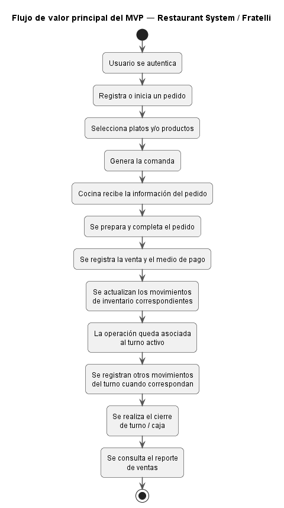

# 05 — Alcance y MVP

## 1. Propósito del documento

Este documento define el **alcance del producto** y delimita formalmente el **MVP operacional de reemplazo** de **Restaurant System** para el restaurante **Fratelli**.

Su finalidad es establecer con claridad:

- qué capacidades pertenecen al producto;
- qué capacidades forman parte de la primera entrega;
- qué actores y procesos serán cubiertos;
- qué datos serán necesarios;
- qué integraciones se realizarán o se diferirán;
- qué restricciones y supuestos condicionan el desarrollo;
- qué elementos quedan explícitamente fuera del MVP;
- qué riesgos deben controlarse antes de comenzar la implementación.

La cadena documental continúa de la siguiente manera:

```text
Problema
   ↓
Hallazgos
   ↓
Necesidades
   ↓
Objetivos y propuesta de valor
   ↓
ALCANCE Y MVP
   ↓
SRS
   ↓
Requisitos
   ↓
Product Backlog
```

---

## 2. Estado documental

| Campo                             | Valor                                |
| --------------------------------- | ------------------------------------ |
| **Documento**                     | `05-alcance-y-mvp.md`                |
| **Proyecto**                      | Restaurant System                    |
| **Organización objetivo**         | Restaurante Fratelli                 |
| **Versión inicial**               | `0.1`                                |
| **Estado**                        | Alcance y MVP definidos inicialmente |
| **Fecha**                         | 20 de agosto de 2026                 |
| **Product Owner**                 | Ana Paola Viscarra Chambi            |
| **Scrum Master**                  | Alex Saúl Fernandez Valdez           |
| **Enfoque aprobado**              | MVP operacional de reemplazo         |
| **Canal principal**               | Aplicación web responsive            |
| **Plazo aproximado del proyecto** | 15 días                              |

---

# 3. Decisión de alcance

Se adopta la alternativa de **MVP operacional de reemplazo**.

Esto significa que la primera entrega no se limitará únicamente a incorporar mejoras aisladas como asistencia o alertas de stock.

El MVP debe disponer de un núcleo suficientemente completo para demostrar un flujo operativo real del restaurante mediante un sistema independiente, incorporando además varios de los procesos prioritarios identificados durante el relevamiento.

La estrategia puede resumirse así:

```text
Conservar capacidades operativas esenciales
                    +
Incorporar mejoras prioritarias
                    +
Eliminar dependencias manuales seleccionadas
                    +
No depender técnicamente del sistema actual
                    ↓
        MVP operacional de reemplazo
```

El MVP **no representa todavía el producto final completo**.

---

# 4. Objetivo del MVP

> **Entregar una primera versión funcional e independiente de Restaurant System que permita ejecutar los procesos operativos principales de Fratelli —incluyendo ventas, pedidos, comandas, inventario, producción, compras, gastos, asistencia y cierre de turno/caja— mediante una aplicación web responsive, incorporando control de usuarios, alertas de stock y reportes mínimos, sin depender del sistema actual ni de hardware especializado.**

---

# 5. Problema principal atendido

El MVP busca reducir la fragmentación existente entre:

```text
Sistema actual
+
Planillas físicas
+
Hojas de producción
+
Cuadernos
+
Recibos
+
Excel
+
Otros medios externos
```

concentrándose en los procesos que:

- sostienen la operación diaria;
- presentan mayor prioridad para la Product Owner;
- son necesarios para demostrar una sustitución operativa inicial;
- pueden beneficiarse de una fuente digital centralizada.

---

# 6. Alcance funcional incluido

## 6.1. Autenticación, usuarios y roles

El MVP incluirá:

- autenticación de usuarios;
- cuentas individuales;
- identificación del usuario activo;
- roles diferenciados;
- autorización de operaciones según responsabilidad;
- trazabilidad básica de operaciones relevantes.

### Relación con necesidades

- `N-010`
- `N-013`
- `N-014`

### Pendiente de SRS

El catálogo definitivo de permisos por rol.

---

## 6.2. Productos, ingredientes y platos

El MVP incluirá la gestión básica de:

- productos;
- ingredientes;
- platos;
- categorías cuando sean necesarias;
- precios;
- estado activo/inactivo;
- relación entre platos e ingredientes;
- cantidades necesarias de ingredientes para poder controlar su consumo.

Estas relaciones permitirán posteriormente mantener la lógica de descuento de ingredientes asociada a la operación de venta.

### Relación con necesidades

- `N-004`
- `N-011`

---

## 6.3. Inventario

El MVP incluirá:

- existencias;
- entradas;
- salidas;
- bajas;
- movimientos de inventario;
- consulta de stock;
- stock mínimo;
- identificación de productos con existencias bajas;
- historial básico de movimientos;
- relación entre movimientos y usuarios responsables cuando corresponda.

### Relación con necesidades

- `N-004`
- `N-005`
- `N-014`

---

## 6.4. Alertas de stock bajo

El sistema deberá permitir que los responsables identifiquen productos o ingredientes que hayan alcanzado un nivel bajo según el umbral configurado.

El MVP contempla:

- definición de un valor de stock mínimo;
- detección de existencias iguales o inferiores al umbral establecido;
- presentación de alertas dentro del sistema;
- consulta de los productos que requieren atención.

### No se fija todavía

- notificación por correo;
- SMS;
- WhatsApp;
- notificación push;
- alertas externas.

El primer mecanismo será interno a la aplicación.

### Relación con necesidades

- `N-005`

---

## 6.5. Producción

El MVP incluirá un flujo de registro de producción que reduzca la dependencia de:

```text
hoja manual
    ↓
transcripción posterior
    ↓
sistema
```

Se contempla:

- registrar una producción;
- identificar productos o preparaciones producidas;
- indicar cantidades;
- registrar fecha y responsable;
- reflejar los movimientos de inventario que correspondan según las reglas definidas posteriormente;
- consultar registros de producción.

### Relación con necesidades

- `N-003`
- `N-004`

### Pendiente de SRS

- reglas exactas de consumo durante producción;
- mermas;
- desperdicios;
- excepciones;
- unidades y conversiones.

---

## 6.6. Ventas

El módulo de ventas forma parte central del MVP.

Debe permitir cubrir el flujo operativo básico de una venta, incluyendo:

- creación de una venta o pedido;
- selección de platos/productos;
- cantidades;
- precios;
- cálculo del total;
- identificación del mesero/usuario responsable;
- asociación opcional de un cliente;
- registro del medio de pago;
- finalización de la operación;
- consulta básica del historial de ventas.

### Facturación fiscal

La **facturación fiscal/electrónica no forma parte del MVP**.

Una futura integración con los servicios tributarios correspondientes deberá tratarse como un módulo independiente cuando el proyecto llegue a esa etapa y se disponga de los requisitos técnicos y normativos necesarios.

### Relación con necesidades

- `N-011`
- `N-013`
- `N-014`

---

## 6.7. Pedidos y comandas

El MVP incluirá:

- registro de pedidos;
- detalle del pedido;
- generación de la comanda correspondiente;
- disponibilidad de la información del pedido para cocina;
- identificación del estado básico del pedido;
- asociación con la venta correspondiente.

El flujo deberá conservar la capacidad operativa conocida del sistema actual:

```text
Cliente
   ↓
Mesero
   ↓
Pedido
   ↓
Comanda
   ↓
Cocina
   ↓
Preparación
   ↓
Venta / cobro
```

### Relación con necesidades

- `N-011`

---

## 6.8. Clientes

El MVP incluirá únicamente una gestión básica de clientes suficiente para:

- registrar un cliente;
- consultar clientes;
- seleccionar un cliente;
- asociarlo a una venta cuando corresponda.

### Fuera del MVP

- ventas a crédito;
- cuentas por cobrar;
- mora;
- vencimientos;
- pagos parciales de crédito;
- límites de crédito.

La estructura del sistema deberá permitir una ampliación futura sin que el MVP tenga que implementar todavía el flujo de crédito.

---

## 6.9. Proveedores

El MVP incluirá una gestión básica de proveedores:

- registro;
- consulta;
- datos de contacto necesarios;
- estado;
- asociación con compras.

### Relación con necesidades

- `N-006`
- `N-008`

---

## 6.10. Compras

Las compras forman parte de la primera entrega.

El MVP incluirá, como mínimo:

- creación de una compra;
- proveedor asociado;
- fecha;
- detalle de productos/insumos;
- cantidades;
- costos;
- total;
- usuario responsable;
- registro de recepción;
- consulta del historial de compras;
- actualización de inventario cuando la compra recibida corresponda a productos inventariables.

### Alcance limitado dentro del MVP

Las reglas avanzadas que todavía no fueron suficientemente relevadas quedarán sujetas a refinamiento.

No se consideran obligatorias en esta primera versión:

- calendarios complejos de vencimiento;
- múltiples cuotas;
- pagos parciales avanzados;
- conciliación contable;
- automatización de pagos a proveedores;
- integración con WhatsApp;
- integración directa con QR bancario.

### Relación con necesidades

- `N-006`
- `N-007`
- `N-008`
- `N-014`

---

## 6.11. Gastos diarios y caja chica

El MVP incluirá:

- registro de gastos;
- fecha;
- concepto/detalle;
- monto;
- usuario responsable;
- clasificación básica cuando corresponda;
- consulta de gastos registrados;
- consideración de estos movimientos dentro de la información necesaria para el cierre de caja cuando aplique.

El objetivo es eliminar la dependencia del cuaderno como única fuente principal para estos gastos.

### Relación con necesidades

- `N-009`
- `N-014`

---

## 6.12. Asistencia

El control de asistencia forma parte completa del MVP a nivel de software.

Debe permitir:

- identificar al trabajador;
- registrar entrada;
- registrar salida;
- conservar fecha y hora;
- consultar historial personal;
- consulta administrativa;
- disponer de información utilizable posteriormente para procesos de control de horas.

### Relación con necesidades

- `N-001`
- `N-002`

---

## 6.13. Integración biométrica

La **integración física con un lector biométrico no forma parte del MVP**.

El sistema sí deberá diseñarse de forma que la asistencia no dependa permanentemente de una única forma de captura.

La futura integración se tratará mediante un componente separado.

Estructura conceptual:

```text
Aplicación web
      ↓
Backend / API de asistencia
      ↑
Componente de hardware
      ↑
Lector biométrico
```

Durante el MVP, el registro de entrada y salida podrá demostrarse sin disponer del hardware real.

---

## 6.14. Turnos y cierre de caja

El MVP incluirá:

- identificación del turno;
- asociación de ventas con el turno correspondiente;
- registro de los medios de pago utilizados;
- consulta de operaciones del turno;
- registro del cierre;
- resumen del turno;
- información necesaria para obtener un cierre general según las reglas que se definan;
- consideración de los gastos registrados que correspondan al cierre.

La evidencia disponible indica que Fratelli trabaja con dos turnos y realiza un cierre total considerando ambos.

### Pendiente de SRS

Deben precisarse:

- reglas exactas de apertura;
- responsables;
- diferencias de caja;
- tratamiento de cada medio de pago;
- secuencia exacta entre cierre de turno y cierre total.

---

## 6.15. Reportes mínimos

El MVP incluirá únicamente los reportes que actualmente pueden justificarse con la evidencia disponible:

### REP-MVP-01 — Ventas

Información necesaria para consultar las ventas registradas durante un periodo o contexto definido.

### REP-MVP-02 — Inventario y stock

Información sobre:

- existencias;
- productos con stock bajo;
- movimientos relevantes cuando corresponda.

### REP-MVP-03 — Asistencia

Información sobre:

- entradas;
- salidas;
- historial por trabajador;
- periodo consultado.

Los reportes avanzados se tratarán posteriormente.

---

## 6.16. Aplicación web responsive

El MVP se implementará como una **aplicación web responsive**.

Debe poder utilizarse desde diferentes tamaños de pantalla, principalmente:

- computadora;
- tablet;
- teléfono móvil.

La misma plataforma atenderá los distintos perfiles mediante autenticación y autorización.

Esta decisión evita mantener aplicaciones funcionalmente duplicadas para cada tipo de dispositivo durante la primera entrega.

---

# 7. Actores incluidos

## 7.1. Mesero / personal de atención

Participará principalmente en:

- autenticación;
- pedidos;
- ventas;
- clientes;
- medios de pago;
- operaciones relacionadas con su turno;
- asistencia.

## 7.2. Cocina / encargadas de cocina

Participará principalmente en:

- consulta de comandas;
- producción;
- información relacionada con insumos;
- compras que correspondan a cocina;
- asistencia.

## 7.3. Encargado

Participará principalmente en:

- productos;
- inventario;
- producción;
- compras;
- proveedores;
- gastos;
- turnos/caja;
- reportes;
- asistencia;
- administración operativa.

## 7.4. Contadora

Participará principalmente en:

- consulta de asistencia;
- información necesaria para control de horas;
- inventario cuando corresponda;
- reportes autorizados.

El MVP **no automatiza completamente la nómina salarial**.

## 7.5. Administrador / propietario o responsable autorizado

Participará principalmente en:

- administración de usuarios;
- permisos;
- consulta general;
- reportes;
- configuración operativa;
- control de ventas;
- inventario;
- compras;
- gastos;
- cierres.

La identidad exacta y permisos de este rol deberán confirmarse durante SRS.

## 7.6. Trabajador

Como actor genérico podrá:

- autenticarse cuando corresponda;
- registrar entrada;
- registrar salida;
- consultar su información de asistencia según permisos.

## 7.7. Cliente

El cliente es principalmente un **beneficiario y entidad de negocio**.

No se define todavía como usuario autenticado del sistema.

---

# 8. Procesos incluidos

| Proceso                         | MVP           |
| ------------------------------- | ------------- |
| Autenticación                   | Incluido      |
| Usuarios y roles                | Incluido      |
| Productos e ingredientes        | Incluido      |
| Platos y composición            | Incluido      |
| Inventario                      | Incluido      |
| Movimientos de inventario       | Incluido      |
| Stock mínimo y alertas          | Incluido      |
| Producción                      | Incluido      |
| Pedidos                         | Incluido      |
| Comandas                        | Incluido      |
| Ventas                          | Incluido      |
| Asociación de clientes a ventas | Incluido      |
| Proveedores                     | Incluido      |
| Compras                         | Incluido      |
| Recepción básica de compras     | Incluido      |
| Gastos diarios / caja chica     | Incluido      |
| Asistencia                      | Incluido      |
| Turnos                          | Incluido      |
| Cierre de caja                  | Incluido      |
| Reporte de ventas               | Incluido      |
| Reporte de inventario/stock     | Incluido      |
| Reporte de asistencia           | Incluido      |
| Créditos a clientes             | Fuera del MVP |
| Facturación fiscal              | Fuera del MVP |
| Nómina completa                 | Fuera del MVP |
| Integración biométrica física   | Fuera del MVP |
| Impresión térmica integrada     | Fuera del MVP |
| Migración histórica             | Fuera del MVP |
| Reportería avanzada             | Fuera del MVP |

---

# 9. Datos principales incluidos

El modelo conceptual del MVP deberá considerar, como mínimo, información relacionada con:

```text
Usuarios
Roles
Permisos
Trabajadores
Asistencias

Productos
Ingredientes
Platos
Composición / receta
Inventario
Movimientos
Stock mínimo
Alertas

Producción

Clientes

Pedidos
Detalle de pedido
Comandas
Ventas
Detalle de venta
Medios de pago

Proveedores
Compras
Detalle de compra
Recepción

Gastos

Turnos
Cierres de caja
```

Esta lista establece **áreas de información**, no constituye todavía el modelo de datos final.

La estructura formal se realizará posteriormente en:

```text
docs/11-modelo-datos.md
```

y en los artefactos de base de datos correspondientes.

---

# 10. Integraciones

## 10.1. Integraciones incluidas en el MVP

No existe una integración externa obligatoria para que el MVP pueda funcionar.

El sistema deberá ser autónomo respecto del sistema anterior.

## 10.2. Hardware

Se establece una frontera clara:

```text
Sistema principal
      ↓
Interfaces / API
      ↓
Componentes de hardware separados
```

El software principal no deberá quedar acoplado directamente a un modelo específico de:

- lector biométrico;
- impresora de recibos;
- otro periférico futuro.

## 10.3. Integraciones excluidas del MVP

- sistema actual de Fratelli;
- hardware biométrico real;
- impresora térmica;
- servicios fiscales de facturación;
- WhatsApp;
- sistemas bancarios/QR;
- PedidosYa u otras plataformas externas;
- servicios externos de nómina;
- migración automatizada desde la plataforma anterior.

---

# 11. Flujo de valor principal del MVP

El flujo de valor principal seleccionado es el **ciclo de atención y venta**, porque representa una operación central del restaurante y conecta varios módulos del producto.

```text
Usuario autenticado
      ↓
Pedido
      ↓
Comanda
      ↓
Cocina
      ↓
Venta / cobro
      ↓
Actualización de inventario
      ↓
Información del turno
      ↓
Cierre de caja
      ↓
Reporte de ventas
```



> **Fuente editable:** [`puml/flujo-valor-mvp.puml`](puml/flujo-valor-mvp.puml)

Este flujo principal se complementa con tres flujos de soporte prioritarios:

```text
Producción → Inventario → Alertas

Proveedor → Compra → Inventario

Trabajador → Entrada/Salida → Asistencia
```

---

# 12. Capacidades mínimas del MVP

Se establecen las siguientes capacidades de producto antes de convertirlas en requisitos formales.

| Código   | Capacidad                                                                      |
| -------- | ------------------------------------------------------------------------------ |
| `MVP-01` | Autenticar usuarios                                                            |
| `MVP-02` | Aplicar roles y permisos                                                       |
| `MVP-03` | Gestionar productos, ingredientes y platos                                     |
| `MVP-04` | Relacionar platos con ingredientes                                             |
| `MVP-05` | Gestionar existencias y movimientos                                            |
| `MVP-06` | Configurar y detectar stock bajo                                               |
| `MVP-07` | Registrar producción                                                           |
| `MVP-08` | Registrar pedidos                                                              |
| `MVP-09` | Generar y consultar comandas                                                   |
| `MVP-10` | Registrar ventas                                                               |
| `MVP-11` | Asociar cliente a una venta                                                    |
| `MVP-12` | Registrar proveedores                                                          |
| `MVP-13` | Registrar y consultar compras                                                  |
| `MVP-14` | Registrar recepción básica de compras                                          |
| `MVP-15` | Registrar gastos diarios                                                       |
| `MVP-16` | Registrar entrada y salida del personal                                        |
| `MVP-17` | Consultar asistencia                                                           |
| `MVP-18` | Gestionar turnos                                                               |
| `MVP-19` | Realizar cierre de turno/caja                                                  |
| `MVP-20` | Consultar reporte de ventas                                                    |
| `MVP-21` | Consultar reporte de inventario/stock                                          |
| `MVP-22` | Consultar reporte de asistencia                                                |
| `MVP-23` | Utilizar el sistema desde PC, tablet y móvil mediante interfaz responsive      |
| `MVP-24` | Mantener trazabilidad básica del usuario responsable de operaciones relevantes |

Estos códigos son identificadores de alcance y **no sustituyen los futuros `RF-XXX`**.

---

# 13. Fuera del MVP

## 13.1. Facturación fiscal

Queda fuera:

- generación fiscal de facturas;
- integración tributaria;
- envío a servicios fiscales;
- gestión de códigos, autorizaciones o procesos tributarios específicos.

Puede convertirse en un módulo posterior.

---

## 13.2. Créditos a clientes

Quedan fuera:

- venta a crédito;
- límite de crédito;
- cuenta por cobrar;
- vencimientos;
- mora;
- pagos parciales;
- cobranza.

El MVP sí permite manejar el cliente como entidad asociada a una venta.

---

## 13.3. Hardware biométrico

Queda fuera:

- enrolamiento real de huellas;
- lector físico;
- SDK del fabricante;
- drivers;
- almacenamiento específico de plantillas biométricas;
- comunicación con un dispositivo real.

La capa de software de asistencia sí forma parte del MVP.

---

## 13.4. Impresora térmica

Queda fuera la comunicación directa con hardware de impresión.

El sistema podrá preparar posteriormente una integración separada.

---

## 13.5. Nómina completa

El MVP no reemplazará completamente el proceso contable de pago de personal.

Incluye los datos de asistencia que podrán servir de base para una futura ampliación.

---

## 13.6. Cuentas por pagar avanzadas

El módulo de compras entra en el MVP, pero quedan fuera mientras no existan reglas suficientemente definidas:

- cronogramas complejos de pago;
- cuotas;
- intereses;
- vencimientos avanzados;
- conciliación financiera completa.

---

## 13.7. Promociones y descuentos avanzados

No se implementarán reglas promocionales complejas mientras no hayan sido relevadas y validadas.

---

## 13.8. Migración histórica

No se garantiza migración automática desde el sistema actual debido a que no existe acceso técnico ni mecanismo conocido de exportación.

---

## 13.9. Aplicaciones nativas

No forman parte del MVP:

- aplicación Android nativa separada;
- aplicación iOS nativa;
- aplicación Windows de escritorio independiente.

La estrategia es web responsive.

---

## 13.10. Reportería avanzada

No se incluyen dashboards o reportes no sustentados por la evidencia actual.

---

# 14. Supuestos

## SUP-01

Los usuarios del MVP dispondrán de acceso a un navegador moderno desde computadora, tablet o teléfono.

## SUP-02

La Product Owner estará disponible para aclarar reglas concretas durante refinamiento.

## SUP-03

Cuando una regla dependa de otro miembro del restaurante, la Product Owner podrá realizar una consulta puntual según el mecanismo definido en el relevamiento.

## SUP-04

El MVP se demostrará sin depender del sistema existente.

## SUP-05

La ausencia temporal de biométrico o impresora no bloqueará la validación funcional de los módulos correspondientes.

## SUP-06

Los datos utilizados durante desarrollo y prueba podrán ser preparados específicamente para el entorno del proyecto cuando no sea viable migrar información real.

## SUP-07

Las reglas todavía no conocidas no se inventarán para completar artificialmente el alcance.

---

# 15. Restricciones

## RST-MVP-01 — Tiempo

El proyecto dispone aproximadamente de **15 días**.

## RST-MVP-02 — Equipo

El proyecto cuenta con **cuatro integrantes**.

## RST-MVP-03 — Sistema anterior

No existe acceso técnico suficiente para depender de su arquitectura, API o base de datos.

## RST-MVP-04 — Relevamiento adicional

No se realizarán nuevas entrevistas directas.

Las aclaraciones se canalizarán mediante la Product Owner.

## RST-MVP-05 — Hardware

El hardware real no debe convertirse en dependencia crítica de la primera entrega.

## RST-MVP-06 — Evidencia

No existen métricas históricas suficientes para prometer mejoras cuantitativas específicas.

## RST-MVP-07 — Reglas pendientes

Algunos detalles del dominio deberán resolverse antes de implementar las historias correspondientes.

---

# 16. Dependencias internas

## DEP-01 — Usuarios y permisos

Los módulos operativos dependen de disponer de identificación y autorización básicas de usuarios.

## DEP-02 — Catálogo e inventario

Ventas, compras y producción dependen de una representación consistente de productos e ingredientes.

## DEP-03 — Composición de platos

El descuento de ingredientes asociado a ventas depende de conocer la relación entre platos e ingredientes.

## DEP-04 — Inventario para alertas

Las alertas dependen de existencias y stock mínimo.

## DEP-05 — Proveedores para compras

Una compra requiere disponer previamente del proveedor correspondiente.

## DEP-06 — Turnos para cierre

El cierre requiere disponer de información de ventas, medios de pago y movimientos incluidos durante el turno.

## DEP-07 — Reglas de negocio

Las historias con reglas todavía pendientes no podrán considerarse Ready hasta aclararlas.

---

# 17. Riesgos del MVP

| ID         | Riesgo                                                                                 | Impacto    | Respuesta inicial                                                                 |
| ---------- | -------------------------------------------------------------------------------------- | ---------- | --------------------------------------------------------------------------------- |
| `R-MVP-01` | El alcance sigue siendo amplio para aproximadamente 15 días                            | Alto       | Refinar y ordenar por valor/dependencias; proteger los flujos críticos            |
| `R-MVP-02` | Reglas incompletas de cierre de caja                                                   | Alto       | Aclarar antes de llevar sus historias a Ready                                     |
| `R-MVP-03` | Reglas incompletas de compras/pagos                                                    | Medio/Alto | Implementar primero flujo básico confirmado y no inventar reglas avanzadas        |
| `R-MVP-04` | Roles y permisos todavía no están totalmente definidos                                 | Alto       | Consolidarlos durante SRS/refinamiento                                            |
| `R-MVP-05` | Integración biométrica puede depender del fabricante                                   | Medio      | Mantenerla fuera del MVP físico y desacoplada                                     |
| `R-MVP-06` | No existe migración conocida desde el sistema actual                                   | Medio/Alto | Trabajar con sistema independiente y datos controlados                            |
| `R-MVP-07` | Intentar replicar todas las capacidades del sistema anterior puede expandir el alcance | Alto       | Mantener baseline funcional, pero exigir justificación para cada historia del MVP |
| `R-MVP-08` | Varias áreas del negocio dependen entre sí                                             | Alto       | Ordenar implementación por dependencias                                           |
| `R-MVP-09` | El tiempo puede obligar a diferir capacidades secundarias                              | Alto       | Aplicar control de alcance explícito y priorización del Product Backlog           |

---

# 18. Hipótesis que valida el MVP

## HMVP-01

Una aplicación única y responsive puede cubrir los perfiles operativos y administrativos principales sin necesitar una aplicación independiente por dispositivo.

## HMVP-02

Registrar directamente producción, compras, gastos y asistencia dentro del nuevo sistema puede reducir la necesidad de mantener fuentes manuales paralelas para los procesos incluidos.

## HMVP-03

Mantener inventario actualizado y un stock mínimo configurable permite detectar productos que requieren atención antes de depender exclusivamente de una revisión periódica.

## HMVP-04

El flujo pedido → comanda → venta → inventario puede funcionar de manera independiente del sistema anterior y constituir el núcleo de reemplazo operacional.

## HMVP-05

Roles y permisos permiten que los usuarios autorizados accedan directamente a las operaciones e información que necesitan sin compartir responsabilidades innecesariamente.

---

# 19. Criterios de validación del MVP

Debido a que no existe una línea base cuantitativa suficiente, la validación inicial utilizará condiciones observables.

El MVP podrá considerarse validado inicialmente cuando:

- los usuarios puedan autenticarse y operar según permisos;
- pueda completarse el flujo pedido → comanda → venta;
- una venta pueda reflejar los movimientos de inventario que correspondan según las reglas definidas;
- pueda registrarse producción sin depender obligatoriamente de una hoja física como fuente primaria;
- puedan consultarse existencias y alertas de stock bajo;
- pueda registrarse una compra y su recepción básica;
- puedan registrarse gastos diarios;
- pueda registrarse entrada y salida del personal;
- pueda realizarse el cierre de turno/caja definido;
- estén disponibles los tres reportes mínimos;
- el sistema pueda demostrarse desde una interfaz web responsive;
- el MVP funcione sin integración con la plataforma anterior;
- la Product Owner valide los principales flujos incluidos;
- no existan defectos críticos abiertos en los flujos declarados como terminados.

---

# 20. Control de alcance

Toda nueva funcionalidad propuesta durante el desarrollo deberá evaluarse mediante las siguientes preguntas:

```text
¿Responde a una necesidad documentada?
              ↓
¿Aporta a un objetivo del proyecto?
              ↓
¿Es necesaria para el MVP?
              ↓
¿Existe información suficiente para definirla?
              ↓
¿Puede implementarse dentro del tiempo disponible?
              ↓
¿Desplaza una capacidad de mayor prioridad?
```

Si una propuesta no supera este control:

```text
Backlog posterior
o
Fuera de alcance
```

No deberá incorporarse silenciosamente al Sprint.

---

# 21. Estrategia de reducción de alcance

Si durante el desarrollo el tiempo disponible resulta insuficiente, **no se eliminará arbitrariamente funcionalidad sin revisar dependencias y valor**.

El orden de protección será:

## Nivel 1 — Núcleo operacional

- autenticación;
- usuarios/roles;
- productos/platos/ingredientes;
- inventario;
- pedidos;
- comandas;
- ventas;
- turnos/cierre.

## Nivel 2 — Mejoras prioritarias confirmadas

- producción directa;
- stock mínimo/alertas;
- asistencia;
- compras;
- gastos.

## Nivel 3 — Capacidades de soporte

- clientes básicos;
- proveedores;
- reportes mínimos;
- trazabilidad adicional.

Cualquier reducción deberá registrarse como cambio de alcance y validarse con la Product Owner.

---

# 22. Resultado esperado de la primera entrega

La primera entrega deberá demostrar que Fratelli puede disponer de una **base operacional independiente** capaz de ejecutar el ciclo principal del restaurante y varios procesos actualmente fragmentados desde una aplicación web responsive.

No se pretende afirmar todavía que la primera versión pueda sustituir inmediatamente al sistema de producción real en todos los escenarios.

La primera entrega debe demostrar:

```text
viabilidad funcional
+
coherencia del dominio
+
integración de procesos prioritarios
+
base para continuar el reemplazo
```

---

# 23. Diagrama del flujo de valor

Para este documento se utiliza un único diagrama de actividad con el fin de representar el flujo de valor principal del MVP.

Archivos esperados:

```text
docs/puml/flujo-valor-mvp.puml
docs/images/flujo-valor-mvp.png
```

No se crean todavía diagramas UML exhaustivos de casos de uso, clases o secuencias.

Estos se elaborarán después de consolidar SRS, requisitos y alcance funcional.

---

# 24. Condiciones para avanzar al SRS

El alcance se considera suficientemente definido para avanzar cuando:

- el MVP está delimitado;
- los módulos incluidos y excluidos son explícitos;
- se conocen los actores principales;
- las dependencias críticas están identificadas;
- los riesgos principales están registrados;
- las integraciones diferidas están claras;
- no se confunde MVP con producto final;
- las funcionalidades todavía ambiguas están marcadas para refinamiento.

---

# 25. Próximo documento

El siguiente artefacto será:

```text
docs/06-srs.md
```

El SRS deberá convertir este alcance en una especificación formal del producto, incluyendo:

- propósito;
- alcance;
- actores;
- supuestos;
- restricciones;
- dependencias;
- sistemas externos;
- requisitos funcionales;
- requisitos no funcionales;
- reglas principales;
- trazabilidad con las necesidades.

---

# 26. Control de cambios

| Versión | Fecha      | Descripción                                                                            | Estado         |
| ------- | ---------- | -------------------------------------------------------------------------------------- | -------------- |
| `0.1`   | 20/08/2026 | Definición del alcance y MVP operacional de reemplazo aprobado para la primera entrega | Listo para SRS |
