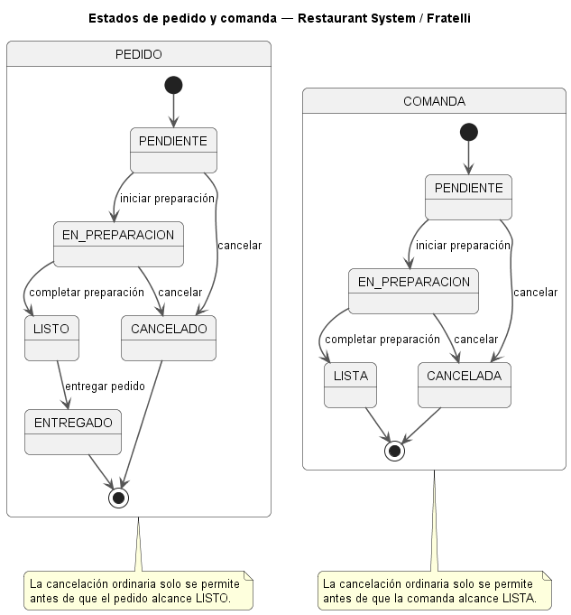

# 06 — SRS — Especificación de Requisitos de Software

## 1. Propósito

Este documento establece la **Especificación de Requisitos de Software (SRS)** de **Restaurant System** para el restaurante **Fratelli**.

Su función es consolidar, en una única especificación de producto:

- propósito y alcance;
- perspectiva del sistema;
- actores;
- contexto operativo;
- interfaces;
- capacidades funcionales;
- reglas de comportamiento;
- requisitos no funcionales de alto nivel;
- restricciones;
- supuestos;
- dependencias;
- información pendiente;
- trazabilidad hacia las necesidades y objetivos ya documentados.

La especificación se deriva de:

```text
01-contexto-y-diagnostico.md
        ↓
02-relevamiento.md
        ↓
03-hallazgos-y-necesidades.md
        ↓
04-objetivos-y-propuesta-valor.md
        ↓
05-alcance-y-mvp.md
        ↓
06-srs.md
```

Los requisitos detallados se mantendrán posteriormente en:

```text
docs/requirements/
├── requisitos-funcionales.md
├── requisitos-no-funcionales.md
└── reglas-negocio.md
```

`06-srs.md` actúa como especificación maestra y catálogo de referencia. Los archivos anteriores contendrán el detalle verificable de cada requisito y regla, evitando mantener copias completas duplicadas.

---

## 2. Estado documental

| Campo                     | Valor                        |
| ------------------------- | ---------------------------- |
| **Documento**             | `06-srs.md`                  |
| **Proyecto**              | Restaurant System            |
| **Organización objetivo** | Restaurante Fratelli         |
| **Versión inicial**       | `0.1`                        |
| **Estado**                | SRS inicial                  |
| **Fecha**                 | 20 de agosto de 2026         |
| **Product Owner**         | Ana Paola Viscarra Chambi    |
| **Scrum Master**          | Alex Saúl Fernandez Valdez   |
| **Baseline de alcance**   | `05-alcance-y-mvp.md`        |
| **Producto objetivo**     | Aplicación web responsive    |
| **Tipo de entrega**       | MVP operacional de reemplazo |

---

# 3. Alcance del producto

Restaurant System será un sistema de información independiente para la gestión operativa y administrativa de Fratelli.

El MVP aprobado cubrirá:

- autenticación;
- usuarios, roles y permisos;
- productos;
- ingredientes;
- platos;
- composición de platos;
- inventario;
- movimientos;
- stock mínimo;
- alertas de stock bajo;
- producción;
- lotes de producción;
- pedidos;
- comandas;
- ventas;
- clientes básicos;
- proveedores;
- compras;
- recepción básica de compras;
- gastos diarios/caja chica;
- asistencia;
- turnos;
- cierre de caja;
- reportes mínimos de ventas, inventario y asistencia;
- uso responsive desde computadora, tablet y teléfono.

Quedan fuera del MVP, entre otros:

- facturación fiscal;
- créditos a clientes;
- cuentas por cobrar;
- nómina salarial completa;
- integración física con biométrico;
- impresión térmica integrada;
- migración histórica automatizada;
- reportería avanzada;
- aplicaciones nativas independientes.

---

# 4. Objetivos relacionados

El SRS responde principalmente a los objetivos definidos en `04-objetivos-y-propuesta-valor.md`.

| Objetivo | Relación con el SRS                       |
| -------- | ----------------------------------------- |
| `OE-01`  | Centralización de información prioritaria |
| `OE-02`  | Control de asistencia                     |
| `OE-03`  | Inventario, producción y stock bajo       |
| `OE-04`  | Compras, proveedores y gastos             |
| `OE-05`  | Roles, permisos, reportes y trazabilidad  |
| `OE-06`  | Independencia del sistema anterior        |
| `OE-07`  | Validación con Product Owner              |

---

# 5. Definiciones y terminología

## 5.1. Pedido

Registro de los productos y/o platos solicitados por un cliente durante la atención.

## 5.2. Comanda

Información derivada del pedido que debe llegar al área de cocina para su preparación.

## 5.3. Venta

Operación comercial confirmada que registra los elementos vendidos, cantidades, total, medio de pago, usuario responsable y demás datos aplicables.

## 5.4. Ingrediente

Insumo utilizado para producir preparaciones o platos.

## 5.5. Plato

Elemento ofertado para venta cuya gestión se mantiene diferenciada del inventario de ingredientes.

## 5.6. Composición / receta

Relación entre un plato o preparación y los ingredientes necesarios para producirlo.

No se considera todavía una receta culinaria detallada; representa la información mínima requerida para controlar consumo de ingredientes.

## 5.7. Lote de producción

Registro que representa una cantidad producida de un plato o preparación en una operación determinada.

El lote permite mantener separados:

```text
Inventario de ingredientes
        ↓ producción
Lotes de platos/preparaciones
        ↓ venta
Salida del producto preparado
```

## 5.8. Stock mínimo

Umbral configurado para identificar que una existencia requiere atención.

## 5.9. Turno

Periodo operativo utilizado para agrupar ventas, medios de pago, gastos y demás información requerida para realizar un cierre.

## 5.10. Cierre de caja

Proceso mediante el cual un usuario autorizado registra y consolida la información del turno según las reglas de caja disponibles.

## 5.11. Asistencia abierta

Registro de entrada de un trabajador que todavía no cuenta con una salida asociada.

## 5.12. HardwareIntegration

Frontera conceptual mediante la cual el sistema podrá comunicarse en el futuro con periféricos físicos sin acoplar el núcleo del producto a un dispositivo específico.

---

# 6. Perspectiva del producto

Restaurant System reemplazará progresivamente la dependencia del sistema actual de Fratelli.

El nuevo producto:

- funcionará de manera independiente;
- no requerirá acceso a la base de datos o API del sistema anterior;
- conservará las capacidades operativas incluidas en el alcance;
- incorporará procesos que actualmente se manejan fuera del sistema;
- será utilizado por diferentes roles;
- centralizará información en una fuente persistente;
- podrá ampliarse posteriormente con nuevas funciones e integraciones.

El MVP no pretende replicar internamente la implementación del sistema anterior.

---

# 7. Actores

## 7.1. ADMINISTRADOR

Rol con responsabilidades generales de administración del sistema.

Como baseline inicial podrá participar en:

- usuarios;
- roles;
- permisos;
- configuración;
- productos;
- inventario;
- compras;
- gastos;
- turnos;
- cierres;
- reportes.

Los permisos definitivos se especificarán en el detalle de requisitos.

## 7.2. ENCARGADO

Rol operativo con responsabilidades relevantes sobre:

- productos;
- inventario;
- producción;
- proveedores;
- compras;
- gastos;
- turnos/caja;
- reportes;
- asistencia cuando corresponda.

## 7.3. MESERO

Rol orientado principalmente a:

- pedidos;
- ventas;
- asociación de clientes;
- medios de pago;
- operaciones correspondientes al turno;
- asistencia.

## 7.4. COCINA

Rol orientado principalmente a:

- recepción/consulta de comandas;
- estados de preparación;
- producción;
- lotes;
- consultas de insumos cuando corresponda;
- compras relacionadas con cocina según permisos;
- asistencia.

## 7.5. CONTADORA

Rol orientado principalmente a:

- consulta de asistencia;
- control de horas;
- inventario cuando corresponda;
- reportes autorizados;
- información administrativa relacionada con sus responsabilidades.

La nómina completa queda fuera del MVP.

## 7.6. EMPLEADO

Rol base para trabajadores que únicamente necesiten capacidades limitadas, especialmente:

- registrar entrada;
- registrar salida;
- consultar su asistencia cuando esté autorizado.

## 7.7. Cliente

El cliente no se considera usuario autenticado del MVP.

Se modela como entidad de negocio que puede ser asociada opcionalmente a una venta.

---

# 8. Contexto operativo

## 8.1. Plataforma

Restaurant System se utilizará mediante una **aplicación web responsive**.

Dispositivos objetivo:

- computadora;
- tablet;
- teléfono móvil.

## 8.2. Navegador

El MVP dependerá de un navegador moderno compatible con las capacidades web requeridas.

Los navegadores exactos soportados se definirán posteriormente durante diseño y pruebas.

## 8.3. Persistencia

Los datos principales deberán almacenarse de forma persistente.

La tecnología definitiva de base de datos se seleccionará durante arquitectura.

## 8.4. Conectividad

La aplicación requerirá acceso al servicio backend correspondiente para operar sobre información centralizada.

Las estrategias de funcionamiento offline no forman parte del alcance inicial salvo decisión posterior.

---

# 9. Frontera e interfaces del sistema

## 9.1. Interfaz de usuario

El sistema dispondrá de una interfaz web responsive.

La interfaz deberá adaptar:

- navegación;
- tablas;
- formularios;
- controles;
- acciones;

a los tamaños de pantalla previstos.

## 9.2. Backend / API

La aplicación cliente se comunicará con una capa de servicios/backend responsable de:

- reglas de negocio;
- autorización;
- persistencia;
- consistencia de datos;
- operaciones del dominio.

La tecnología concreta se definirá posteriormente en arquitectura.

## 9.3. HardwareIntegration

Se contempla desde el diseño una frontera conceptual denominada:

```text
HardwareIntegration
```

Su objetivo será permitir futuras integraciones con:

- lector biométrico;
- impresora térmica;
- otros periféricos.

### MVP

Durante el MVP:

- no se requiere hardware real;
- no se almacena una huella real;
- no se depende de SDK de fabricante;
- asistencia puede funcionar sin biométrico;
- ventas pueden funcionar sin impresora física.

## 9.4. Sistemas externos

No son dependencias obligatorias del MVP:

- sistema anterior de Fratelli;
- servicios de facturación fiscal;
- WhatsApp;
- PedidosYa;
- servicios bancarios;
- dispositivos biométricos;
- impresoras.

---

# 10. Capacidades funcionales por módulo

## 10.1. Seguridad y usuarios

El sistema deberá ofrecer capacidades para:

- autenticación;
- cierre de sesión;
- cuentas de usuario;
- asignación de roles;
- autorización;
- identificación del usuario responsable de operaciones relevantes.

## 10.2. Catálogo

Debe permitir administrar:

- productos;
- ingredientes;
- platos;
- precios;
- estados;
- composición necesaria para producción.

## 10.3. Inventario

Debe permitir:

- registrar entradas;
- registrar salidas o bajas;
- consultar existencias;
- registrar movimientos;
- configurar stock mínimo;
- advertir stock bajo;
- mantener historial.

### Stock negativo

El sistema **no bloqueará automáticamente una venta por stock insuficiente**.

Ante una venta que provoque saldo negativo:

```text
Stock insuficiente
        ↓
Advertencia al usuario
        ↓
Usuario puede continuar
        ↓
Movimiento se registra
        ↓
Saldo puede quedar negativo
```

Esto permite reflejar la operación real aunque el reabastecimiento sea realizado posteriormente.

---

# 11. Producción y lotes

## 11.1. Separación entre ingredientes y platos

El MVP mantendrá separados:

```text
Ingredientes
≠
Platos / preparaciones producidas
```

Los ingredientes representan insumos.

Los platos o preparaciones producidas podrán ser representados mediante lotes.

## 11.2. Confirmación de producción

Al confirmar una producción:

1. se registra la producción;
2. se registra el responsable;
3. se consumen los ingredientes correspondientes según la composición definida;
4. se genera o registra el lote del plato/preparación producido;
5. se registra la cantidad obtenida.

## 11.3. Venta de elementos preparados

Cuando un elemento administrado mediante lote sea vendido, la salida deberá afectar el lote o existencia vendible correspondiente.

No se deberá descontar nuevamente del inventario de ingredientes aquello que ya fue consumido durante la producción.

## 11.4. Detalles pendientes

Todavía deben precisarse:

- unidades;
- conversiones;
- rendimiento de producción;
- mermas;
- desperdicios;
- comportamiento de lotes agotados;
- selección del lote cuando existan varios lotes disponibles;
- fechas de elaboración o vencimiento si fueran necesarias.

Estas reglas deberán aclararse antes de declarar Ready las historias que dependan de ellas.

---

# 12. Pedidos y comandas

## 12.1. Estados de pedido

Los estados iniciales serán:

```text
PENDIENTE
EN_PREPARACION
LISTO
ENTREGADO
CANCELADO
```

## 12.2. Estados de comanda

Los estados iniciales serán:

```text
PENDIENTE
EN_PREPARACION
LISTA
CANCELADA
```

## 12.3. Cancelación

La cancelación normal será permitida mientras:

- el pedido no haya alcanzado `LISTO`;
- la comanda asociada no haya alcanzado `LISTA`.

Una vez alcanzado el estado listo/lista, el MVP no definirá una cancelación ordinaria.

Cualquier ajuste posterior deberá tratarse mediante una regla específica que todavía no forma parte de esta baseline.

## 12.4. Diagrama de estados



> **Fuente editable:** [`puml/estados-pedido-comanda.puml`](puml/estados-pedido-comanda.puml)

---

# 13. Ventas

## 13.1. Registro

Una venta deberá poder registrar:

- detalle;
- cantidades;
- precios;
- total;
- usuario responsable;
- cliente opcional;
- medio de pago;
- turno;
- fecha/hora;
- estado necesario para representar su confirmación.

## 13.2. Momento de afectación de inventario

La afectación definitiva asociada a la venta ocurrirá al **confirmar/cobrar la venta**.

Antes de la confirmación:

- crear un pedido no genera por sí mismo un movimiento definitivo de venta;
- un pedido todavía cancelable no debe registrar una salida comercial definitiva.

## 13.3. Stock insuficiente

Si la venta requiere una existencia mayor que la disponible:

1. el sistema advertirá el stock insuficiente;
2. la venta podrá continuar;
3. el inventario podrá quedar con saldo negativo;
4. el movimiento deberá conservarse para que la situación sea visible y pueda regularizarse posteriormente.

## 13.4. Cliente

La asociación de un cliente a una venta será opcional en el MVP.

## 13.5. Crédito

El MVP no incluirá ventas a crédito.

## 13.6. Facturación

La facturación fiscal queda fuera del MVP.

---

# 14. Compras

## 14.1. Estados

Los estados iniciales serán:

```text
PENDIENTE
RECIBIDA
CANCELADA
```

## 14.2. Afectación de inventario

Una compra únicamente incrementará las existencias cuando haya sido marcada como:

```text
RECIBIDA
```

Una compra `PENDIENTE` no incrementará stock.

Una compra `CANCELADA` no incrementará stock.

## 14.3. Información mínima

La compra deberá contemplar:

- proveedor;
- fecha;
- detalle;
- cantidades;
- costos;
- total;
- responsable;
- estado;
- recepción.

## 14.4. Reglas avanzadas pendientes

Quedan pendientes:

- pagos parciales;
- vencimientos;
- crédito de proveedor;
- cuotas;
- recepción parcial;
- rechazo parcial;
- conciliación contable.

---

# 15. Gastos

El sistema deberá permitir registrar gastos diarios/caja chica con información suficiente para:

- conocer fecha;
- detalle;
- monto;
- responsable;
- clasificación básica;
- relación con el turno cuando corresponda;
- consulta posterior.

Los gastos incluidos en el cierre deberán poder formar parte de la información utilizada para el cálculo correspondiente.

---

# 16. Asistencia

## 16.1. Entrada

Un empleado podrá registrar una entrada si no posee una asistencia abierta.

## 16.2. Salida

La salida cerrará la asistencia abierta correspondiente.

## 16.3. Consistencia

Un empleado no podrá registrar una segunda entrada mientras exista una entrada previa sin salida.

Flujo:

```text
Sin asistencia abierta
        ↓
Registrar entrada
        ↓
Asistencia abierta
        ↓
Registrar salida
        ↓
Asistencia cerrada
```

## 16.4. Biométrico

La lógica de asistencia deberá poder reutilizarse posteriormente desde un componente biométrico.

El biométrico no modifica la regla de negocio de asistencia; únicamente sería otro mecanismo de identificación/captura.

---

# 17. Turnos y cierre de caja

## 17.1. Información incluida inicialmente

Cada turno deberá poder relacionar:

- ventas;
- efectivo;
- QR;
- otros medios registrados;
- gastos asociados;
- usuario o usuarios correspondientes;
- cierre.

## 17.2. Cálculo base

El sistema deberá disponer de información suficiente para obtener el **total esperado** del turno según las operaciones registradas.

## 17.3. Registro de cierre

Un usuario autorizado podrá registrar el cierre correspondiente.

## 17.4. Reglas todavía pendientes

Antes de implementar el flujo definitivo deberán confirmarse:

- monto inicial de caja;
- tratamiento de diferencias;
- sobrantes;
- faltantes;
- reglas exactas del cierre total entre ambos turnos;
- tratamiento exacto de PedidosYa dentro del cierre.

Estas reglas deberán obtenerse mediante una consulta puntual canalizada por la Product Owner.

No se inventarán valores ni reglas faltantes.

---

# 18. Reportes

El MVP incluirá tres familias de reportes.

## 18.1. Ventas

Debe permitir consultar información de ventas utilizando los filtros que sean definidos durante requisitos detallados.

## 18.2. Inventario

Debe permitir consultar:

- existencias;
- stock bajo;
- movimientos relevantes cuando corresponda.

## 18.3. Asistencia

Debe permitir consultar:

- entradas;
- salidas;
- trabajador;
- periodo;
- historial.

Los reportes avanzados quedan fuera de esta baseline.

---

# 19. Catálogo inicial de requisitos funcionales

Los siguientes identificadores se reservan como catálogo inicial.

El detalle completo será mantenido en:

```text
docs/requirements/requisitos-funcionales.md
```

| ID       | Capacidad                                         |
| -------- | ------------------------------------------------- |
| `RF-001` | Autenticar usuario                                |
| `RF-002` | Cerrar sesión                                     |
| `RF-003` | Gestionar cuentas de usuario                      |
| `RF-004` | Asignar roles                                     |
| `RF-005` | Aplicar permisos                                  |
| `RF-006` | Registrar responsable de operaciones relevantes   |
| `RF-007` | Gestionar productos                               |
| `RF-008` | Gestionar ingredientes                            |
| `RF-009` | Gestionar platos                                  |
| `RF-010` | Definir composición de platos/preparaciones       |
| `RF-011` | Gestionar precios                                 |
| `RF-012` | Consultar catálogo                                |
| `RF-013` | Registrar entrada de inventario                   |
| `RF-014` | Registrar salida/baja de inventario               |
| `RF-015` | Consultar existencias                             |
| `RF-016` | Configurar stock mínimo                           |
| `RF-017` | Detectar y mostrar stock bajo                     |
| `RF-018` | Registrar movimientos de inventario               |
| `RF-019` | Consultar historial de movimientos                |
| `RF-020` | Advertir stock insuficiente sin bloquear la venta |
| `RF-021` | Registrar producción                              |
| `RF-022` | Consumir ingredientes al confirmar producción     |
| `RF-023` | Registrar lote producido                          |
| `RF-024` | Consultar lotes/producciones                      |
| `RF-025` | Registrar pedido                                  |
| `RF-026` | Gestionar estado del pedido                       |
| `RF-027` | Cancelar pedido antes de estado listo             |
| `RF-028` | Generar comanda                                   |
| `RF-029` | Gestionar estado de comanda                       |
| `RF-030` | Consultar comandas desde cocina                   |
| `RF-031` | Registrar venta                                   |
| `RF-032` | Calcular total de venta                           |
| `RF-033` | Registrar medio de pago                           |
| `RF-034` | Asociar cliente opcional a venta                  |
| `RF-035` | Confirmar venta                                   |
| `RF-036` | Afectar inventario al confirmar venta             |
| `RF-037` | Consultar historial de ventas                     |
| `RF-038` | Gestionar clientes básicos                        |
| `RF-039` | Gestionar proveedores                             |
| `RF-040` | Registrar compra                                  |
| `RF-041` | Gestionar estado de compra                        |
| `RF-042` | Registrar recepción de compra                     |
| `RF-043` | Incrementar inventario al recibir compra          |
| `RF-044` | Consultar historial de compras                    |
| `RF-045` | Registrar gasto diario                            |
| `RF-046` | Consultar gastos                                  |
| `RF-047` | Registrar entrada de asistencia                   |
| `RF-048` | Registrar salida de asistencia                    |
| `RF-049` | Impedir múltiples asistencias abiertas            |
| `RF-050` | Consultar asistencia personal                     |
| `RF-051` | Consultar asistencia administrativamente          |
| `RF-052` | Gestionar turnos                                  |
| `RF-053` | Asociar operaciones al turno                      |
| `RF-054` | Calcular información esperada de cierre           |
| `RF-055` | Registrar cierre de turno/caja                    |
| `RF-056` | Consultar cierre                                  |
| `RF-057` | Generar/consultar reporte de ventas               |
| `RF-058` | Generar/consultar reporte de inventario           |
| `RF-059` | Generar/consultar reporte de asistencia           |

Estos requisitos deberán ser refinados antes de incorporarlos al Product Backlog.

---

# 20. Requisitos no funcionales de alto nivel

El detalle canónico será mantenido en:

```text
docs/requirements/requisitos-no-funcionales.md
```

## RNF-SEG-001 — Autenticación

Las funciones protegidas deberán requerir una identidad autenticada.

## RNF-SEG-002 — Autorización

Las operaciones deberán respetar los permisos asignados al rol o usuario correspondiente.

## RNF-SEG-003 — Protección de credenciales

Las credenciales no deberán almacenarse ni exponerse de forma insegura.

El mecanismo técnico se definirá durante arquitectura.

## RNF-INT-001 — Integridad de datos

Las operaciones relacionadas entre ventas, inventario, compras, producción, asistencia y cierre deberán preservar consistencia.

## RNF-INT-002 — Trazabilidad

Las operaciones relevantes deberán conservar el usuario responsable cuando corresponda.

## RNF-USA-001 — Responsive

Las funciones del MVP deberán poder utilizarse desde computadora, tablet y teléfono mediante una interfaz adaptable.

## RNF-USA-002 — Claridad de estados

Los estados de pedidos, comandas, compras y procesos operativos deberán mostrarse de manera comprensible para el usuario.

## RNF-COM-001 — Compatibilidad web

La aplicación deberá operar mediante navegadores modernos definidos en la estrategia de pruebas.

## RNF-MAN-001 — Mantenibilidad

La solución deberá organizarse de forma que los módulos principales puedan evolucionar sin depender innecesariamente unos de otros.

## RNF-MAN-002 — Separación de hardware

La integración con hardware deberá mantenerse desacoplada de la lógica central de negocio.

## RNF-DAT-001 — Persistencia

Las operaciones confirmadas deberán persistirse en la fuente de datos definida.

## RNF-REC-001 — Manejo de errores

Los errores esperables deberán comunicarse al usuario sin corromper el estado de la operación.

## RNF-AUD-001 — Auditabilidad básica

El sistema deberá conservar información suficiente para identificar operaciones relevantes y su responsable.

### Métricas

No se establecen todavía valores como:

- tiempo máximo de respuesta;
- porcentaje de disponibilidad;
- número máximo de usuarios simultáneos;

porque no existe una baseline validada.

Cuando sean necesarios, deberán documentarse como métricas propuestas y posteriormente validarse.

---

# 21. Reglas de negocio iniciales

El detalle canónico se mantendrá posteriormente en:

```text
docs/requirements/reglas-negocio.md
```

## RN-001 — Estados válidos de pedido

Un pedido utilizará:

```text
PENDIENTE
EN_PREPARACION
LISTO
ENTREGADO
CANCELADO
```

## RN-002 — Estados válidos de comanda

Una comanda utilizará:

```text
PENDIENTE
EN_PREPARACION
LISTA
CANCELADA
```

## RN-003 — Límite de cancelación

Pedido/comanda podrá cancelarse de forma ordinaria únicamente antes de alcanzar `LISTO` / `LISTA`.

## RN-004 — Confirmación de venta

El movimiento definitivo asociado a una venta se realizará al confirmarse/cobrarse la operación.

## RN-005 — Stock negativo permitido

La falta de stock generará una advertencia, pero no impedirá confirmar la venta.

El saldo podrá quedar negativo.

## RN-006 — Producción consume ingredientes

La confirmación de una producción consumirá los ingredientes definidos por la composición correspondiente.

## RN-007 — Producción genera lote

La producción confirmada generará el lote o registro de cantidad preparada correspondiente.

## RN-008 — No duplicar consumo de ingredientes

La venta de una unidad proveniente de un lote no volverá a consumir los ingredientes que ya fueron descontados durante su producción.

## RN-009 — Compra recibida incrementa inventario

Solo una compra `RECIBIDA` podrá incrementar stock.

## RN-010 — Compra pendiente no incrementa inventario

Una compra `PENDIENTE` no modificará las existencias como recepción definitiva.

## RN-011 — Una asistencia abierta por trabajador

Un trabajador no podrá registrar una nueva entrada mientras tenga una asistencia abierta.

## RN-012 — Salida cierra asistencia

Una salida deberá corresponder a una entrada abierta.

## RN-013 — Cliente opcional en venta

Una venta del MVP podrá existir sin cliente asociado.

## RN-014 — Crédito fuera del MVP

Las ventas del MVP no utilizarán un flujo de crédito a clientes.

## RN-015 — Facturación fiscal fuera del MVP

Confirmar una venta no implicará generar una factura fiscal.

## RN-016 — Cierre autorizado

El cierre de turno/caja deberá ser realizado por un usuario con permiso correspondiente.

## RN-017 — Trazabilidad

Las operaciones definidas como relevantes deberán registrar su usuario responsable.

## RN-018 — Hardware no condiciona asistencia

La asistencia deberá funcionar sin biométrico físico.

---

# 22. Estados de pedido y comanda

El comportamiento inicial se representa mediante el siguiente diagrama.


> **Fuente editable:** [`puml/estados-pedido-comanda.puml`](puml/estados-pedido-comanda.puml)

El diagrama representa la baseline actual.

Cualquier transición adicional deberá justificarse mediante una regla de negocio.

---

# 23. Dependencias

## DEP-SRS-01

Autorización depende de usuarios y roles.

## DEP-SRS-02

Pedidos y ventas dependen del catálogo de platos/productos.

## DEP-SRS-03

Comandas dependen de pedidos.

## DEP-SRS-04

Producción depende de ingredientes, composición y existencias.

## DEP-SRS-05

Lotes dependen de una producción confirmada.

## DEP-SRS-06

Venta de elementos producidos depende de la disponibilidad lógica del lote correspondiente, aunque una insuficiencia pueda producir saldo negativo según la regla definida.

## DEP-SRS-07

Compras dependen del catálogo de proveedores y productos/ingredientes correspondientes.

## DEP-SRS-08

Alertas dependen del stock registrado y del umbral mínimo.

## DEP-SRS-09

Cierre de caja depende de las operaciones registradas en el turno.

## DEP-SRS-10

Los requisitos con reglas pendientes no deberán considerarse Ready hasta su aclaración.

---

# 24. Supuestos

## SUP-SRS-01

Los usuarios dispondrán de un navegador compatible.

## SUP-SRS-02

La Product Owner podrá validar el comportamiento de los flujos del MVP.

## SUP-SRS-03

Las reglas desconocidas podrán aclararse mediante consultas puntuales canalizadas por la Product Owner.

## SUP-SRS-04

El sistema operará independientemente de la plataforma anterior.

## SUP-SRS-05

La primera versión podrá utilizar datos preparados específicamente para desarrollo y pruebas cuando no sea posible migrar información real.

## SUP-SRS-06

La ausencia de biométrico o impresora no impedirá la demostración del MVP.

---

# 25. Restricciones

## RST-SRS-01 — Tiempo

El proyecto dispone aproximadamente de 15 días.

## RST-SRS-02 — Equipo

El proyecto cuenta con cuatro integrantes.

## RST-SRS-03 — Plataforma anterior

No existe acceso técnico suficiente al sistema actual para depender de su implementación.

## RST-SRS-04 — Relevamiento

Las aclaraciones adicionales se realizarán únicamente mediante Product Owner.

## RST-SRS-05 — Hardware

No se condicionará el MVP a un hardware específico.

## RST-SRS-06 — Métricas

No se inventarán valores cuantitativos de rendimiento o impacto sin evidencia.

---

# 26. Información pendiente

## 26.1. Producción / lotes

Pendiente de precisar:

- unidades;
- conversiones;
- rendimiento;
- mermas;
- desperdicios;
- uso de múltiples lotes;
- vencimientos si aplican.

## 26.2. Inventario

Pendiente:

- reglas exactas para ajustes;
- permisos para cambios manuales;
- unidades y conversiones.

## 26.3. Compras

Pendiente:

- pagos parciales;
- crédito;
- vencimientos;
- recepción parcial;
- rechazo parcial.

## 26.4. Cierre

Pendiente:

- monto inicial;
- diferencias;
- faltantes/sobrantes;
- cierre total de los dos turnos;
- tratamiento exacto de PedidosYa.

## 26.5. Roles

El catálogo inicial está aprobado:

```text
ADMINISTRADOR
ENCARGADO
MESERO
COCINA
CONTADORA
EMPLEADO
```

pero la matriz definitiva de permisos aún debe refinarse.

## 26.6. Hardware

Pendiente:

- modelo de biométrico;
- SDK;
- impresora;
- protocolo;
- máquina física que actuará como host del componente.

## 26.7. Facturación

Pendiente para una versión futura:

- requisitos legales;
- mecanismo de integración;
- contratos del servicio;
- flujos de emisión;
- contingencias.

---

# 27. Trazabilidad inicial

## 27.1. Necesidad → módulos

| Necesidad | Cobertura principal                           |
| --------- | --------------------------------------------- |
| `N-001`   | Asistencia                                    |
| `N-002`   | Asistencia / consulta administrativa          |
| `N-003`   | Producción / lotes                            |
| `N-004`   | Inventario / producción                       |
| `N-005`   | Stock mínimo / alertas                        |
| `N-006`   | Compras                                       |
| `N-007`   | Compras / roles                               |
| `N-008`   | Proveedores / compras                         |
| `N-009`   | Gastos / caja                                 |
| `N-010`   | Reportes / permisos                           |
| `N-011`   | Ventas, pedidos, comandas, inventario, turnos |
| `N-012`   | Independencia técnica                         |
| `N-013`   | Usuarios / roles / permisos                   |
| `N-014`   | Trazabilidad                                  |

## 27.2. Necesidad → requisitos funcionales principales

| Necesidad | RF principales                                             |
| --------- | ---------------------------------------------------------- |
| `N-001`   | `RF-047`, `RF-048`, `RF-049`, `RF-050`, `RF-051`           |
| `N-002`   | `RF-050`, `RF-051`, `RF-059`                               |
| `N-003`   | `RF-021`, `RF-022`, `RF-023`, `RF-024`                     |
| `N-004`   | `RF-013`–`RF-020`, `RF-022`, `RF-036`, `RF-043`            |
| `N-005`   | `RF-016`, `RF-017`                                         |
| `N-006`   | `RF-039`–`RF-044`                                          |
| `N-007`   | `RF-004`, `RF-005`, `RF-040`, `RF-042`                     |
| `N-008`   | `RF-039`–`RF-044`                                          |
| `N-009`   | `RF-045`, `RF-046`, `RF-053`–`RF-055`                      |
| `N-010`   | `RF-005`, `RF-057`, `RF-058`, `RF-059`                     |
| `N-011`   | `RF-007`–`RF-019`, `RF-025`–`RF-037`, `RF-052`–`RF-058`    |
| `N-012`   | Cobertura transversal del producto                         |
| `N-013`   | `RF-003`, `RF-004`, `RF-005`                               |
| `N-014`   | `RF-006`, `RF-018`, `RF-040`, `RF-045`, `RF-053`, `RF-055` |

---

# 28. Criterios de calidad de la SRS

La baseline actual busca cumplir los siguientes controles:

- cada capacidad pertenece al alcance aprobado;
- las necesidades tienen trazabilidad;
- los estados están definidos cuando existe evidencia/decisión;
- las reglas faltantes permanecen explícitamente pendientes;
- no se inventan reglas contables;
- no se inventan reglas fiscales;
- no se obliga una tecnología concreta antes de arquitectura;
- hardware se encuentra desacoplado;
- los requisitos pueden evolucionar hacia especificaciones verificables;
- las exclusiones del MVP están documentadas.

---

# 29. Criterio de salida

La SRS se considera suficientemente definida para continuar cuando:

- el alcance funcional está consolidado;
- existe un catálogo inicial de RF;
- existen categorías RNF;
- existen reglas de negocio iniciales;
- las dependencias se conocen;
- las ambigüedades están señaladas;
- los requisitos pendientes pueden identificarse antes de entrar a desarrollo.

El siguiente paso será elaborar los requisitos detallados.

---

# 30. Próximos documentos

El siguiente artefacto será:

```text
docs/requirements/requisitos-funcionales.md
```

Posteriormente:

```text
docs/requirements/requisitos-no-funcionales.md
docs/requirements/reglas-negocio.md
```

Estos documentos utilizarán los IDs establecidos en esta SRS.

---

# 31. Control de cambios

| Versión | Fecha      | Descripción                                                                       | Estado                                            |
| ------- | ---------- | --------------------------------------------------------------------------------- | ------------------------------------------------- |
| `0.1`   | 20/08/2026 | SRS inicial derivada del alcance aprobado y de las reglas confirmadas para el MVP | Lista para especificación detallada de requisitos |
