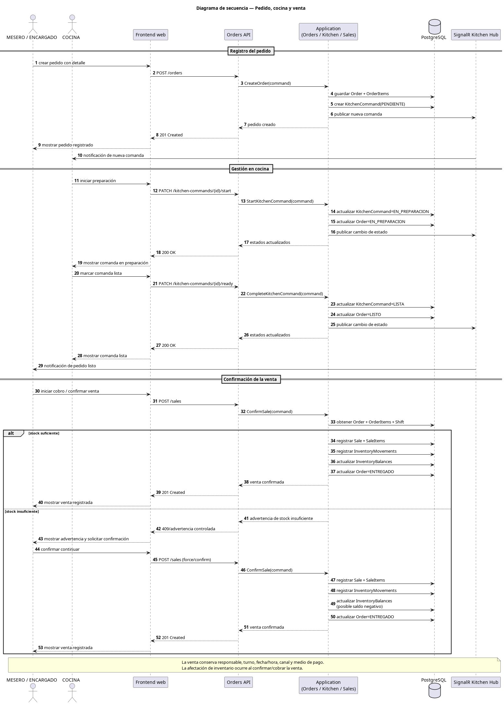
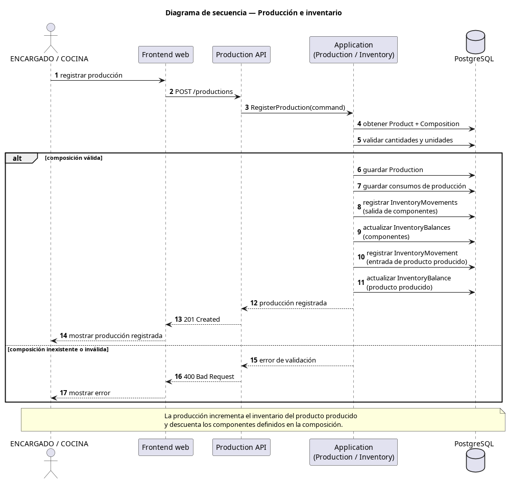
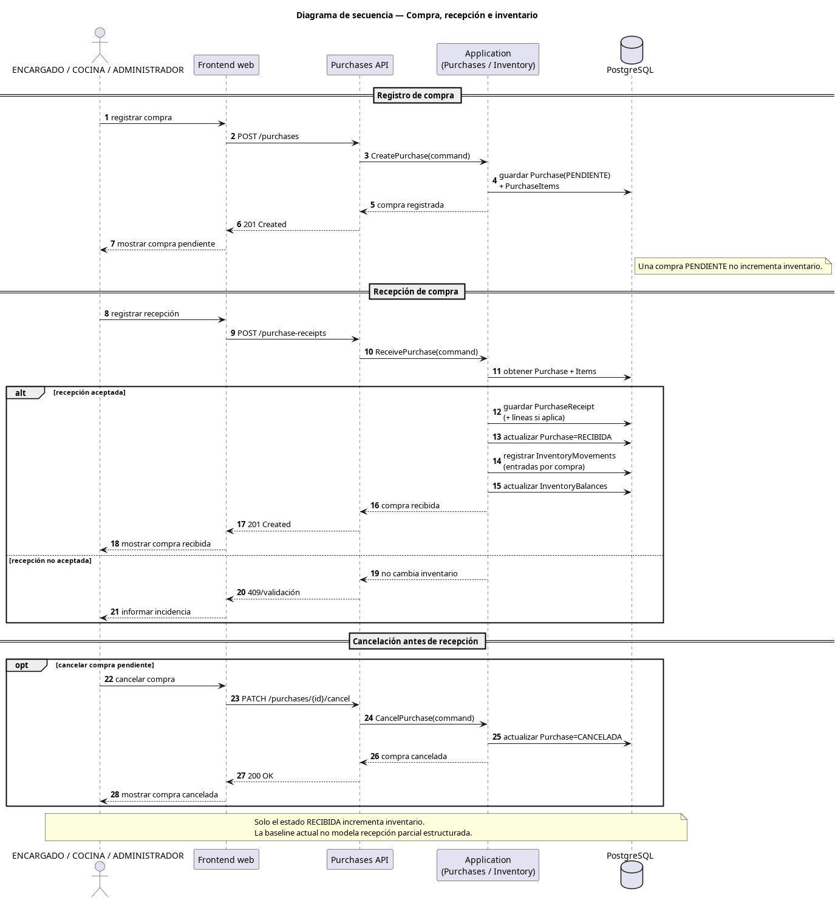
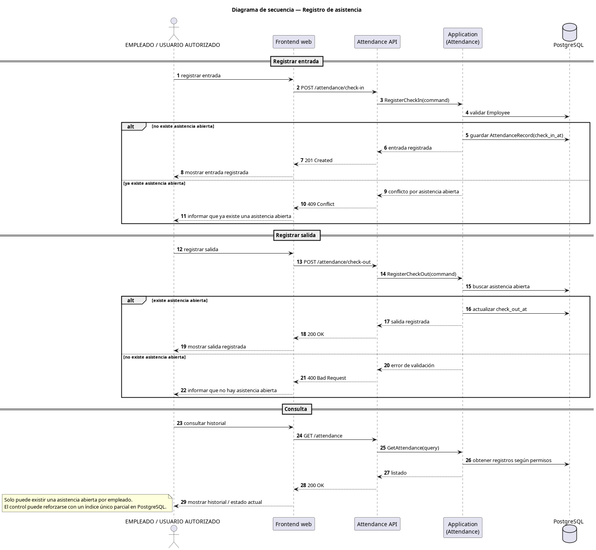
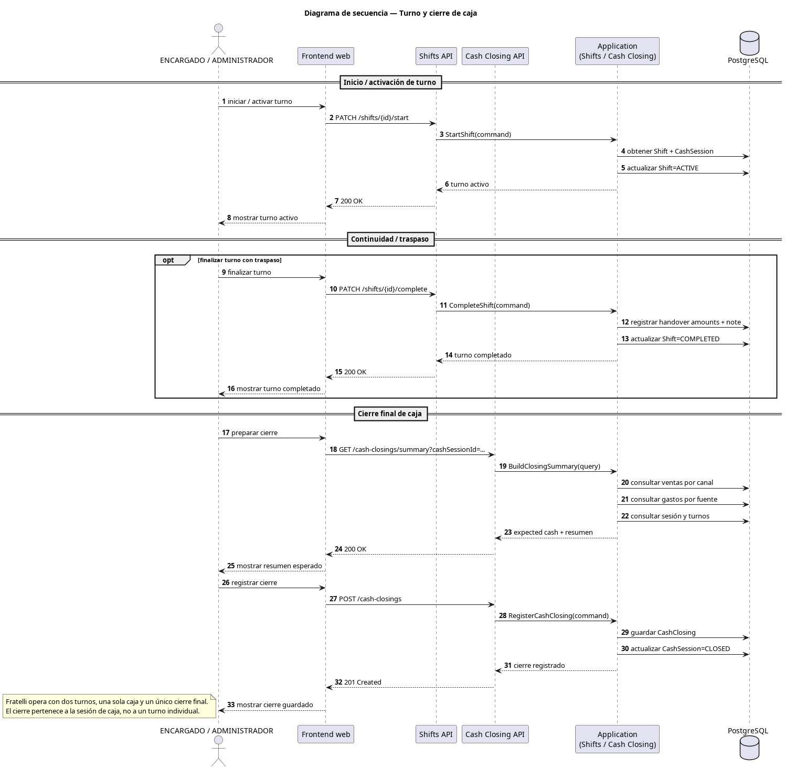
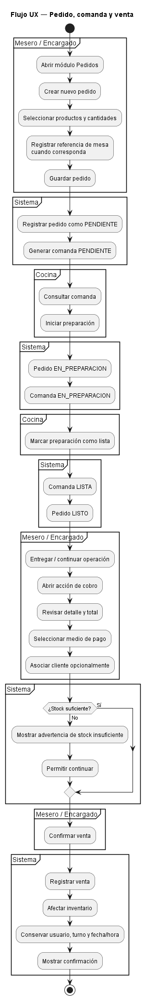
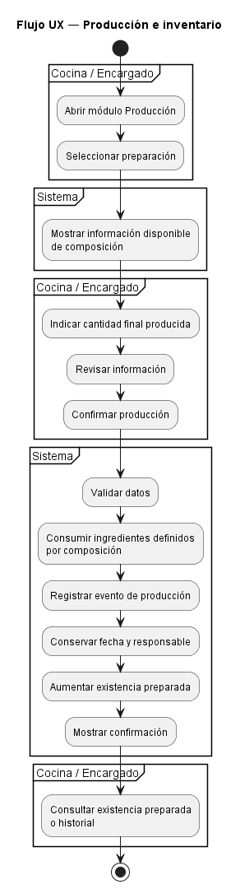
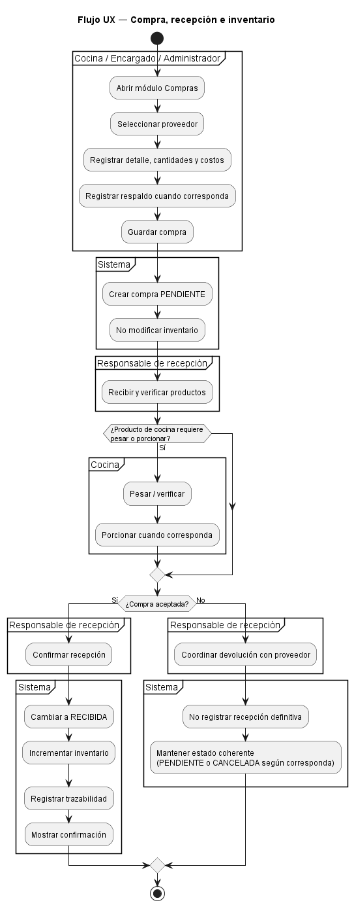
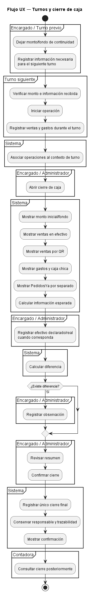
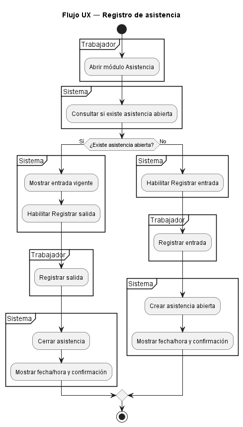

# 09 — UX y flujos

## 1. Propósito

Este documento define la experiencia de usuario funcional de **Restaurant System** para Fratelli. Conserva el diseño visual como guía de flujo; las decisiones técnicas vigentes se documentan en `10-arquitectura.md` y el estado de ejecución en las historias y sprints.

El objetivo es describir:

- cómo se organiza la navegación;
- qué módulos y pantallas principales existen;
- qué puede ver cada rol;
- cómo se conectan los procesos operativos;
- qué estados y mensajes debe comunicar la interfaz;
- cómo debe comportarse la aplicación en computadora, tablet y teléfono;
- qué decisiones UX deben conservar coherencia con los requisitos, reglas de negocio e historias de usuario existentes.

Este archivo trabaja sobre la baseline definida en:

```text
docs/05-alcance-y-mvp.md
docs/06-srs.md
docs/requirements/
docs/07-product-backlog.md
docs/08-scrum-y-refinamiento.md
```

No define todavía:

- arquitectura;
- framework frontend;
- backend;
- base de datos;
- librería visual;
- paleta de colores definitiva;
- tipografía definitiva;
- componentes técnicos concretos.

---

# 2. Principios de UX

La experiencia de usuario deberá seguir los siguientes principios.

## 2.1. Orientación a la operación

Restaurant System es una herramienta de trabajo.

Las acciones frecuentes deberán requerir la menor cantidad razonable de navegación, sin sacrificar:

- claridad;
- seguridad;
- confirmación de acciones críticas;
- trazabilidad.

---

## 2.2. Visibilidad según rol

El usuario deberá ver principalmente las funciones correspondientes a sus responsabilidades.

La interfaz no debe mostrar de forma prominente acciones que el usuario no puede realizar.

Cuando una persona posea varios roles, la navegación podrá reflejar la **unión de permisos** autorizados.

---

## 2.3. Estado visible

Los procesos operativos deberán comunicar claramente su estado.

Especialmente:

```text
Pedidos
Comandas
Compras
Asistencia
Turnos
Cierre
Inventario
```

Cuando exista un estado formal de negocio, la interfaz deberá representarlo de forma comprensible y consistente.

---

## 2.4. Acciones críticas explícitas

Acciones con impacto relevante deberán diferenciarse de acciones de consulta.

Ejemplos:

- confirmar venta;
- cancelar pedido;
- registrar baja de inventario;
- confirmar producción;
- marcar compra como recibida;
- registrar cierre.

Cuando corresponda, deberán requerir confirmación.

---

## 2.5. Diseño responsive

La aplicación será una **web responsive** utilizable desde:

- computadora;
- tablet;
- teléfono.

El viewport mínimo de referencia será:

```text
360 px de ancho
```

El responsive no consiste únicamente en reducir tamaños.

La interfaz podrá reorganizar:

- columnas;
- menús;
- tarjetas;
- tablas;
- paneles;
- botones;

siempre que conserve el flujo funcional.

---

## 2.6. Evitar complejidad no validada

No se diseñarán como parte del MVP funciones no confirmadas.

Por ejemplo, no se incorporará automáticamente:

- gestión completa de mesas;
- reservas;
- división de cuenta;
- fidelización;
- facturación fiscal;
- ventas a crédito;
- reportería avanzada;
- control avanzado de vencimientos;
- integración automática con PedidosYa.

---

# 3. Contexto de uso

Restaurant System será utilizado durante la operación cotidiana de Fratelli.

Esto implica contextos distintos.

## 3.1. Atención al cliente

Características:

- operación rápida;
- uso repetitivo;
- necesidad de consultar y registrar pedidos;
- necesidad de cobrar;
- posible uso desde equipos de tamaño reducido.

Roles principalmente relacionados:

```text
MESERO
ENCARGADO
ADMINISTRADOR
```

---

## 3.2. Cocina

Características:

- consulta frecuente de comandas;
- actualización rápida de estados;
- visualización clara a distancia razonable;
- menor necesidad de información financiera;
- necesidad de conocer stock o producción cuando corresponda.

Rol principal:

```text
COCINA
```

---

## 3.3. Administración

Características:

- mayor densidad de información;
- formularios;
- tablas;
- consultas;
- configuración;
- reportes;
- cierres;
- usuarios y roles.

Roles principalmente relacionados:

```text
ADMINISTRADOR
ENCARGADO
CONTADORA
```

---

## 3.4. Asistencia

Características:

- acción rápida;
- interfaz simple;
- mínima cantidad de pasos;
- confirmación clara de entrada o salida.

Roles:

```text
EMPLEADO
MESERO
COCINA
ENCARGADO
otros trabajadores autorizados
```

---

# 4. Perfiles de usuario

## 4.1. ADMINISTRADOR

Necesita acceso amplio a:

- usuarios;
- roles;
- productos;
- inventario;
- proveedores;
- compras;
- gastos;
- turnos;
- cierres;
- reportes;
- configuración autorizada.

Su interfaz puede ofrecer acceso a todos los módulos del MVP para los cuales posea permiso.

---

## 4.2. ENCARGADO

Perfil operativo-administrativo.

Necesita acceso frecuente a:

- productos;
- inventario;
- producción;
- proveedores;
- compras;
- gastos;
- turnos;
- caja;
- reportes;
- asistencia;
- pedidos/ventas cuando también ejerza esas funciones.

---

## 4.3. MESERO

Necesita principalmente:

- registrar pedidos;
- consultar sus pedidos;
- gestionar el flujo hacia venta;
- asociar cliente cuando corresponda;
- registrar medio de pago;
- consultar ventas dentro de su alcance;
- registrar asistencia.

No debe cargarse su interfaz con administración innecesaria.

---

## 4.4. COCINA

Necesita principalmente:

- ver comandas;
- cambiar estado de preparación;
- consultar insumos autorizados;
- registrar producción;
- consultar existencias preparadas;
- gestionar compras de cocina dentro de sus permisos;
- registrar asistencia.

La interfaz debe priorizar información operativa por encima de información contable.

---

## 4.5. CONTADORA

Necesita principalmente:

- consultar asistencia;
- revisar información administrativa;
- consultar cierres;
- acceder a reportes autorizados;
- consultar inventario cuando corresponda.

La nómina completa permanece fuera del MVP.

---

## 4.6. EMPLEADO

Perfil de acceso limitado.

Necesita principalmente:

- registrar entrada;
- registrar salida;
- consultar su asistencia cuando corresponda.

---

# 5. Estructura general de navegación

Se adopta una navegación basada en:

```text
Sidebar lateral
+
barra superior
+
dashboard inicial
```

---

# 6. Layout de escritorio

Conceptualmente:

```text
┌──────────────────────────────────────────────────────────────┐
│ Fratelli / Restaurant System                 Usuario / Rol   │
├────────────────┬─────────────────────────────────────────────┤
│                │                                             │
│ Inicio         │                                             │
│ Pedidos        │                                             │
│ Ventas         │               CONTENIDO                     │
│ Cocina         │                                             │
│ Inventario     │                                             │
│ Producción     │                                             │
│ Compras        │                                             │
│ Gastos         │                                             │
│ ...            │                                             │
│                │                                             │
└────────────────┴─────────────────────────────────────────────┘
```

La barra superior podrá contener información transversal, por ejemplo:

- identidad del producto;
- usuario autenticado;
- roles activos o contexto de permisos cuando sea útil;
- acceso a cerrar sesión.

No se define todavía su estilo visual.

---

# 7. Layout móvil

En pantallas pequeñas el sidebar se convierte en menú desplegable.

Conceptualmente:

```text
┌─────────────────────────────┐
│ ☰  Fratelli       Usuario   │
├─────────────────────────────┤
│                             │
│          CONTENIDO          │
│                             │
└─────────────────────────────┘
```

El menú no debe ocupar permanentemente una parte relevante del ancho de 360 px.

---

# 8. Dashboard adaptado por rol

Se confirma un Dashboard inicial adaptado según los permisos del usuario.

El Dashboard no constituye reportería avanzada.

Su propósito es:

- resumir información operativa ya disponible;
- mostrar situaciones que requieren atención;
- ofrecer accesos rápidos.

No debe introducir métricas nuevas que no existan en los requisitos o datos del MVP.

---

# 9. Dashboard — ADMINISTRADOR

Podrá priorizar accesos a:

- operación general;
- productos;
- inventario;
- compras;
- gastos;
- usuarios;
- turnos;
- cierres;
- reportes.

Puede mostrar resúmenes operativos permitidos, por ejemplo:

- pedidos activos;
- alertas de stock bajo;
- estado operativo de caja/turno cuando corresponda;
- accesos a reportes MVP.

No se fijan cifras o KPI adicionales en esta etapa.

---

# 10. Dashboard — ENCARGADO

Debe ser principalmente operativo.

Puede priorizar:

```text
Pedidos activos
Stock bajo
Producción
Compras pendientes
Gastos
Turno / caja
Accesos rápidos
```

Las tarjetas o indicadores deben navegar al módulo correspondiente.

---

# 11. Dashboard — MESERO

Puede priorizar:

- nuevo pedido;
- pedidos en curso dentro de su alcance;
- acción para continuar al cobro;
- ventas del turno dentro de su alcance;
- asistencia.

---

# 12. Dashboard — COCINA

Puede priorizar:

- comandas pendientes;
- comandas en preparación;
- acceso a producción;
- existencias preparadas;
- stock bajo autorizado;
- compras de cocina;
- asistencia.

---

# 13. Dashboard — CONTADORA

Puede priorizar:

- asistencia;
- cierres para consulta;
- reportes autorizados;
- inventario cuando corresponda.

---

# 14. Dashboard — EMPLEADO

Debe ser mínimo.

Puede priorizar:

```text
Registrar entrada / salida
Consultar mi asistencia
```

No debe mostrar módulos administrativos no disponibles.

---

# 15. Módulos principales

La navegación conceptual del MVP se compone de los siguientes módulos:

| Módulo           | Propósito principal                          |
| ---------------- | -------------------------------------------- |
| Inicio           | Dashboard contextual por rol                 |
| Pedidos          | Registrar y seguir pedidos                   |
| Ventas           | Cobrar, confirmar y consultar ventas         |
| Cocina           | Gestionar comandas                           |
| Productos        | Gestionar productos, ingredientes y platos   |
| Inventario       | Existencias, movimientos, bajas y stock bajo |
| Producción       | Registrar y consultar producción             |
| Proveedores      | Gestionar proveedores                        |
| Compras          | Registrar, recibir y consultar compras       |
| Gastos           | Registrar y consultar gastos                 |
| Clientes         | Gestionar clientes básicos                   |
| Asistencia       | Entrada, salida y consultas                  |
| Turnos / Caja    | Operación de turno y cierre                  |
| Reportes         | Ventas, inventario y asistencia              |
| Usuarios / Roles | Administración de acceso                     |

El menú real deberá ocultar o deshabilitar los módulos no autorizados.

---

# 16. Mapa conceptual de navegación

```text
Inicio
│
├── Pedidos
│   └── Pedido
│       ├── Comanda
│       └── Continuar a venta
│
├── Ventas
│   ├── Confirmar/cobrar
│   └── Historial autorizado
│
├── Cocina
│   └── Comandas
│
├── Productos
│   └── Composición
│
├── Inventario
│   ├── Existencias
│   ├── Movimientos
│   ├── Bajas
│   └── Stock bajo
│
├── Producción
│   ├── Registrar
│   └── Historial
│
├── Proveedores
│
├── Compras
│   ├── Registrar
│   ├── Recibir
│   └── Historial
│
├── Gastos
│
├── Clientes
│
├── Asistencia
│
├── Turnos / Caja
│   ├── Operación
│   ├── Resumen esperado
│   └── Cierre
│
├── Reportes
│
└── Usuarios / Roles
```

---

# 17. Referencia de mesa en pedido

Se adopta una referencia simple de mesa dentro del pedido.

Esta decisión **no implica gestión completa de mesas**.

El MVP podrá permitir que un pedido conserve una referencia que identifique la mesa cuando corresponda.

Ejemplo conceptual:

```text
Mesa: [ referencia ]
```

No se incorpora:

- mapa del salón;
- CRUD de mesas;
- ocupación automática;
- reservas;
- transferencia de mesa;
- combinación de mesas;
- división de cuenta por mesa.

La referencia tiene únicamente valor operativo para identificar dónde corresponde el pedido.

La obligatoriedad exacta y el formato del dato deberán definirse durante el refinamiento técnico de `HU-009` / `RF-025`.

---

# 18. Pedidos y ventas como módulos separados pero conectados

Se confirma el enfoque:

```text
PEDIDO
→ captura de lo solicitado
→ seguimiento operativo
→ cocina
→ listo
→ continuar a cobro

VENTA
→ información económica
→ cliente opcional
→ medio de pago
→ confirmación
→ afectación definitiva de inventario
```

No se fusionarán conceptualmente.

Tampoco se obligará al usuario a navegar manualmente de forma innecesaria entre módulos.

Desde un pedido que pueda continuar a cobro debe existir una acción clara como:

```text
Cobrar / continuar a venta
```

El texto final del botón se definirá durante diseño visual.

---

# 19. Pantalla de pedidos

Debe permitir, según permisos:

- crear pedido;
- agregar productos/platos;
- indicar cantidades;
- conservar referencia de mesa cuando corresponda;
- registrar observaciones operativas si la historia/requisito lo permite;
- consultar estado;
- enviar/generar comanda;
- cancelar mientras la regla lo permita;
- continuar a venta cuando corresponda.

---

# 20. Estados de pedido

Los estados son:

```text
PENDIENTE
EN_PREPARACION
LISTO
ENTREGADO
CANCELADO
```

La interfaz deberá:

- mostrar el estado de manera clara;
- impedir transiciones no permitidas;
- comunicar cuándo la cancelación ya no está disponible.

El color podrá ayudar, pero no será el único mecanismo.

También deberá utilizarse:

- texto;
- etiqueta;
- icono cuando aporte claridad.

---

# 21. Cancelación de pedido

La cancelación ordinaria solo es válida antes de:

```text
Pedido = LISTO
o
Comanda = LISTA
```

La interfaz deberá evitar presentar el botón de cancelación como disponible cuando la acción ya no sea válida.

Cuando sea válida, deberá solicitar confirmación.

Ejemplo conceptual:

```text
¿Cancelar este pedido?

Esta acción cambiará el pedido y su comanda asociada a estado cancelado.

[Volver] [Confirmar cancelación]
```

El texto exacto se definirá posteriormente.

---

# 22. Cocina — enfoque KDS/Kanban

La pantalla de cocina utilizará un enfoque visual tipo KDS/Kanban.

Columnas principales:

```text
PENDIENTE
EN PREPARACIÓN
LISTA
```

Conceptualmente:

```text
┌────────────────┬────────────────┬────────────────┐
│ PENDIENTE      │ EN PREPARACIÓN │ LISTA          │
│                │                │                │
│ ┌────────────┐ │ ┌────────────┐ │ ┌────────────┐ │
│ │ Pedido     │ │ │ Pedido     │ │ │ Pedido     │ │
│ │ Mesa ref.  │ │ │ Mesa ref.  │ │ │ Mesa ref.  │ │
│ │ Productos  │ │ │ Productos  │ │ │ Productos  │ │
│ └────────────┘ │ └────────────┘ │ └────────────┘ │
└────────────────┴────────────────┴────────────────┘
```

`CANCELADA` no necesita funcionar como una columna principal activa.

Puede tratarse como:

- registro histórico;
- filtro;
- estado fuera del flujo activo.

---

# 23. Tarjeta de comanda

Una tarjeta debe priorizar información operativa.

Puede incluir, cuando exista:

- identificador de pedido/comanda;
- referencia de mesa;
- hora;
- productos;
- cantidades;
- observaciones relevantes;
- estado.

No debe mostrar información financiera innecesaria para Cocina.

---

# 24. Cambio de estado de comanda

El cambio de estado debe ser rápido.

Flujo conceptual:

```text
PENDIENTE
   ↓
Iniciar preparación
   ↓
EN_PREPARACION
   ↓
Marcar lista
   ↓
LISTA
```

La interfaz debe evitar cambios accidentales.

La técnica exacta puede ser:

- botón;
- acción contextual;
- drag & drop;

pero no se fija todavía.

Para dispositivos táctiles se deberá evitar depender exclusivamente de arrastrar.

---

# 25. Responsive de cocina

En escritorio o tablet amplia puede utilizarse el Kanban multicolumna.

En móvil se permitirá reorganizar la vista.

Por ejemplo:

```text
Filtro de estado
+
lista vertical de comandas
```

No se obliga a comprimir tres columnas dentro de 360 px.

---

# 26. Flujo UX pedido → venta

Resumen:

```text
MESERO
  ↓
Nuevo pedido
  ↓
Selecciona productos
  ↓
Referencia de mesa opcional
  ↓
Registra pedido
  ↓
Se genera comanda
  ↓
COCINA
  ↓
PENDIENTE
  ↓
EN_PREPARACION
  ↓
LISTA
  ↓
Pedido LISTO
  ↓
Entrega / continuidad operativa
  ↓
Cobrar
  ↓
Seleccionar medio de pago
  ↓
Cliente opcional
  ↓
Confirmar venta
  ↓
Afectación de inventario
```

Diagrama editable:

```text
docs/puml/flujo-ux-pedido-venta.puml
```

La secuencia complementa este recorrido UX: describe el intercambio temporal entre frontend, API, aplicación, persistencia y SignalR; no reemplaza el flujo de interacción del usuario.



> **Fuente editable:** [`puml/diagrama-secuencia-pedido-cocina-venta.puml`](puml/diagrama-secuencia-pedido-cocina-venta.puml)

---

# 27. Pantalla de venta

La pantalla de cobro deberá priorizar:

- pedido relacionado cuando exista;
- detalle;
- cantidades;
- precios;
- total;
- cliente opcional;
- medio de pago;
- advertencias;
- confirmación.

La confirmación de venta es una acción crítica.

---

# 28. Stock insuficiente durante venta

Si existe stock insuficiente:

```text
Advertencia visible
        ↓
El usuario comprende la situación
        ↓
Puede continuar
        ↓
Confirmación de venta
```

La advertencia no debe bloquear la venta.

Ejemplo conceptual:

```text
Stock insuficiente

La cantidad disponible es menor que la requerida.
La venta puede continuar y el inventario quedará negativo.

[Volver] [Continuar]
```

---

# 29. Clientes

La asociación de cliente es opcional.

La UX deberá permitir:

```text
Venta sin cliente
```

sin generar fricción artificial.

Cuando se desee asociar:

- buscar cliente;
- seleccionar existente;
- crear cliente básico cuando el flujo lo permita.

No se incorpora crédito.

---

# 30. Productos

El módulo deberá diferenciar conceptualmente:

- productos;
- ingredientes;
- platos/preparaciones.

La interfaz debe evitar que el usuario confunda:

```text
producto vendido
```

con:

```text
ingrediente consumido
```

cuando la distinción sea relevante.

---

# 31. Composición

La pantalla de composición deberá permitir relacionar una preparación/plato con sus ingredientes y cantidades.

Debe comunicar:

- ingrediente;
- cantidad;
- unidad;
- relación con la preparación.

No se define todavía el componente UI concreto.

---

# 32. Inventario

El módulo deberá ofrecer acceso a:

- existencias;
- movimientos;
- entradas;
- bajas/salidas;
- stock bajo;
- historial relevante.

---

# 33. Estado de stock bajo

El stock bajo deberá ser reconocible sin depender exclusivamente del color.

Ejemplo:

```text
⚠ Stock bajo
```

La interfaz podrá utilizar:

- badge;
- icono;
- texto;
- resaltado.

---

# 34. Baja de inventario

Una baja relevante requiere motivo.

Flujo UX:

```text
Seleccionar producto/ingrediente
        ↓
Indicar cantidad
        ↓
Indicar motivo
        ↓
Confirmar baja
        ↓
Movimiento registrado
```

La interfaz deberá informar que la acción modifica inventario.

---

# 35. Producción

La pantalla de producción deberá permitir:

- seleccionar preparación;
- visualizar composición necesaria cuando aporte valor;
- indicar cantidad final producida;
- confirmar producción;
- conservar responsable autenticado;
- consultar registros previos.

La evidencia existente también menciona firma del responsable como parte del proceso actual, pero la captura de firma no se incorpora automáticamente al MVP.

---

# 36. Flujo UX producción → inventario

```text
COCINA / ENCARGADO
        ↓
Selecciona preparación
        ↓
Indica cantidad final
        ↓
Revisa información
        ↓
Confirma producción
        ↓
Sistema consume ingredientes
        ↓
Registra evento de producción
        ↓
Aumenta existencia preparada
```

No se requiere elegir lote durante la venta.

Diagrama editable:

```text
docs/puml/flujo-ux-produccion-inventario.puml
```

La secuencia detalla la confirmación y la actualización coordinada de producción e inventario que el flujo UX presenta desde la perspectiva operativa.



> **Fuente editable:** [`puml/diagrama-secuencia-produccion-inventario.puml`](puml/diagrama-secuencia-produccion-inventario.puml)

---

# 37. Historial de producción

Debe permitir consultar registros de producción.

Cada evento conserva su trazabilidad aunque la cantidad disponible se consolide.

La pantalla puede mostrar, según los datos definidos:

- fecha;
- preparación;
- cantidad;
- responsable.

No se fija todavía estructura de tabla definitiva.

---

# 38. Proveedores

El módulo debe permitir:

- registrar;
- editar;
- consultar;
- seleccionar proveedor durante compra.

No se incorpora cuentas por pagar avanzada.

---

# 39. Compras

La UX deberá diferenciar:

```text
Compra registrada
```

de:

```text
Compra recibida
```

Estados:

```text
PENDIENTE
RECIBIDA
CANCELADA
```

---

# 40. Registrar compra

La pantalla deberá recoger la información necesaria para la compra, incluyendo:

- proveedor;
- fecha;
- detalle;
- cantidades;
- costos;
- total;
- responsable;
- respaldo cuando corresponda.

No se define en este documento si el respaldo será:

- archivo;
- número;
- referencia;
- observación;

porque esa decisión pertenece al diseño técnico/refinamiento correspondiente.

---

# 41. Recibir compra

Flujo conceptual:

```text
Compra PENDIENTE
      ↓
Verificar recepción
      ↓
si corresponde, pesar/porcionar
      ↓
Confirmar recepción
      ↓
Compra RECIBIDA
      ↓
Incrementar inventario
```

Si no se acepta:

```text
coordinar devolución
+
no marcar como RECIBIDA
```

---

# 42. Compra incompleta

La recepción parcial estructurada está fuera de la baseline del MVP.

Por tanto, la interfaz no necesita diseñar un flujo avanzado de:

- cantidades parciales;
- backorders;
- líneas parcialmente recibidas.

Si la compra no puede aceptarse, no debe presentarse como recepción completa.

---

# 43. Flujo UX compra → recepción → inventario

Diagrama editable:

```text
docs/puml/flujo-ux-compra-recepcion.puml
```

La secuencia aclara que registrar una compra no altera inventario y que la recepción aceptada es la operación que actualiza sus saldos.



> **Fuente editable:** [`puml/diagrama-secuencia-compra-recepcion-inventario.puml`](puml/diagrama-secuencia-compra-recepcion-inventario.puml)

---

# 44. Gastos

La pantalla deberá permitir registrar de forma directa:

- fecha;
- detalle;
- monto;
- responsable;
- clasificación básica;
- relación con turno cuando corresponda.

El formulario debe priorizar rapidez sin eliminar trazabilidad.

---

# 45. Asistencia

La interfaz de asistencia debe ser una de las más simples del sistema.

Cuando el trabajador no tiene asistencia abierta:

```text
[Registrar entrada]
```

Cuando tiene asistencia abierta:

```text
Entrada registrada: [hora]

[Registrar salida]
```

No se debe permitir una nueva entrada mientras exista una abierta.

---

# 46. Confirmación de asistencia

Después de registrar entrada o salida, el sistema deberá comunicar:

- acción realizada;
- fecha/hora registrada;
- estado actual.

No debe depender únicamente de que el botón cambie.

---

# 47. Consulta de asistencia

Según permisos:

```text
EMPLEADO
→ propia asistencia

MESERO / COCINA / otros
→ propia asistencia

CONTADORA / ENCARGADO / ADMINISTRADOR
→ alcance administrativo autorizado
```

---

# 48. Flujo UX de asistencia

```text
Usuario
  ↓
Asistencia
  ↓
¿Existe asistencia abierta?
  ├── No → Registrar entrada
  │          ↓
  │       Entrada confirmada
  │
  └── Sí → Registrar salida
             ↓
          Salida confirmada
```

Diagrama editable:

```text
docs/puml/flujo-ux-asistencia.puml
```

La secuencia muestra la validación de una única asistencia abierta y las respuestas de éxito o conflicto que sostienen este recorrido UX.



> **Fuente editable:** [`puml/diagrama-secuencia-asistencia.puml`](puml/diagrama-secuencia-asistencia.puml)

---

# 49. Turnos y caja

Fratelli utiliza:

```text
2 turnos
+
1 caja compartida
+
1 cierre final
```

La UX no debe representar dos cajas independientes.

---

# 50. Inicio/continuidad de turno

Las personas conocen su turno.

El encargado deja un monto/fondo que sirve como punto de partida para el turno siguiente.

La interfaz deberá permitir representar la continuidad operativa sin obligar a realizar un cierre completo entre ambos turnos.

---

# 51. Resumen entre turnos

La continuidad puede mostrar información como:

- monto/fondo;
- efectivo registrado;
- QR;
- PedidosYa;
- observaciones;
- otros datos permitidos por el MVP.

La evidencia del proceso actual menciona crédito, pero no se incorpora como capacidad del MVP.

---

# 52. Preparar información de cierre

La pantalla de cierre deberá mostrar de forma separada al menos:

- monto inicial/fondo;
- ventas en efectivo;
- ventas por QR;
- otros medios registrados;
- gastos;
- caja chica;
- PedidosYa separado;
- efectivo esperado;
- efectivo real/declarado cuando corresponda;
- diferencia;
- observación.

La interfaz debe facilitar comparación.

---

# 53. PedidosYa

En UX, PedidosYa se representa como canal/control separado.

No debe mezclarse visualmente con:

```text
Efectivo
QR
```

como si fuese necesariamente un medio de pago equivalente.

Esto no implica integración automática con PedidosYa.

---

# 54. Diferencia de caja

Si existe diferencia:

```text
Esperado ≠ declarado/real
```

la interfaz debe:

- mostrar la diferencia;
- permitir observación;
- conservar trazabilidad.

No se define un flujo contable adicional.

---

# 55. Registrar cierre

La acción de cierre deberá ser explícita.

Usuarios autorizados:

- ENCARGADO;
- ADMINISTRADOR;
- otros usuarios únicamente si poseen uno de esos roles.

La CONTADORA puede revisar posteriormente, pero su aprobación no es necesaria para cerrar.

---

# 56. Confirmación de cierre

Antes de confirmar:

```text
Resumen
+
diferencias
+
observaciones
+
responsable
```

Después de confirmar:

```text
Cierre registrado
```

La interfaz deberá evitar que el usuario interprete una simple visualización como un cierre ya guardado.

---

# 57. Flujo UX turno → cierre

Diagrama editable:

```text
docs/puml/flujo-ux-turno-cierre.puml
```

La secuencia distingue activación y traspaso de turno del cierre definitivo de la sesión de caja compartida.



> **Fuente editable:** [`puml/diagrama-secuencia-turno-cierre.puml`](puml/diagrama-secuencia-turno-cierre.puml)

---

# 58. Reportes

El MVP contempla:

```text
Ventas
Inventario
Asistencia
```

La pantalla de reportes podrá utilizar:

- filtros;
- tablas;
- resúmenes básicos;
- exportación únicamente si existe requisito posterior.

No se diseñará reportería avanzada en este documento.

---

# 59. Reporte de ventas

Debe respetar permisos.

Especialmente, cuando aplique:

```text
MESERO
→ ventas de su alcance/turno
```

mientras roles administrativos podrán poseer un alcance superior.

---

# 60. Reporte de inventario

Debe permitir visualizar al menos:

- existencias;
- stock bajo;
- movimientos relevantes cuando corresponda.

---

# 61. Reporte de asistencia

Debe permitir consultar información según alcance autorizado.

La nómina permanece fuera del MVP.

---

# 62. Usuarios y roles

El módulo administrativo debe permitir:

- cuentas;
- roles;
- múltiples roles;
- permisos derivados.

La interfaz deberá dejar claro que:

```text
usuario
puede poseer
más de un rol
```

---

# 63. Visibilidad por permisos

La navegación debe adaptarse a permisos efectivos.

Se prefiere:

```text
no mostrar acciones no autorizadas
```

frente a:

```text
mostrar muchas acciones que siempre terminan en error
```

Sin embargo, la seguridad real deberá aplicarse también fuera de la interfaz.

Ocultar un botón no sustituye autorización en backend.

---

# 64. Estado de carga

Cuando una acción o consulta requiera espera perceptible, debe existir feedback.

Ejemplos:

```text
Cargando comandas…
Guardando compra…
Registrando cierre…
```

No se deberá permitir que el usuario interprete una operación en curso como fallida por ausencia de respuesta visual.

---

# 65. Estado vacío

Cada módulo debe definir un estado vacío comprensible.

Ejemplos conceptuales:

```text
No hay comandas pendientes.
```

```text
No existen compras para los filtros seleccionados.
```

```text
No se encontraron movimientos.
```

Cuando el usuario tenga permiso para crear el primer elemento, el estado vacío podrá ofrecer una acción.

---

# 66. Estado de éxito

Las operaciones relevantes deberán confirmar su resultado.

Ejemplos:

```text
Venta confirmada.
Compra registrada.
Compra recibida.
Entrada registrada.
Cierre registrado.
```

No se fija todavía el mecanismo visual exacto:

- toast;
- banner;
- mensaje inline;

pero debe existir feedback.

---

# 67. Estado de error

Un mensaje de error deberá indicar, en lenguaje comprensible:

- qué acción no pudo completarse;
- si el usuario puede intentar nuevamente;
- qué debe corregir cuando sea un error de validación.

Evitar mensajes únicamente técnicos como:

```text
500
SQL error
NullReference
```

para usuarios finales.

---

# 68. Errores de validación

Los errores de formulario deben mostrarse cerca del campo cuando sea razonable.

Ejemplo:

```text
Cantidad
[      ]

La cantidad debe ser mayor a cero.
```

No se deberán borrar los demás datos válidos del formulario innecesariamente.

---

# 69. Sin permisos

Si un usuario intenta acceder a una función no autorizada:

```text
Acceso no autorizado
```

La interfaz deberá:

- explicar que no posee permisos;
- ofrecer una salida segura;
- evitar mostrar información protegida.

---

# 70. Confirmaciones

Las confirmaciones se reservarán para acciones con consecuencias importantes.

No se debe solicitar confirmación para cada clic.

Casos especialmente relevantes:

- cancelar pedido;
- confirmar venta;
- registrar baja;
- confirmar recepción;
- confirmar producción;
- registrar cierre;
- cambios administrativos sensibles cuando corresponda.

---

# 71. Prevención de doble envío

Acciones críticas deberán evitar ejecución duplicada por:

- doble clic;
- múltiples taps;
- reintentos accidentales.

La UX podrá:

- deshabilitar temporalmente el botón;
- mostrar estado de guardado;
- impedir una segunda confirmación mientras la primera está en proceso.

La solución técnica se definirá posteriormente.

---

# 72. Tablas y listas

En escritorio podrán utilizarse tablas para información administrativa.

En móvil se deberá evaluar:

- scroll horizontal controlado;
- tarjetas;
- filas resumidas expandibles;
- priorización de columnas.

No se debe comprimir una tabla ancha hasta volverla ilegible.

---

# 73. Formularios

Principios:

- etiquetas visibles;
- orden lógico;
- campos relacionados agrupados;
- acciones principales claras;
- validación cercana al campo;
- valores por defecto únicamente cuando sean seguros;
- no solicitar datos fuera del alcance.

---

# 74. Accesibilidad básica

La interfaz deberá considerar:

- contraste legible;
- texto comprensible;
- áreas táctiles razonables;
- foco visible cuando se navegue con teclado;
- etiquetas para controles;
- no depender exclusivamente del color;
- iconos acompañados de texto cuando su significado no sea evidente.

No se declara conformidad formal con una norma específica en esta etapa.

---

# 75. Responsive — criterios funcionales

## 75.1. Navegación

Escritorio:

```text
Sidebar visible
```

Móvil:

```text
Sidebar ocultable / drawer
```

---

## 75.2. Dashboard

Escritorio:

```text
varias tarjetas por fila
```

Móvil:

```text
una o pocas tarjetas por fila
```

según ancho disponible.

---

## 75.3. Cocina

Escritorio/tablet:

```text
Kanban multicolumna
```

Móvil:

```text
estado seleccionado
+
lista vertical
```

---

## 75.4. Formularios

Los formularios deberán adaptarse a una columna cuando el ancho no permita mantener varias sin afectar lectura.

---

## 75.5. Acciones

Los botones críticos deben permanecer accesibles sin superposiciones ni texto ilegible.

---

# 76. Wireframes funcionales

Los siguientes wireframes son conceptuales.

No representan diseño visual final.

---

## 76.1. Dashboard

```text
┌───────────────────────────────────────────────────────┐
│ Inicio                                                │
│ Resumen operativo                                     │
├──────────────────┬──────────────────┬─────────────────┤
│ Estado / acceso  │ Estado / acceso  │ Estado / acceso │
├──────────────────┴──────────────────┴─────────────────┤
│ Acciones frecuentes                                   │
│ [Acción] [Acción] [Acción]                            │
└───────────────────────────────────────────────────────┘
```

---

## 76.2. Pedido

```text
┌────────────────────────────────────────────────────────┐
│ Nuevo pedido                                           │
├──────────────────────────────┬─────────────────────────┤
│ Buscar / seleccionar         │ Pedido actual           │
│ productos                    │                         │
│                              │ Producto   Cantidad     │
│                              │ ...                     │
│                              │                         │
│                              │ Mesa: [ referencia ]    │
│                              │                         │
│                              │ [Guardar / continuar]   │
└──────────────────────────────┴─────────────────────────┘
```

En móvil, ambos paneles podrán apilarse.

---

## 76.3. Cocina

```text
┌───────────────────────────────────────────────────────────┐
│ Cocina                                                    │
├───────────────────┬───────────────────┬───────────────────┤
│ PENDIENTE         │ EN PREPARACIÓN    │ LISTA             │
│                   │                   │                   │
│ [Comanda]         │ [Comanda]         │ [Comanda]         │
│ [Comanda]         │ [Comanda]         │                   │
└───────────────────┴───────────────────┴───────────────────┘
```

---

## 76.4. Cierre

```text
┌────────────────────────────────────────────────────┐
│ Cierre de caja                                     │
├────────────────────────────────────────────────────┤
│ Monto inicial                ...                   │
│ Ventas efectivo              ...                   │
│ Ventas QR                    ...                   │
│ Gastos                       ...                   │
│ Caja chica                   ...                   │
│ PedidosYa                    ...                   │
├────────────────────────────────────────────────────┤
│ Efectivo esperado            ...                   │
│ Efectivo declarado           [          ]          │
│ Diferencia                   ...                   │
│ Observación                  [                ]    │
├────────────────────────────────────────────────────┤
│                         [Registrar cierre]         │
└────────────────────────────────────────────────────┘
```

---

# 77. Diagramas UX

Los cinco flujos UX conservan el recorrido usuario–sistema y se muestran una única vez en la sección siguiente. Las secuencias ubicadas junto a cada flujo operativo son complementarias: explican la interacción temporal entre participantes técnicos y no sustituyen estos recorridos.

Se utilizarán cinco diagramas principales:

```text
docs/puml/flujo-ux-pedido-venta.puml
docs/puml/flujo-ux-produccion-inventario.puml
docs/puml/flujo-ux-compra-recepcion.puml
docs/puml/flujo-ux-turno-cierre.puml
docs/puml/flujo-ux-asistencia.puml
```

Las imágenes renderizadas deberán ubicarse en:

```text
docs/images/
```

con nombres equivalentes:

```text
flujo-ux-pedido-venta.png
flujo-ux-produccion-inventario.png
flujo-ux-compra-recepcion.png
flujo-ux-turno-cierre.png
flujo-ux-asistencia.png
```

---

# 78. Diagramas



> **Fuente editable:** [`puml/flujo-ux-pedido-venta.puml`](puml/flujo-ux-pedido-venta.puml)

---



> **Fuente editable:** [`puml/flujo-ux-produccion-inventario.puml`](puml/flujo-ux-produccion-inventario.puml)

---



> **Fuente editable:** [`puml/flujo-ux-compra-recepcion.puml`](puml/flujo-ux-compra-recepcion.puml)

---



> **Fuente editable:** [`puml/flujo-ux-turno-cierre.puml`](puml/flujo-ux-turno-cierre.puml)

---



> **Fuente editable:** [`puml/flujo-ux-asistencia.puml`](puml/flujo-ux-asistencia.puml)

---

# 79. Trazabilidad UX principal

| Área UX        | HU principales                         |
| -------------- | -------------------------------------- |
| Autenticación  | `HU-001`                               |
| Usuarios/roles | `HU-002`                               |
| Productos      | `HU-003`, `HU-004`                     |
| Inventario     | `HU-005`, `HU-006`, `HU-013`, `HU-030` |
| Producción     | `HU-007`, `HU-008`                     |
| Pedidos        | `HU-009`, `HU-011`                     |
| Cocina         | `HU-010`                               |
| Ventas         | `HU-012`, `HU-013`, `HU-015`           |
| Clientes       | `HU-014`                               |
| Proveedores    | `HU-016`                               |
| Compras        | `HU-017`, `HU-018`, `HU-019`           |
| Gastos         | `HU-020`, `HU-021`                     |
| Asistencia     | `HU-022`, `HU-023`, `HU-024`, `HU-031` |
| Turnos/caja    | `HU-025`, `HU-026`, `HU-027`, `HU-028` |
| Reportes       | `HU-029`, `HU-030`, `HU-031`           |

---

# 80. Referencia de mesa y trazabilidad

La decisión de incorporar una referencia simple a mesa se relaciona principalmente con:

```text
HU-009 — Registrar y gestionar pedidos
RF-025 — Registrar pedido
```

Esta decisión deberá propagarse a los documentos de requisitos si durante la siguiente revisión de consistencia se decide formalizarla como dato del pedido.

Mientras tanto se mantiene explícitamente como:

```text
Decisión UX aprobada
+
sin gestión completa de mesas
```

---

# 81. Decisiones UX confirmadas

## UX-DEC-001

```text
Navegación principal:
Sidebar lateral
+
barra superior
```

---

## UX-DEC-002

```text
Pantalla inicial:
Dashboard adaptado al rol/permisos
```

---

## UX-DEC-003

```text
Cocina:
Vista tipo KDS/Kanban
```

---

## UX-DEC-004

```text
Pedidos y ventas:
Módulos separados
+
conectados mediante continuidad operativa
```

---

## UX-DEC-005

```text
Mesas:
Referencia simple dentro del pedido
```

Sin gestión completa de mesas.

---

## UX-DEC-006

```text
Diagramas UX:
5 flujos principales en PlantUML
```

---

# 82. Aspectos deliberadamente pendientes

Este documento no decide aún:

- colores;
- tipografía;
- iconografía final;
- dimensiones exactas;
- framework de componentes;
- rutas URL;
- API;
- modelo relacional;
- estructura técnica del frontend;
- estrategia exacta de drag & drop en cocina;
- formato técnico de referencia de mesa;
- mecanismo técnico de archivos/recibos;
- navegadores concretos soportados.

Estas decisiones deberán tomarse en los documentos correspondientes o durante implementación.

---

# 83. Criterios para prototipos posteriores

Si se crean prototipos visuales, deberán cubrir como mínimo pantallas de alto impacto:

- login;
- dashboard;
- pedido;
- venta;
- cocina/KDS;
- inventario;
- producción;
- compra/recepción;
- asistencia;
- turno/cierre.

Los prototipos deberán representar también:

- carga;
- error;
- vacío;
- confirmación;
- responsive.

No se requiere que todas las pantallas tengan un prototipo de alta fidelidad antes de comenzar a definir arquitectura.

---

# 84. Coherencia con Scrum

Las decisiones UX de este documento sirven como insumo para refinamiento.

Una historia podrá requerir ajustes UX durante Sprint Planning o implementación.

Si un cambio modifica comportamiento funcional:

```text
UX cambia
    ↓
revisar HU
    ↓
revisar RF/RN
    ↓
actualizar criterios
```

No se tratará un cambio funcional como si fuera únicamente visual.

---

# 85. Próximo paso documental

Después de esta baseline UX y de flujos, el proyecto podrá avanzar hacia la definición de arquitectura.

La secuencia queda:

```text
09-ux-y-flujos.md
        ↓
10-arquitectura.md
        ↓
11-modelo-datos.md
        ↓
seguridad / pruebas / trazabilidad
        ↓
Sprint Planning
        ↓
implementación
```

Antes de programar una historia, deberá continuar cumpliéndose la Definition of Ready definida en `08-scrum-y-refinamiento.md`.

---

# 86. Control de cambios

| Versión | Descripción                                                                                                                     | Estado  |
| ------- | ------------------------------------------------------------------------------------------------------------------------------- | ------- |
| `0.1`   | Baseline UX: sidebar, dashboard por rol, KDS/Kanban, separación pedido/venta, referencia simple de mesa y cinco flujos PlantUML | Vigente |
