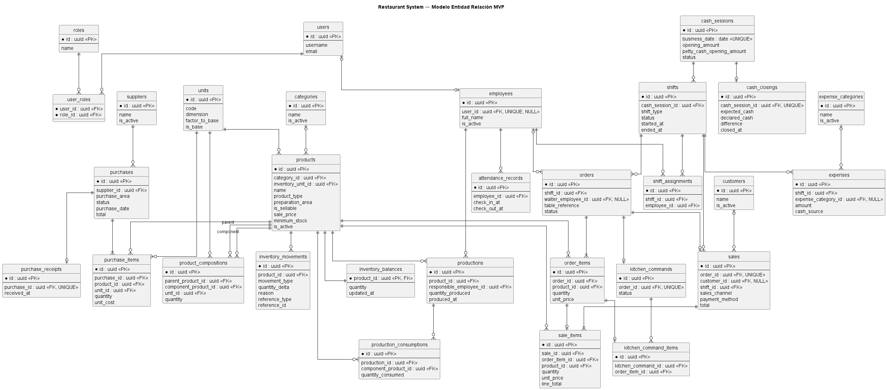

# 11 — Modelo de datos

## 1. Propósito

Este documento define la baseline lógica y relacional de datos de **Restaurant System** para Fratelli. El modelo deberá reflejarse posteriormente en las entidades de dominio, configuraciones de Entity Framework Core, migrations de PostgreSQL, contratos API y pruebas de integración.

Es parte de la documentación vigente:

```text
docs/05-alcance-y-mvp.md
docs/06-srs.md
docs/requirements/
docs/07-product-backlog.md
docs/08-scrum-y-refinamiento.md
docs/09-ux-y-flujos.md
docs/10-arquitectura.md
```

---

## 2. Decisiones aprobadas

| Área               | Decisión                                            |
| ------------------ | --------------------------------------------------- |
| Identificadores    | UUID/GUID para entidades propias e Identity         |
| Convención SQL     | `snake_case`                                        |
| Schema             | `public` único                                      |
| Usuario y empleado | Separados                                           |
| Unidades           | Tabla `units` con conversión a unidad base          |
| Cantidades         | `numeric(14,4)`                                     |
| Dinero             | `numeric(12,2)`                                     |
| Moneda             | BOB                                                 |
| Catálogo           | `products` unificado                                |
| Inventario         | Un único almacén/existencia                         |
| Preparación        | `KITCHEN`, `BAR`, `NONE`                            |
| Venta              | Un pedido puede originar como máximo una venta      |
| Pago               | Medio de pago separado del canal de venta           |
| Caja               | `cash_session` separada de `shift`                  |
| Eliminación        | Catálogos se desactivan; transacciones no se borran |
| Persistencia       | PostgreSQL + EF Core + Npgsql                       |

---

## 3. Convenciones

### 3.1. Base de datos

Tablas, columnas, índices y constraints utilizarán `snake_case`.

Ejemplos:

```text
inventory_movements
created_at
cash_session_id
product_id
```

### 3.2. Código

Las convenciones de lenguaje se mantienen separadas del modelo físico:

```text
C#          → PascalCase para tipos y propiedades
TypeScript  → camelCase para variables/funciones
Archivos    → kebab-case cuando corresponda
SQL         → snake_case
```

### 3.3. Schema

Todas las tablas del MVP residirán en:

```text
public
```

La modularidad se mantiene en código, no mediante schemas PostgreSQL separados.

---

## 4. Identificadores

Todas las entidades propias utilizarán:

```text
PostgreSQL → uuid
C#         → Guid
```

ASP.NET Core Identity también deberá configurarse con:

```text
IdentityUser<Guid>
IdentityRole<Guid>
```

No se mezclarán identificadores `int`, `long`, `string` y `Guid` para entidades de dominio.

---

## 5. Identity

Las tablas técnicas de Identity deberán respetar la convención `snake_case`.

Conceptualmente:

```text
users
roles
user_roles
user_claims
user_logins
user_tokens
role_claims
```

Los roles funcionales del MVP son:

```text
ADMINISTRADOR
ENCARGADO
MESERO
COCINA
CONTADORA
EMPLEADO
```

Un usuario puede poseer varios roles.

---

## 6. Usuario y empleado

Se mantiene explícitamente:

```text
User != Employee
```

`User` representa identidad y acceso. `Employee` representa a la persona trabajadora y permite relacionar asistencia, turnos y responsabilidades sin acoplarlas a autenticación.

Relación:

```text
Employee 0..1 ── 0..1 User
```

Esta separación deja abierta una evolución futura donde otros tipos de personas, como clientes, puedan obtener acceso sin convertirse artificialmente en empleados.

### `employees`

| Campo                | Tipo           | Null | Regla              |
| -------------------- | -------------- | ---: | ------------------ |
| `id`                 | `uuid`         |   No | PK                 |
| `user_id`            | `uuid`         |   Sí | FK `users`, UNIQUE |
| `full_name`          | `varchar(160)` |   No |                    |
| `is_active`          | `boolean`      |   No | default `true`     |
| `created_at`         | `timestamptz`  |   No | auditoría          |
| `created_by_user_id` | `uuid`         |   Sí | FK `users`         |
| `updated_at`         | `timestamptz`  |   Sí | auditoría          |
| `updated_by_user_id` | `uuid`         |   Sí | FK `users`         |

No se incorpora nómina al MVP.

---

## 7. Fechas y horas

Timestamps técnicos y operativos usarán:

```text
timestamptz
```

Ejemplos:

```text
created_at
received_at
confirmed_at
check_in_at
closed_at
```

Los conceptos puramente de calendario usarán `date`, por ejemplo `business_date`.

El backend será autoridad para timestamps críticos.

---

## 8. Dinero y cantidades

Dinero:

```text
numeric(12,2)
moneda: BOB
```

Cantidades físicas:

```text
numeric(14,4)
```

No se utilizará `float`, `real` o `double precision` para dinero.

---

## 9. Enumeraciones persistidas

Estados y categorías pequeñas se almacenarán como `varchar` con `CHECK`.

Ejemplo conceptual:

```sql
status varchar(30) not null
check (status in ('PENDIENTE', 'RECIBIDA', 'CANCELADA'))
```

Esto facilita migrations y mantiene legibilidad del esquema.

---

## 10. Auditoría y política de eliminación

Cuando corresponda se utilizarán:

```text
created_at
created_by_user_id
updated_at
updated_by_user_id
```

### Datos maestros

Se desactivan mediante `is_active`:

```text
products
categories
units
suppliers
customers
employees
expense_categories
```

### Transacciones

No se eliminan físicamente:

```text
sales
purchases
inventory_movements
productions
attendance_records
cash_sessions
cash_closings
```

Cuando exista cancelación se utilizarán estado y datos de trazabilidad.

Un registro marcado como protegido o histórico no podrá ser borrado. Una cancelación/desactivación permitida deberá ser realizada por un usuario autorizado; en el MVP esa capacidad privilegiada corresponde al rol `ADMINISTRADOR`.

No se crea un rol técnico `OWNER`. Si el dueño de la organización requiere esa capacidad mediante el sistema, deberá disponer del rol administrativo correspondiente.

---

# 11. Catálogo

## 11.1. `categories`

| Campo                | Tipo           | Null | Regla               |
| -------------------- | -------------- | ---: | ------------------- |
| `id`                 | `uuid`         |   No | PK                  |
| `name`               | `varchar(100)` |   No | nombre lógico único |
| `description`        | `varchar(300)` |   Sí |                     |
| `is_active`          | `boolean`      |   No | default `true`      |
| `created_at`         | `timestamptz`  |   No |                     |
| `created_by_user_id` | `uuid`         |   Sí | FK                  |
| `updated_at`         | `timestamptz`  |   Sí |                     |
| `updated_by_user_id` | `uuid`         |   Sí | FK                  |

---

## 11.2. `units`

La tabla permite conversiones físicas consistentes.

| Campo            | Tipo            | Null | Regla          |
| ---------------- | --------------- | ---: | -------------- |
| `id`             | `uuid`          |   No | PK             |
| `code`           | `varchar(20)`   |   No | UNIQUE         |
| `name`           | `varchar(80)`   |   No |                |
| `symbol`         | `varchar(20)`   |   No |                |
| `dimension`      | `varchar(20)`   |   No | CHECK          |
| `factor_to_base` | `numeric(18,6)` |   No | `> 0`          |
| `is_base`        | `boolean`       |   No |                |
| `is_active`      | `boolean`       |   No | default `true` |

Dimensiones iniciales:

```text
MASS
VOLUME
COUNT
```

Unidades base:

```text
MASS   → g
VOLUME → ml
COUNT  → unit
```

Seeds mínimos:

```text
g     factor 1
kg    factor 1000
ml    factor 1
l     factor 1000
unit  factor 1
```

Solo se permite convertir unidades de la misma dimensión. No se implementan conversiones de empaque como `1 caja = 12 botellas` en el MVP.

---

## 11.3. Catálogo unificado `products`

Tipos iniciales:

```text
INGREDIENT
PREPARATION
SALE_ITEM
SUPPLY
```

Interpretación:

- `INGREDIENT`: materia prima utilizada en composición;
- `PREPARATION`: producto preparado internamente; puede o no ser vendible;
- `SALE_ITEM`: producto vendido sin producción interna registrada;
- `SUPPLY`: insumo controlado que no forma parte habitual de venta.

### `products`

| Campo                | Tipo            | Null | Regla           |
| -------------------- | --------------- | ---: | --------------- |
| `id`                 | `uuid`          |   No | PK              |
| `category_id`        | `uuid`          |   Sí | FK `categories` |
| `inventory_unit_id`  | `uuid`          |   No | FK `units`      |
| `name`               | `varchar(160)`  |   No |                 |
| `description`        | `varchar(500)`  |   Sí |                 |
| `product_type`       | `varchar(30)`   |   No | CHECK           |
| `preparation_area`   | `varchar(20)`   |   No | CHECK           |
| `is_sellable`        | `boolean`       |   No | default `false` |
| `sale_price`         | `numeric(12,2)` |   Sí | `>= 0`          |
| `minimum_stock`      | `numeric(14,4)` |   Sí | `>= 0`          |
| `is_active`          | `boolean`       |   No | default `true`  |
| `created_at`         | `timestamptz`   |   No |                 |
| `created_by_user_id` | `uuid`          |   Sí | FK              |
| `updated_at`         | `timestamptz`   |   Sí |                 |
| `updated_by_user_id` | `uuid`          |   Sí | FK              |

Áreas de preparación:

```text
KITCHEN
BAR
NONE
```

`KITCHEN` identifica elementos que deben incorporarse al flujo de comanda. `BAR` representa elementos atendidos fuera de Cocina. `NONE` no requiere preparación operativa.

---

## 11.4. `product_compositions`

Representa receta/composición.

| Campo                  | Tipo            | Null | Regla         |
| ---------------------- | --------------- | ---: | ------------- |
| `id`                   | `uuid`          |   No | PK            |
| `parent_product_id`    | `uuid`          |   No | FK `products` |
| `component_product_id` | `uuid`          |   No | FK `products` |
| `quantity`             | `numeric(14,4)` |   No | `> 0`         |
| `unit_id`              | `uuid`          |   No | FK `units`    |
| `created_at`           | `timestamptz`   |   No |               |
| `created_by_user_id`   | `uuid`          |   Sí | FK            |
| `updated_at`           | `timestamptz`   |   Sí |               |
| `updated_by_user_id`   | `uuid`          |   Sí | FK            |

Restricciones:

```text
parent_product_id != component_product_id
UNIQUE(parent_product_id, component_product_id)
```

La unidad del componente debe ser compatible con la dimensión de su unidad de inventario. También deben impedirse ciclos de composición desde Application.

---

# 12. Inventario

El MVP utiliza un único almacén, por lo que no se crean tablas `warehouses` ni stock por ubicación.

## 12.1. `inventory_balances`

Representa existencia actual.

| Campo        | Tipo            | Null | Regla              |
| ------------ | --------------- | ---: | ------------------ |
| `product_id` | `uuid`          |   No | PK + FK `products` |
| `quantity`   | `numeric(14,4)` |   No | puede ser negativa |
| `updated_at` | `timestamptz`   |   No |                    |

La cantidad se expresa siempre en `products.inventory_unit_id`.

No se aplica `CHECK quantity >= 0`, porque el negocio permite continuar una venta con stock insuficiente.

---

## 12.2. `inventory_movements`

Explica cada modificación de stock.

| Campo                | Tipo            | Null | Regla                                       |
| -------------------- | --------------- | ---: | ------------------------------------------- |
| `id`                 | `uuid`          |   No | PK                                          |
| `product_id`         | `uuid`          |   No | FK                                          |
| `movement_type`      | `varchar(40)`   |   No | CHECK                                       |
| `quantity_delta`     | `numeric(14,4)` |   No | `<> 0`                                      |
| `reason`             | `varchar(500)`  |   Sí | requerido para bajas/ajustes cuando aplique |
| `reference_type`     | `varchar(50)`   |   Sí | origen lógico                               |
| `reference_id`       | `uuid`          |   Sí | ID del origen                               |
| `created_at`         | `timestamptz`   |   No |                                             |
| `created_by_user_id` | `uuid`          |   No | FK `users`                                  |

Tipos iniciales:

```text
ENTRY
SALE
PRODUCTION_CONSUMPTION
PRODUCTION_OUTPUT
PURCHASE_RECEIPT
WRITE_OFF
ADJUSTMENT
```

Convención de signo:

```text
entrada → positivo
salida  → negativo
```

`reference_type/reference_id` actúa como referencia polimórfica de trazabilidad; su consistencia se controla desde Application y pruebas.

---

# 13. Producción

La producción registra la cantidad final obtenida y el responsable. No se implementa control de vencimiento ni selección obligatoria de lotes durante venta.

## 13.1. `productions`

| Campo                     | Tipo            | Null | Regla          |
| ------------------------- | --------------- | ---: | -------------- |
| `id`                      | `uuid`          |   No | PK             |
| `product_id`              | `uuid`          |   No | FK `products`  |
| `quantity_produced`       | `numeric(14,4)` |   No | `> 0`          |
| `responsible_employee_id` | `uuid`          |   No | FK `employees` |
| `produced_at`             | `timestamptz`   |   No |                |
| `notes`                   | `varchar(500)`  |   Sí |                |
| `created_at`              | `timestamptz`   |   No |                |
| `created_by_user_id`      | `uuid`          |   No | FK             |

La cantidad se almacena en la unidad canónica del producto.

La evidencia de firma manual del responsable se satisface en el MVP mediante trazabilidad digital de responsable/usuario; no se captura firma digital.

---

## 13.2. `production_consumptions`

Snapshot del consumo calculado para esa producción.

| Campo                  | Tipo            | Null | Regla         |
| ---------------------- | --------------- | ---: | ------------- |
| `id`                   | `uuid`          |   No | PK            |
| `production_id`        | `uuid`          |   No | FK            |
| `component_product_id` | `uuid`          |   No | FK `products` |
| `quantity_consumed`    | `numeric(14,4)` |   No | `> 0`         |
| `created_at`           | `timestamptz`   |   No |               |

El snapshot evita que un cambio posterior de receta altere el histórico.

La operación de producción debe confirmar atómicamente:

```text
production
+ consumptions
+ movimientos negativos de componentes
+ movimiento positivo de producción
+ balances
```

---

# 14. Caja y turnos

Se modelan por separado porque el negocio trabaja con dos turnos pero una sola caja y un cierre final.

## 14.1. `cash_sessions`

Representa la continuidad de caja para una jornada de negocio.

| Campo                       | Tipo            | Null | Regla  |
| --------------------------- | --------------- | ---: | ------ |
| `id`                        | `uuid`          |   No | PK     |
| `business_date`             | `date`          |   No | UNIQUE |
| `opening_amount`            | `numeric(12,2)` |   No | `>= 0` |
| `petty_cash_opening_amount` | `numeric(12,2)` |   No | `>= 0` |
| `status`                    | `varchar(20)`   |   No | CHECK  |
| `opened_at`                 | `timestamptz`   |   No |        |
| `opened_by_user_id`         | `uuid`          |   No | FK     |

Estados:

```text
OPEN
CLOSED
```

---

## 14.2. `shifts`

Tipos iniciales:

```text
MORNING
NIGHT
```

| Campo                      | Tipo            | Null | Regla         |
| -------------------------- | --------------- | ---: | ------------- |
| `id`                       | `uuid`          |   No | PK            |
| `cash_session_id`          | `uuid`          |   No | FK            |
| `shift_type`               | `varchar(20)`   |   No | CHECK         |
| `status`                   | `varchar(20)`   |   No | CHECK         |
| `started_at`               | `timestamptz`   |   Sí |               |
| `ended_at`                 | `timestamptz`   |   Sí |               |
| `handover_cash_amount`     | `numeric(12,2)` |   Sí | continuidad   |
| `handover_qr_amount`       | `numeric(12,2)` |   Sí | continuidad   |
| `handover_external_amount` | `numeric(12,2)` |   Sí | canal externo |
| `handover_note`            | `varchar(500)`  |   Sí |               |
| `handed_over_at`           | `timestamptz`   |   Sí |               |
| `handed_over_by_user_id`   | `uuid`          |   Sí | FK            |

Unique:

```text
UNIQUE(cash_session_id, shift_type)
```

Estados:

```text
PENDING
ACTIVE
COMPLETED
```

No existe cierre de caja independiente por turno.

---

## 14.3. `shift_assignments`

| Campo                 | Tipo          | Null | Regla |
| --------------------- | ------------- | ---: | ----- |
| `id`                  | `uuid`        |   No | PK    |
| `shift_id`            | `uuid`        |   No | FK    |
| `employee_id`         | `uuid`        |   No | FK    |
| `assigned_at`         | `timestamptz` |   No |       |
| `assigned_by_user_id` | `uuid`        |   Sí | FK    |

```text
UNIQUE(shift_id, employee_id)
```

---

# 15. Pedidos y Cocina

## 15.1. `orders`

Estados:

```text
PENDIENTE
EN_PREPARACION
LISTO
ENTREGADO
CANCELADO
```

| Campo                  | Tipo           | Null | Regla                               |
| ---------------------- | -------------- | ---: | ----------------------------------- |
| `id`                   | `uuid`         |   No | PK                                  |
| `shift_id`             | `uuid`         |   No | FK `shifts`                         |
| `waiter_employee_id`   | `uuid`         |   Sí | FK `employees`                      |
| `table_reference`      | `varchar(50)`  |   Sí | referencia simple, no tabla maestra |
| `status`               | `varchar(30)`  |   No | CHECK                               |
| `notes`                | `varchar(500)` |   Sí |                                     |
| `created_at`           | `timestamptz`  |   No |                                     |
| `created_by_user_id`   | `uuid`         |   No | FK                                  |
| `updated_at`           | `timestamptz`  |   Sí |                                     |
| `updated_by_user_id`   | `uuid`         |   Sí | FK                                  |
| `cancelled_at`         | `timestamptz`  |   Sí |                                     |
| `cancelled_by_user_id` | `uuid`         |   Sí | FK                                  |
| `cancellation_reason`  | `varchar(500)` |   Sí |                                     |

No se crea tabla `tables`.

---

## 15.2. `order_items`

| Campo        | Tipo            | Null | Regla  |
| ------------ | --------------- | ---: | ------ |
| `id`         | `uuid`          |   No | PK     |
| `order_id`   | `uuid`          |   No | FK     |
| `product_id` | `uuid`          |   No | FK     |
| `quantity`   | `numeric(14,4)` |   No | `> 0`  |
| `unit_price` | `numeric(12,2)` |   No | `>= 0` |
| `notes`      | `varchar(300)`  |   Sí |        |
| `created_at` | `timestamptz`   |   No |        |

El precio es snapshot del momento del pedido.

---

## 15.3. `kitchen_commands`

Relación:

```text
Order 1 ── 0..1 KitchenCommand
```

| Campo                | Tipo          | Null | Regla       |
| -------------------- | ------------- | ---: | ----------- |
| `id`                 | `uuid`        |   No | PK          |
| `order_id`           | `uuid`        |   No | FK + UNIQUE |
| `status`             | `varchar(30)` |   No | CHECK       |
| `created_at`         | `timestamptz` |   No |             |
| `started_at`         | `timestamptz` |   Sí |             |
| `ready_at`           | `timestamptz` |   Sí |             |
| `cancelled_at`       | `timestamptz` |   Sí |             |
| `updated_by_user_id` | `uuid`        |   Sí | FK          |

Estados:

```text
PENDIENTE
EN_PREPARACION
LISTA
CANCELADA
```

---

## 15.4. `kitchen_command_items`

Solo los productos con `preparation_area = KITCHEN` forman parte automáticamente de la comanda.

| Campo                | Tipo          | Null | Regla |
| -------------------- | ------------- | ---: | ----- |
| `id`                 | `uuid`        |   No | PK    |
| `kitchen_command_id` | `uuid`        |   No | FK    |
| `order_item_id`      | `uuid`        |   No | FK    |
| `created_at`         | `timestamptz` |   No |       |

```text
UNIQUE(kitchen_command_id, order_item_id)
```

---

# 16. Clientes y ventas

## 16.1. `customers`

Modelo mínimo del MVP:

| Campo                | Tipo           | Null | Regla          |
| -------------------- | -------------- | ---: | -------------- |
| `id`                 | `uuid`         |   No | PK             |
| `name`               | `varchar(160)` |   No |                |
| `is_active`          | `boolean`      |   No | default `true` |
| `notes`              | `varchar(500)` |   Sí |                |
| `created_at`         | `timestamptz`  |   No |                |
| `created_by_user_id` | `uuid`         |   Sí | FK             |
| `updated_at`         | `timestamptz`  |   Sí |                |
| `updated_by_user_id` | `uuid`         |   Sí | FK             |

No se incorporan crédito, saldos ni cuentas por cobrar.

---

## 16.2. Venta, canal y pago

Relación:

```text
Order 1 ── 0..1 Sale
```

Canales:

```text
DIRECT
PEDIDOSYA
```

Medios de pago:

```text
CASH
QR
EXTERNAL
```

Ejemplos:

```text
DIRECT + CASH
DIRECT + QR
PEDIDOSYA + EXTERNAL
```

Canal y medio de pago son conceptos distintos.

---

## 16.3. `sales`

| Campo                  | Tipo            | Null | Regla          |
| ---------------------- | --------------- | ---: | -------------- |
| `id`                   | `uuid`          |   No | PK             |
| `order_id`             | `uuid`          |   No | FK + UNIQUE    |
| `customer_id`          | `uuid`          |   Sí | FK `customers` |
| `shift_id`             | `uuid`          |   No | FK `shifts`    |
| `sales_channel`        | `varchar(30)`   |   No | CHECK          |
| `payment_method`       | `varchar(30)`   |   No | CHECK          |
| `subtotal`             | `numeric(12,2)` |   No | `>= 0`         |
| `total`                | `numeric(12,2)` |   No | `>= 0`         |
| `confirmed_at`         | `timestamptz`   |   No |                |
| `confirmed_by_user_id` | `uuid`          |   No | FK             |
| `created_at`           | `timestamptz`   |   No |                |

---

## 16.4. `sale_items`

Snapshot financiero del momento de venta.

| Campo           | Tipo            | Null | Regla  |
| --------------- | --------------- | ---: | ------ |
| `id`            | `uuid`          |   No | PK     |
| `sale_id`       | `uuid`          |   No | FK     |
| `order_item_id` | `uuid`          |   No | FK     |
| `product_id`    | `uuid`          |   No | FK     |
| `quantity`      | `numeric(14,4)` |   No | `> 0`  |
| `unit_price`    | `numeric(12,2)` |   No | `>= 0` |
| `line_total`    | `numeric(12,2)` |   No | `>= 0` |

Confirmar una venta debe persistir atómicamente venta, detalle, movimientos y balances.

---

# 17. Proveedores y compras

## 17.1. `suppliers`

| Campo                | Tipo           | Null | Regla          |
| -------------------- | -------------- | ---: | -------------- |
| `id`                 | `uuid`         |   No | PK             |
| `name`               | `varchar(160)` |   No |                |
| `notes`              | `varchar(500)` |   Sí |                |
| `is_active`          | `boolean`      |   No | default `true` |
| `created_at`         | `timestamptz`  |   No |                |
| `created_by_user_id` | `uuid`         |   Sí | FK             |
| `updated_at`         | `timestamptz`  |   Sí |                |
| `updated_by_user_id` | `uuid`         |   Sí | FK             |

No se modelan cuentas por pagar avanzadas.

---

## 17.2. `purchases`

Estados:

```text
PENDIENTE
RECIBIDA
CANCELADA
```

Ámbito de compra:

```text
KITCHEN
GENERAL
```

| Campo                  | Tipo            | Null | Regla                            |
| ---------------------- | --------------- | ---: | -------------------------------- |
| `id`                   | `uuid`          |   No | PK                               |
| `supplier_id`          | `uuid`          |   No | FK                               |
| `purchase_area`        | `varchar(20)`   |   No | CHECK                            |
| `status`               | `varchar(20)`   |   No | CHECK                            |
| `purchase_date`        | `date`          |   No |                                  |
| `total`                | `numeric(12,2)` |   No | `>= 0`                           |
| `receipt_reference`    | `varchar(250)`  |   Sí | respaldo descriptivo, no archivo |
| `notes`                | `varchar(500)`  |   Sí |                                  |
| `created_at`           | `timestamptz`   |   No |                                  |
| `created_by_user_id`   | `uuid`          |   No | FK                               |
| `cancelled_at`         | `timestamptz`   |   Sí |                                  |
| `cancelled_by_user_id` | `uuid`          |   Sí | FK                               |
| `cancellation_reason`  | `varchar(500)`  |   Sí |                                  |

Una compra `PENDIENTE` no modifica inventario.

---

## 17.3. `purchase_items`

| Campo         | Tipo            | Null | Regla      |
| ------------- | --------------- | ---: | ---------- |
| `id`          | `uuid`          |   No | PK         |
| `purchase_id` | `uuid`          |   No | FK         |
| `product_id`  | `uuid`          |   No | FK         |
| `quantity`    | `numeric(14,4)` |   No | `> 0`      |
| `unit_id`     | `uuid`          |   No | FK `units` |
| `unit_cost`   | `numeric(12,2)` |   No | `>= 0`     |
| `line_total`  | `numeric(12,2)` |   No | `>= 0`     |

La unidad de compra puede diferir de la unidad de inventario si pertenece a la misma dimensión.

---

## 17.4. `purchase_receipts`

En el MVP existe como máximo una recepción definitiva por compra.

| Campo                 | Tipo           | Null | Regla       |
| --------------------- | -------------- | ---: | ----------- |
| `id`                  | `uuid`         |   No | PK          |
| `purchase_id`         | `uuid`         |   No | FK + UNIQUE |
| `received_at`         | `timestamptz`  |   No |             |
| `received_by_user_id` | `uuid`         |   No | FK          |
| `notes`               | `varchar(500)` |   Sí |             |
| `created_at`          | `timestamptz`  |   No |             |

No se implementa recepción parcial estructurada.

Solo una compra `RECIBIDA` genera movimientos de entrada. Cuando un insumo de Cocina requiere pesado/porcionado, la recepción se confirma después de esa verificación operativa.

---

# 18. Gastos

## 18.1. `expense_categories`

| Campo        | Tipo           | Null | Regla               |
| ------------ | -------------- | ---: | ------------------- |
| `id`         | `uuid`         |   No | PK                  |
| `name`       | `varchar(100)` |   No | nombre lógico único |
| `is_active`  | `boolean`      |   No | default `true`      |
| `created_at` | `timestamptz`  |   No |                     |

---

## 18.2. `expenses`

Fuentes de dinero:

```text
PETTY_CASH
CASH_DRAWER
```

| Campo                 | Tipo            | Null | Regla |
| --------------------- | --------------- | ---: | ----- |
| `id`                  | `uuid`          |   No | PK    |
| `shift_id`            | `uuid`          |   No | FK    |
| `expense_category_id` | `uuid`          |   Sí | FK    |
| `amount`              | `numeric(12,2)` |   No | `> 0` |
| `cash_source`         | `varchar(20)`   |   No | CHECK |
| `description`         | `varchar(500)`  |   No |       |
| `expense_date`        | `date`          |   No |       |
| `created_at`          | `timestamptz`   |   No |       |
| `created_by_user_id`  | `uuid`          |   No | FK    |

---

# 19. Asistencia

## `attendance_records`

| Campo                | Tipo          | Null | Regla                     |
| -------------------- | ------------- | ---: | ------------------------- |
| `id`                 | `uuid`        |   No | PK                        |
| `employee_id`        | `uuid`        |   No | FK                        |
| `check_in_at`        | `timestamptz` |   No |                           |
| `check_out_at`       | `timestamptz` |   Sí | null = asistencia abierta |
| `created_at`         | `timestamptz` |   No |                           |
| `created_by_user_id` | `uuid`        |   No | FK                        |
| `updated_at`         | `timestamptz` |   Sí |                           |
| `updated_by_user_id` | `uuid`        |   Sí | FK                        |

PostgreSQL deberá reforzar la regla de una sola asistencia abierta mediante un índice único parcial equivalente a:

```sql
create unique index ...
on attendance_records(employee_id)
where check_out_at is null;
```

---

# 20. Cierre de caja

## `cash_closings`

Una `cash_session` tiene como máximo un cierre.

| Campo                        | Tipo            | Null | Regla              |
| ---------------------------- | --------------- | ---: | ------------------ |
| `id`                         | `uuid`          |   No | PK                 |
| `cash_session_id`            | `uuid`          |   No | FK + UNIQUE        |
| `cash_sales_total`           | `numeric(12,2)` |   No | `>= 0`             |
| `qr_sales_total`             | `numeric(12,2)` |   No | `>= 0`             |
| `external_sales_total`       | `numeric(12,2)` |   No | `>= 0`             |
| `cash_drawer_expenses_total` | `numeric(12,2)` |   No | `>= 0`             |
| `petty_cash_expenses_total`  | `numeric(12,2)` |   No | `>= 0`             |
| `expected_cash`              | `numeric(12,2)` |   No | snapshot calculado |
| `declared_cash`              | `numeric(12,2)` |   No | `>= 0`             |
| `difference`                 | `numeric(12,2)` |   No | snapshot           |
| `observation`                | `varchar(1000)` |   Sí |                    |
| `closed_at`                  | `timestamptz`   |   No |                    |
| `closed_by_user_id`          | `uuid`          |   No | FK                 |

Conceptualmente:

```text
difference = declared_cash - expected_cash
```

La fórmula completa de `expected_cash` se implementará en Application y deberá distinguir caja principal de caja chica. Los totales del cierre se almacenan como snapshot histórico.

PedidosYa se consolida en `external_sales_total`, separado de efectivo y QR.

La revisión posterior de la contadora no crea una aprobación obligatoria en el modelo.

---

# 21. Relaciones principales

```text
User
  ├──< UserRole >── Role
  └── 0..1 Employee

Category ──< Product >── Unit
Product ── 1 InventoryBalance
Product ──< InventoryMovement
Product ──< ProductComposition
Product ──< Production ──< ProductionConsumption

CashSession ──< Shift ──< ShiftAssignment >── Employee
Shift ──< Order ──< OrderItem
Order ── 0..1 KitchenCommand ──< KitchenCommandItem
Order ── 0..1 Sale ──< SaleItem
Customer ──< Sale

Supplier ──< Purchase ──< PurchaseItem
Purchase ── 0..1 PurchaseReceipt

Shift ──< Expense
Employee ──< AttendanceRecord
CashSession ── 0..1 CashClosing
```

---

# 22. Integridad referencial

La política general para relaciones históricas será `RESTRICT`/sin borrado en cascada.

No se utilizará `CASCADE DELETE` sobre transacciones críticas.

Detalles estrictamente dependientes pueden eliminarse únicamente antes de que una operación se convierta en histórica/confirmada y solo mediante flujo controlado de aplicación.

---

# 23. Índices principales

Además de PK/UNIQUE, se recomiendan inicialmente:

```text
products(category_id)
products(product_type)
products(preparation_area)
inventory_movements(product_id, created_at)
productions(product_id, produced_at)
orders(shift_id, status)
orders(created_at)
kitchen_commands(status, created_at)
sales(shift_id, confirmed_at)
sales(customer_id)
purchases(supplier_id, status)
purchases(purchase_date)
expenses(shift_id, expense_date)
attendance_records(employee_id, check_in_at)
shifts(cash_session_id)
shift_assignments(employee_id)
cash_sessions(business_date)
```

No se agregarán índices indiscriminadamente; se revisarán contra consultas reales.

---

# 24. UNIQUE relevantes

```text
employees.user_id
product_compositions(parent_product_id, component_product_id)
kitchen_commands.order_id
kitchen_command_items(kitchen_command_id, order_item_id)
sales.order_id
purchase_receipts.purchase_id
cash_closings.cash_session_id
cash_sessions.business_date
shifts(cash_session_id, shift_type)
shift_assignments(shift_id, employee_id)
```

---

# 25. CHECK relevantes

Ejemplos:

```text
quantity > 0
quantity_consumed > 0
quantity_produced > 0
factor_to_base > 0
amount > 0
unit_price >= 0
unit_cost >= 0
minimum_stock >= 0 cuando no sea null
```

No se impone `inventory_balances.quantity >= 0`.

---

# 26. Snapshots históricos

Se almacenan valores que no deben cambiar al modificar catálogos posteriormente:

```text
order_items.unit_price
sale_items.unit_price
sale_items.line_total
production_consumptions.quantity_consumed
cash_closings.*_total
```

Esto evita reinterpretar una transacción histórica con datos actuales.

---

# 27. Concurrencia y transacciones

Casos críticos:

```text
venta
producción
recepción de compra
cierre
```

se ejecutarán dentro de transacciones.

La baseline no obliga a una columna de versión global. Si durante implementación aparece un conflicto concurrente concreto, se podrá aplicar concurrencia optimista a la entidad afectada.

---

# 28. Usuario responsable

Los campos `*_by_user_id` no se confiarán a valores arbitrarios enviados por frontend.

El backend obtiene al usuario responsable desde el JWT/contexto autenticado.

---

# 29. Seeds iniciales

Obligatorios:

```text
roles
units
```

Roles:

```text
ADMINISTRADOR
ENCARGADO
MESERO
COCINA
CONTADORA
EMPLEADO
```

Units:

```text
g
kg
ml
l
unit
```

Un administrador inicial podrá crearse mediante seed/configuración controlada, sin publicar credenciales reales en Git.

---

# 30. Tablas deliberadamente fuera del MVP

```text
warehouses
warehouse_locations
currencies
customer_credit_accounts
accounts_receivable
accounts_payable
payroll
biometric_events
printer_jobs
reservations
tables
table_maps
storage_files
attachments
delivery_integrations
loyalty
promotions
advanced_accounting
```

---

# 31. Reportes

Los reportes del MVP son consultas/proyecciones sobre las entidades operativas.

No se crearán tablas:

```text
sales_report
inventory_report
attendance_report
```

salvo que una necesidad posterior de rendimiento justifique materialización.

---

# 32. Evolución futura de clientes

La separación `User` / `Employee` permite en el futuro una relación:

```text
Customer 0..1 ── User
```

pero esa relación no se incorpora al esquema MVP porque los clientes no tienen acceso al sistema en el alcance actual.

---

# 33. Trazabilidad con historias

| Área        | Entidades principales                                     | HU                             |
| ----------- | --------------------------------------------------------- | ------------------------------ |
| Acceso      | `users`, `roles`, `user_roles`, `employees`               | HU-001, HU-002                 |
| Catálogo    | `categories`, `units`, `products`, `product_compositions` | HU-003, HU-004                 |
| Inventario  | `inventory_balances`, `inventory_movements`               | HU-005, HU-006, HU-013, HU-030 |
| Producción  | `productions`, `production_consumptions`                  | HU-007, HU-008                 |
| Pedidos     | `orders`, `order_items`                                   | HU-009, HU-011                 |
| Cocina      | `kitchen_commands`, `kitchen_command_items`               | HU-010                         |
| Ventas      | `customers`, `sales`, `sale_items`                        | HU-012, HU-014, HU-015         |
| Proveedores | `suppliers`                                               | HU-016                         |
| Compras     | `purchases`, `purchase_items`, `purchase_receipts`        | HU-017, HU-018, HU-019         |
| Gastos      | `expense_categories`, `expenses`                          | HU-020, HU-021                 |
| Asistencia  | `attendance_records`                                      | HU-022, HU-023, HU-024, HU-031 |
| Turnos      | `cash_sessions`, `shifts`, `shift_assignments`            | HU-025                         |
| Cierre      | `cash_closings`                                           | HU-026, HU-027, HU-028         |
| Reportes    | proyecciones                                              | HU-029, HU-030, HU-031         |

---

# 34. Reglas que permanecen en Application

No todas las reglas deben convertirse en CHECK constraints. Application/Domain debe validar, entre otras:

- compatibilidad dimensional de unidades;
- ciclos de composición;
- transiciones de estado;
- cancelación de pedido solo cuando corresponda;
- autorización por rol;
- recepción antes de modificar stock;
- correspondencia de `preparation_area`;
- una venta por pedido;
- cierre de una sesión abierta;
- cálculo de caja;
- integridad de referencias polimórficas de inventario.

---

# 35. Reglas reforzadas por DB

PostgreSQL deberá reforzar cuando sea viable:

- PK;
- FK;
- UNIQUE;
- NOT NULL;
- cantidades/montos válidos;
- valores permitidos;
- una asistencia abierta por empleado;
- una venta por pedido;
- una recepción por compra;
- un cierre por sesión;
- un balance por producto.

---

# 36. EF Core y migrations

Se utilizarán configuraciones explícitas cuando aporten claridad:

```text
ProductConfiguration
InventoryMovementConfiguration
OrderConfiguration
SaleConfiguration
PurchaseConfiguration
AttendanceRecordConfiguration
CashSessionConfiguration
CashClosingConfiguration
```

Las migrations de EF Core serán la fuente reproducible del esquema físico aplicado.

Este documento es la especificación lógica; no se mantendrá un `schema.sql` manual como segunda fuente de verdad.

---

# 37. Diagrama ER

Fuente:

```text
docs/puml/modelo-entidad-relacion.puml
```

Render:



---

# 38. Puertos vigentes del proyecto

La baseline técnica utiliza:

```text
Frontend: http://localhost:8087
Backend:  http://localhost:5057
```

El proxy frontend deberá apuntar:

```text
/api  → http://localhost:5057
/hubs → http://localhost:5057
```

Cualquier referencia previa a `5173` o `5000` en arquitectura, CORS, OpenAPI o ejemplos deberá actualizarse antes de crear el scaffold.

---

# 39. Próximo paso

Con el modelo aprobado, el proyecto podrá continuar con seguridad/riesgos, pruebas y trazabilidad antes del Sprint Planning definitivo.

Antes de crear migrations, las entidades seleccionadas para el primer Sprint deberán contrastarse nuevamente con este modelo y con sus RF/RN correspondientes.

---

# 40. Control de cambios

| Versión | Descripción                                                                                                                                                                      | Estado  |
| ------- | -------------------------------------------------------------------------------------------------------------------------------------------------------------------------------- | ------- |
| `0.1`   | Baseline relacional PostgreSQL: UUID, catálogo unificado, unidades, inventario por movimientos, producción, pedidos/comandas, ventas, compras, gastos, asistencia, turnos y caja | Vigente |
