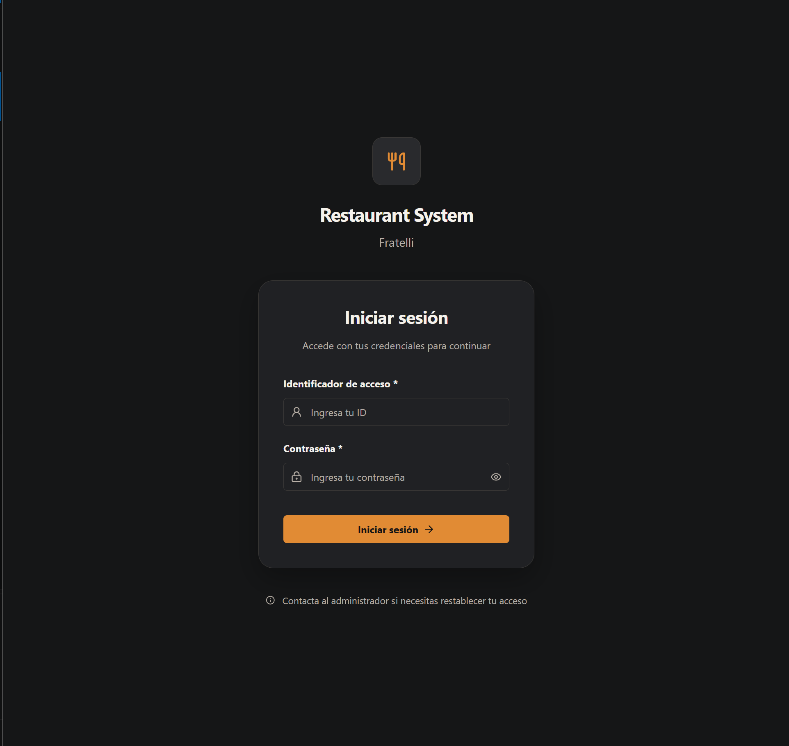
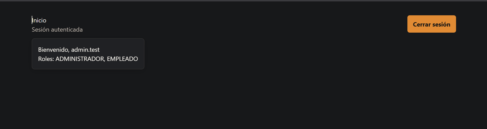

# HU-001 — Iniciar y cerrar sesión

## Estado de implementación

**Backend:** COMPLETE. **Frontend:** COMPLETE. **Validación automatizada:** COMPLETE. **Validación manual:** PENDING.

## Contrato implementado

| Ruta                        | Acceso                   | Resultado                     |
| --------------------------- | ------------------------ | ----------------------------- |
| `POST /api/v1/auth/login`   | Anónimo                  | 200 y sesión nueva            |
| `POST /api/v1/auth/refresh` | Cookie `refreshToken`    | 200 y rotación de esa sesión  |
| `POST /api/v1/auth/logout`  | Anónimo; cookie opcional | 204, siempre expira la cookie |
| `GET /api/v1/auth/me`       | Bearer                   | 200 con el usuario actual     |

`login` acepta solo `{"username":"string","password":"string"}`. No hay inicio por email. Campos de identidad adicionales y credenciales incompletas producen 400; usuario desconocido, contraseña incorrecta, cuenta inactiva o bloqueada producen el mismo 401 `application/problem+json`.

Respuesta de login/refresh:

```json
{
  "accessToken": "jwt",
  "expiresAt": "2026-08-25T12:15:00+00:00",
  "user": {
    "id": "identity-string-id",
    "username": "admin.test",
    "fullName": "admin.test",
    "employeeId": "uuid|null",
    "roles": ["ADMINISTRADOR", "EMPLEADO"]
  }
}
```

`/me` devuelve el mismo objeto `user`. El access token dura 15 minutos. La cookie nunca aparece en JSON: es `HttpOnly`, `SameSite=Strict`, `Path=/api/v1/auth`; es `Secure` fuera de Development. El refresh almacena únicamente su hash, rota el valor de su propia sesión y conserva el límite absoluto de 12 horas. Logout es idempotente y revoca solo la sesión asociada a la cookie.

## Roles y pruebas Development

Roles disponibles: `ADMINISTRADOR`, `ENCARGADO`, `MESERO`, `COCINA`, `CONTADORA` y `EMPLEADO`; no existe `CAJERO`. En Development, el seeder crea idempotentemente `admin.test`, `encargado.test`, `mesero.test`, `cocina.test`, `contadora.test` y `empleado.test`, todos con la contraseña **solo de prueba** `Sprint1.Test!123`. No se documentan ni persisten refresh tokens. En Production no se crean cuentas `.test`.

## Errores

Los errores usan ProblemDetails (`application/problem+json`): 400 para binding/validación, 401 para autenticación y refresh inválido, y 404 para un usuario autenticado que ya no puede resolverse.

## Evidencias

### Captura del login



---

### Captura de usuario logueado


