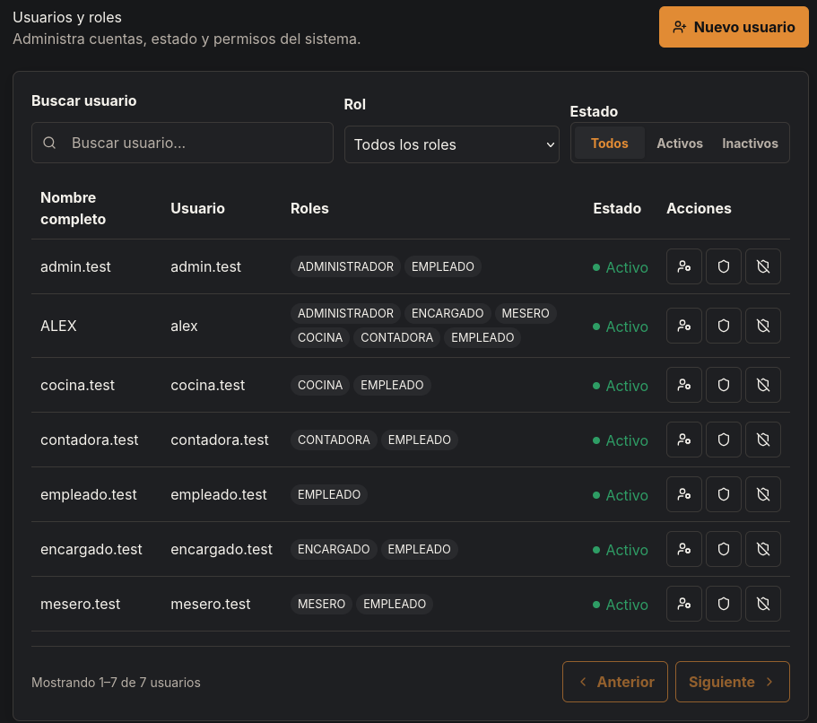
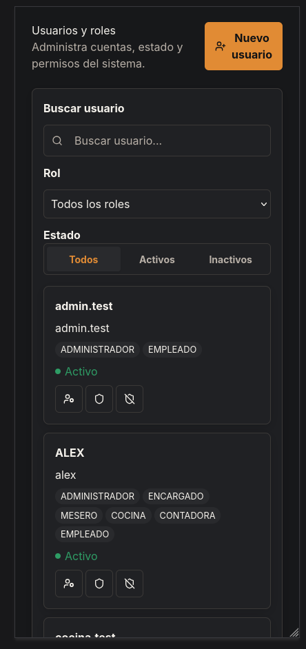
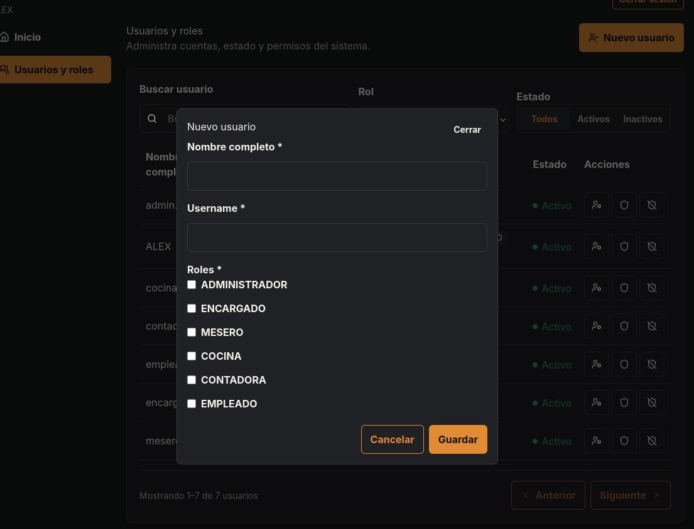
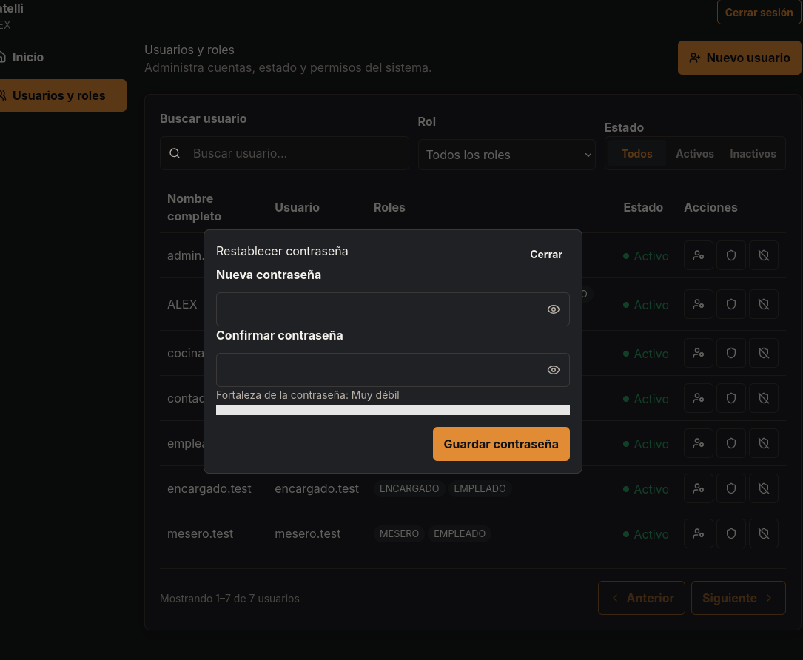

# HU-002 — Gestión de usuarios y múltiples roles

## Resultado

**IMPLEMENTADA END-TO-END**. Un `ADMINISTRADOR` administra cuentas en `/usuarios`: lista paginada, búsqueda, filtros por rol/estado, creación sin contraseña, edición multirol, contraseña separada y activación/desactivación sin borrado físico.

## Reglas implementadas

- Roles canónicos: `ADMINISTRADOR`, `ENCARGADO`, `MESERO`, `COCINA`, `CONTADORA` y `EMPLEADO`; no existe `CAJERO`.
- `User != Employee`: el estado de la cuenta y `Employee.IsActive` no se sincronizan.
- Crear requiere `fullName`, `username` manual y uno o más roles; la cuenta inicia sin contraseña.
- `hasPassword` es derivado por servidor. Establecer/restablecer contraseña es una operación administrativa separada.
- Cambios peligrosos protegen al propio administrador y al último administrador activo; la concurrencia usa bloqueo de la fila de rol canónica.
- `/usuarios` requiere autenticación y `ADMINISTRADOR`; la navegación solo expone Inicio y Usuarios y roles cuando corresponda.

## Seguridad

Los JWT llevan el fingerprint privado `rst` del `SecurityStamp`. En cada validación se resuelve el usuario, se valida cuenta activa y se compara el fingerprint actual. Roles, contraseña y ciclo de cuenta invalidan las sesiones objetivo con las semánticas documentadas en [ADR-007](../adr/ADR-007-security-stamp-session-revocation.md). No se exponen hashes, tokens de reset, refresh tokens, `SecurityStamp` ni `ConcurrencyStamp`.

## Frontend y validación

La feature usa tipos OpenAPI generados, `endpoints`, `httpClient` compartido y TanStack Query; no recibe JWT ni persiste credenciales. La UI ofrece tabla desktop, cards mobile, filtros combinables backend-driven y diálogos accesibles. Alex Saúl Fernandez Valdez validó manualmente rutas, autorización, CRUD/lifecycle, filtros, paginación y viewports desktop/403px/360px. La fidelidad funcional y responsive fue aceptada para MVP; el polish visual menor queda explícitamente diferido y no bloquea la entrega.

## Baseline revalidado

El baseline `develop` inspeccionado fue `9f5e51bd3451e91bab48d75afef318539ecd8e66`. Identity y los servicios de aplicación comparten el `ApplicationDbContext` scoped; `UserSession` conserva refresh hashes por usuario y el login respeta el estado de cuenta. La migración y el snapshot fueron incluidos en la verificación final.

## Evidencia real

- Backend: `dotnet test backend/RestaurantSystem.slnx --no-restore` — 34/34 PASS; build PASS (solo advertencia preexistente NU1903 de SSH.NET).
- Frontend: format, typecheck, lint, Vitest 38/38 y build PASS.
- OpenAPI: `pnpm run api:generate` ejecutado dos veces contra `http://localhost:5057/openapi/v1.json`, con hash idéntico.
- Referencias visuales HU-002 inspeccionadas y validación humana aceptada; no se agregan capturas fabricadas.

## Manifest de archivos del change

### Backend

| Archivo                                                                                                 | Propósito                                                            |
| ------------------------------------------------------------------------------------------------------- | -------------------------------------------------------------------- |
| `backend/src/RestaurantSystem.Api/Program.cs`                                                           | Policy UsersManage, endpoints Users y validación JWT `rst`.          |
| `backend/src/RestaurantSystem.Application/Auth/AuthContracts.cs`                                        | Contratos de autenticación extendidos para seguridad de sesión.      |
| `backend/src/RestaurantSystem.Application/Users/UserContracts.cs`                                       | DTOs y requests seguros de Users.                                    |
| `backend/src/RestaurantSystem.Infrastructure/ApplicationDbContext.cs`                                   | Mapeo Identity/auditoría y consultas de usuarios.                    |
| `backend/src/RestaurantSystem.Infrastructure/DependencyInjection.cs`                                    | Registro de Identity y token providers.                              |
| `backend/src/RestaurantSystem.Infrastructure/Identity/AuthServices.cs`                                  | JWT/security stamp, refresh revoke-all y password seguro.            |
| `backend/src/RestaurantSystem.Infrastructure/Users/UserManagementService.cs`                            | Creación transaccional, listado, edición y lifecycle administrativo. |
| `backend/src/RestaurantSystem.Infrastructure/Migrations/20260825172249_AddUserAccountAudit.cs`          | Migración de auditoría nullable de cuentas Identity.                 |
| `backend/src/RestaurantSystem.Infrastructure/Migrations/20260825172249_AddUserAccountAudit.Designer.cs` | Metadata EF de la migración.                                         |
| `backend/src/RestaurantSystem.Infrastructure/Migrations/ApplicationDbContextModelSnapshot.cs`           | Snapshot EF actualizado.                                             |
| `backend/tests/RestaurantSystem.IntegrationTests/RefreshTokenServicePostgresIntegrationTests.cs`        | Revocación de sesiones target y aislamiento.                         |
| `backend/tests/RestaurantSystem.IntegrationTests/SecurityRevisionPostgresIntegrationTests.cs`           | Revisión de security stamp/JWT.                                      |
| `backend/tests/RestaurantSystem.IntegrationTests/UserManagementPostgresIntegrationTests.cs`             | Read/create, filtros y creación passwordless.                        |
| `backend/tests/RestaurantSystem.IntegrationTests/UserLifecyclePostgresIntegrationTests.cs`              | Password, roles, activate/deactivate y último admin.                 |

### Frontend y contrato generado

| Archivo                                                | Propósito                                                                    |
| ------------------------------------------------------ | ---------------------------------------------------------------------------- |
| `frontend/src/features/auth/AuthProvider.tsx`          | Sincroniza identidad propia o cierra sesión local tras mutaciones sensibles. |
| `frontend/src/features/navigation.tsx`                 | Configuración única de navegación autenticada y role-aware.                  |
| `frontend/src/features/users/api/queries.ts`           | Queries/mutations Users e invalidación raíz.                                 |
| `frontend/src/features/users/pages/UsersPage.tsx`      | Listado, filtros, diálogos, lifecycle y UI responsive.                       |
| `frontend/src/features/users/pages/UsersPage.test.tsx` | Cobertura de Users y filtros.                                                |
| `frontend/src/lib/api/endpoints.ts`                    | Rutas Users centralizadas.                                                   |
| `frontend/src/lib/api/http-client.ts`                  | Soporte PUT preservando sesión compartida.                                   |
| `frontend/src/pages/InicioPage.tsx`                    | Uso del shell autenticado compartido.                                        |
| `frontend/src/routes/AppRoutes.tsx`                    | Ruta `/usuarios` y guards existentes.                                        |
| `frontend/src/types/api.generated.ts`                  | Contrato OpenAPI generado para Users.                                        |
| `frontend/README.md`                                   | Guía de uso de la ruta y del contrato HU-002.                                |
| `frontend/docs/manual-de-uso.md`                       | Límites de arquitectura y flujo de Users.                                    |

### Documentación y OpenSpec

| Archivo                                                                                                     | Propósito                                 |
| ----------------------------------------------------------------------------------------------------------- | ----------------------------------------- |
| `docs/adr/ADR-007-security-stamp-session-revocation.md`                                                     | Decisión de invalidación de sesión.       |
| `docs/historias/HU-002-gestion-usuarios-y-multiples-roles.md`                                               | Historia, evidencia y manifest final.     |
| `docs/openspec/changes/implement-hu-002-user-and-multi-role-management/proposal.md`                         | Alcance y decisiones aprobadas.           |
| `docs/openspec/changes/implement-hu-002-user-and-multi-role-management/design.md`                           | Diseño de seguridad, API y frontend.      |
| `docs/openspec/changes/implement-hu-002-user-and-multi-role-management/specs/account-lifecycle/spec.md`     | Requisitos de activación y desactivación. |
| `docs/openspec/changes/implement-hu-002-user-and-multi-role-management/specs/delivery-contract/spec.md`     | Contrato de gates, evidencia y manifest.  |
| `docs/openspec/changes/implement-hu-002-user-and-multi-role-management/specs/role-aware-navigation/spec.md` | Requisitos de shell, rutas y visibilidad. |
| `docs/openspec/changes/implement-hu-002-user-and-multi-role-management/specs/session-revocation/spec.md`    | Requisitos de revocación de sesión.       |
| `docs/openspec/changes/implement-hu-002-user-and-multi-role-management/specs/user-management/spec.md`       | Requisitos del backend administrativo.    |
| `docs/openspec/changes/implement-hu-002-user-and-multi-role-management/specs/users-frontend/spec.md`        | Requisitos de la experiencia Users.       |
| `docs/openspec/changes/implement-hu-002-user-and-multi-role-management/tasks.md`                            | Trazabilidad y cierre de tareas.          |

## Evidencias

### Captura de la pantalla pricipal de usuarios y roles

---

### Captura de vista para celulares

---

### Captura de modal para agregar usuario

---

### Captura de modal para cambiar/asignar contraseña

---

## Estado de entrega

Completado para MVP, ajustes visuales se harán luego
