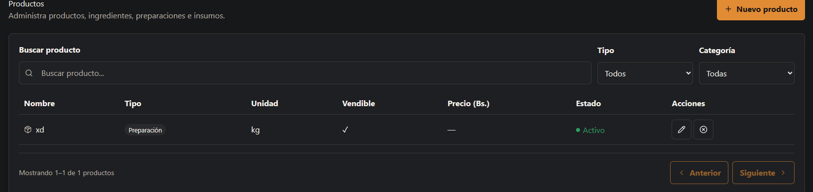
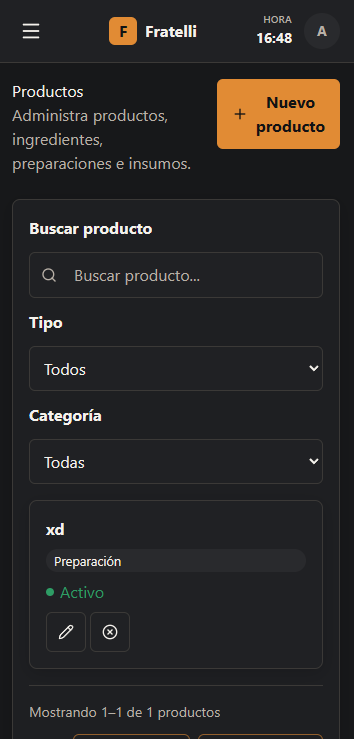
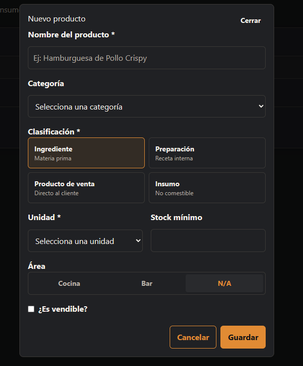
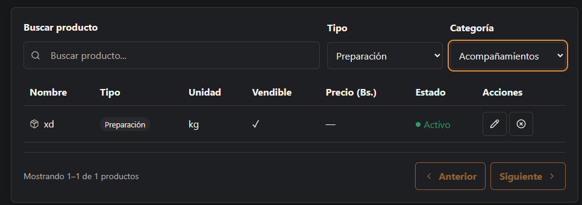
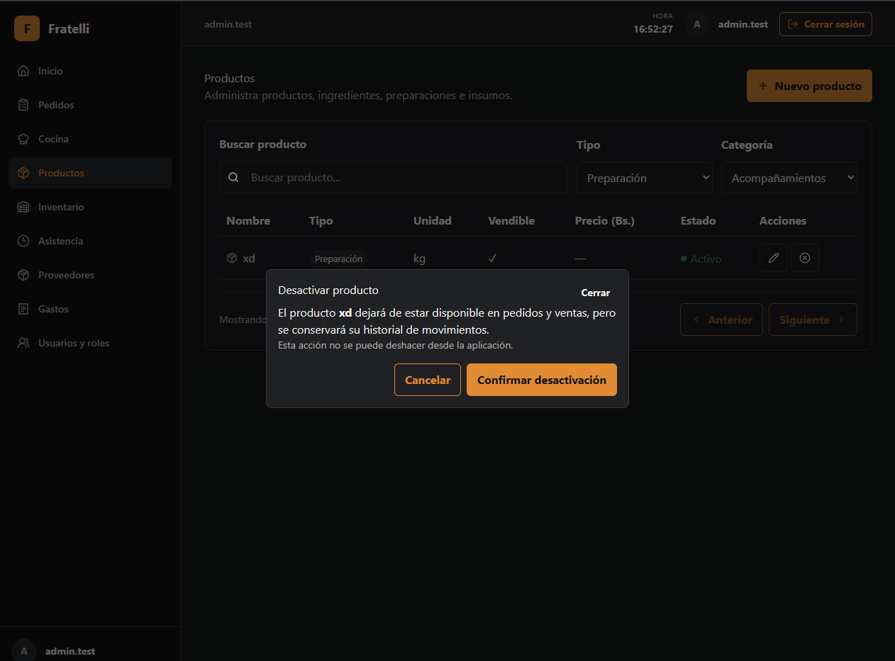

# HU-003 — Gestionar productos, ingredientes y platos

## Resultado

Implementada en backend y frontend para productos. Las categorías y unidades tienen API CRUD, pero no una interfaz dedicada.

## Reglas implementadas

- Lectura: `ADMINISTRADOR`, `ENCARGADO`, `MESERO` y `COCINA`; escritura: `ADMINISTRADOR` y `ENCARGADO`. `CONTADORA` y `EMPLEADO` no están autorizados.
- Producto requiere unidad activa; la categoría es opcional y, si se informa, debe estar activa. El precio y el stock mínimo no pueden ser negativos. La baja es lógica; no existe endpoint de reactivación.
- No se declara acoplamiento de negocio de catálogo que no esté implementado.

## Seguridad

Las políticas `CatalogRead` y `CatalogWrite` protegen el contrato REST; los errores usan ProblemDetails.

## Frontend y validación

`/productos` ofrece listado, filtros, alta, edición y desactivación con contrato generado, tabla desktop y tarjetas mobile.

## Baseline revalidado

`develop` revalidado en `bb2fd04a48bddce1b608bb1639308528daefcfc1`.

## Evidencia real

No se modifica ni incorpora evidencia técnica durante esta normalización.

## Manifest de archivos del change

### Backend

| Archivo |
| --- |
| `backend/src/RestaurantSystem.Api/Program.cs` |
| `backend/src/RestaurantSystem.Application/Catalog/CatalogContracts.cs` |
| `backend/src/RestaurantSystem.Infrastructure/Catalog/CatalogService.cs` |

### Frontend y contrato generado

| Archivo |
| --- |
| `frontend/src/features/products/api.ts` |
| `frontend/src/features/products/pages.tsx` |
| `frontend/src/types/api.generated.ts` |

### Documentación

| Archivo |
| --- |
| `docs/historias/HU-003-catalogo.md` |

## Estado de entrega

Implementada para productos; la UI dedicada de categorías y unidades no está implementada.

## Evidencias

### Captura del listado de productos (desktop)

---

### Captura del listado de productos (mobile)

---

### Captura del formulario de creación

---

### Captura de filtros aplicados

---

### Captura de confirmación de desactivación

---
