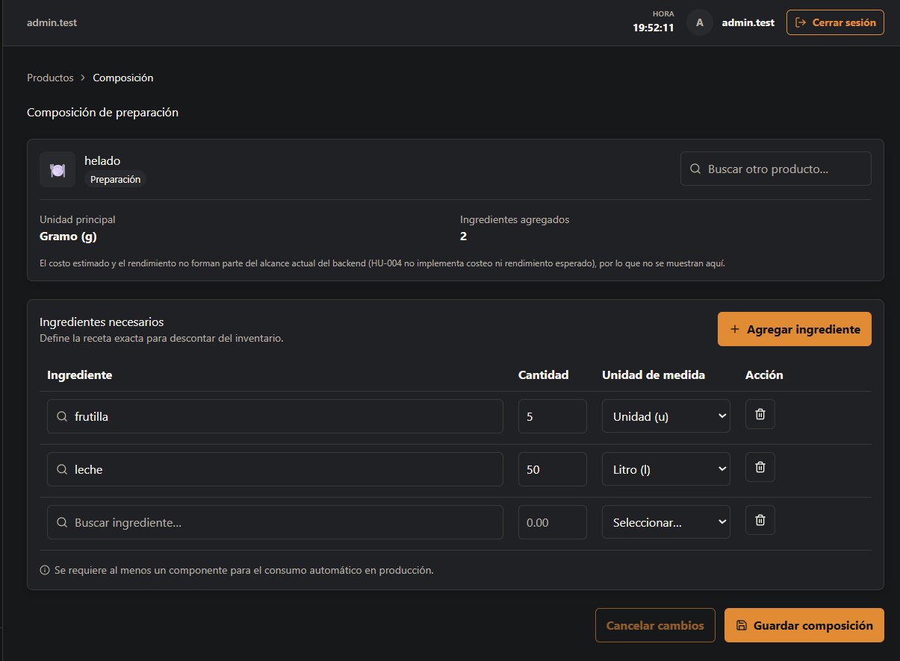
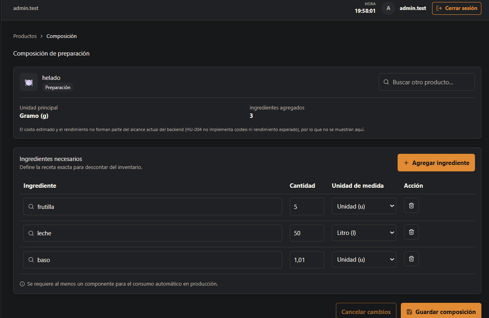

# HU-004 — Definir composición de platos y preparaciones

## Resultado
Implementada end-to-end la gestión de composición de preparaciones en `/productos/:id/composicion`.

## Reglas implementadas
- Lectura: `ADMINISTRADOR` y `ENCARGADO` (política `CatalogRead`); escritura: `ADMINISTRADOR` y `ENCARGADO` (política `CatalogWrite`).
- Solo productos de tipo **Preparación** pueden tener composición; el backend rechaza con `INVALID_COMPOSITION_PARENT` cualquier otro tipo (Ingrediente, Insumo, Producto de venta).
- Un producto no puede ser ingrediente de sí mismo (relación cíclica); el backend la rechaza y el frontend la bloquea antes de intentar guardar.
- No se permite el mismo ingrediente duplicado en dos líneas de la misma composición.
- La unidad de cada línea debe ser dimensionalmente compatible con la unidad de inventario del ingrediente (masa/volumen/unidad); una unidad incompatible se rechaza.
- `PUT /products/{id}/composition` reemplaza la composición completa (no es un merge parcial).
- Modificar la composición **no genera movimientos de inventario**.
- No se implementa costeo ni rendimiento esperado (fuera del alcance de esta historia).

## Seguridad
Los endpoints requieren JWT y aplican las políticas `CatalogRead` (lectura) y `CatalogWrite` (escritura).

## Frontend y validación
La interfaz ofrece tabla desktop y tarjetas apiladas en mobile (responsive), con:
- Autocompletado del ingrediente y autoselección de la unidad correcta al elegirlo, para evitar el error de unidad incompatible desde el inicio.
- El selector de unidad solo muestra las unidades compatibles con el ingrediente ya elegido.
- Bloqueo inmediato (modal) si se intenta agregar el producto padre como su propio ingrediente.
- Aviso visible de error de validación (unidades incompatibles, ingrediente duplicado, falta de al menos un componente) antes de permitir guardar.
- El botón de acceso a la composición solo aparece en la tabla de Productos para filas de tipo Preparación.

No se declara validación manual adicional a la evidencia real.

## Baseline revalidado
`develop` revalidado en `<COMPLETAR: hash de commit>`.

## Evidencia real
<COMPLETAR: indicar si se modifica o incorpora evidencia técnica durante esta normalización>.

## Manifest de archivos del change
### Backend
| Archivo | Propósito |
| --- | --- |
| `backend/src/RestaurantSystem.Api/OperationsEndpoints.cs` | Endpoints `GET`/`PUT` de composición. |
| `backend/src/RestaurantSystem.Infrastructure/Operations/OperationsService.cs` | Reglas de composición (padre válido, cíclico, duplicado, unidad compatible). |
| `<COMPLETAR: entidad de dominio ProductComposition>` | Entidad de composición. |
| `<COMPLETAR: migración que crea product_compositions>` | Migración de la tabla de composición. |

### Frontend y contrato generado
| Archivo | Propósito |
| --- | --- |
| `frontend/src/features/products/composition/types.ts` | Tipos de la feature (basados en el contrato OpenAPI). |
| `frontend/src/features/products/composition/validation.ts` | Reglas de validación en cliente (espejo de las reglas del backend). |
| `frontend/src/features/products/composition/api.ts` | Hooks de lectura/escritura de composición. |
| `frontend/src/features/products/composition/CompositionEditor.tsx` | Editor de ingredientes (tabla/tarjetas responsive). |
| `frontend/src/features/products/composition/CompositionPage.tsx` | Página `/productos/:id/composicion`. |
| `frontend/src/features/products/pages.tsx` | Acción "Editar composición" en la tabla de Productos. |
| `frontend/src/routes/AppRoutes.tsx` | Ruta protegida por rol. |

### Documentación
| Archivo | Propósito |
| --- | --- |
| `docs/historias/HU-004-sprint-2.md` | Historia y evidencia original. |

## Estado de entrega
Implementada para MVP.

## Evidencias

### 1. Lista de composición

### 2. Lista de composición con helado

### 3. Agregar ingrediente

### 4. Vista responsiva - 1

### 5. Vista responsiva - 2

### 6. Error de relación circular

### 7. Mensaje de guardado exitoso

