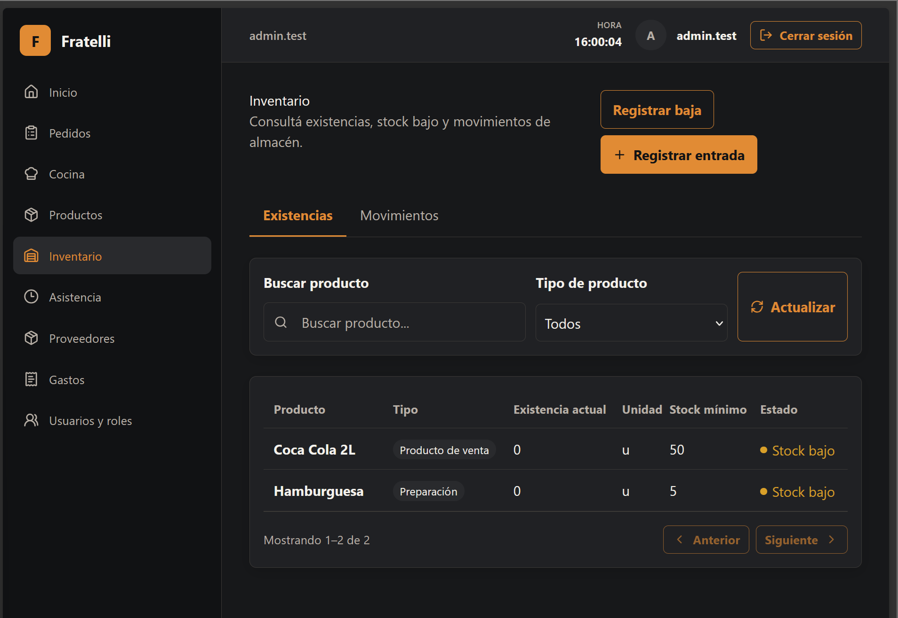
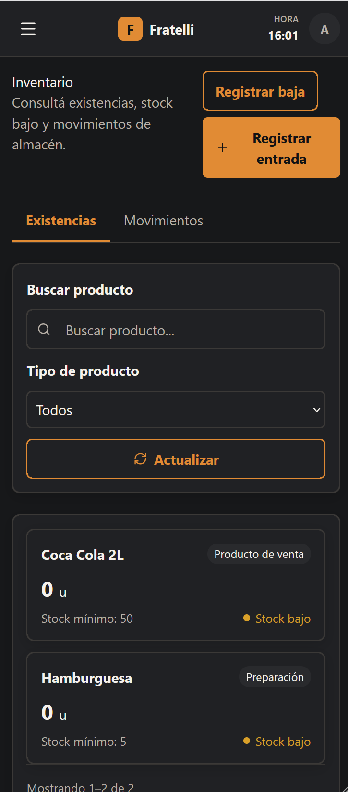
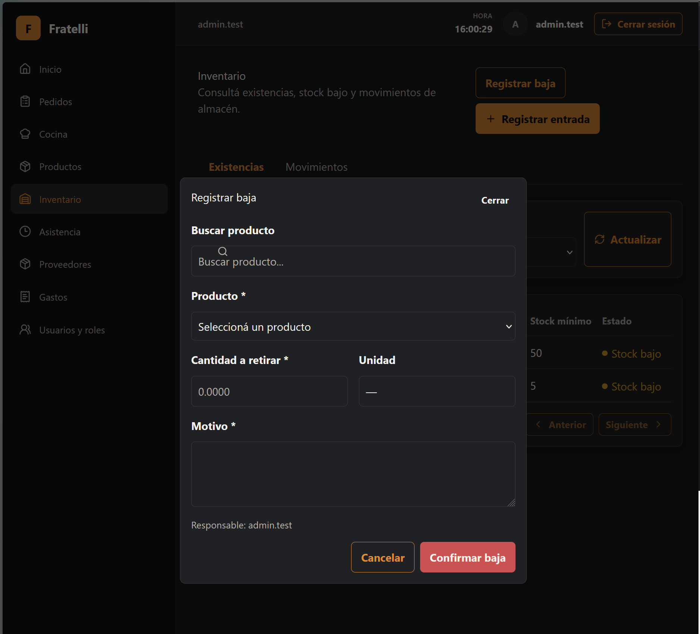
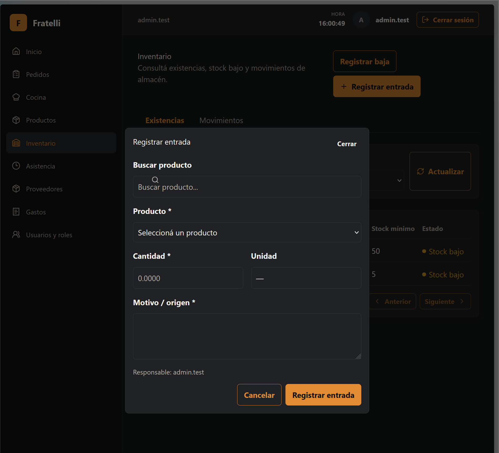

# HU-005 — Gestionar entradas y salidas de inventario

## Resultado

Implementada: consulta de saldos y movimientos, y registro manual de entradas y bajas.

## Reglas implementadas

- Saldos: `ADMINISTRADOR`, `ENCARGADO`, `MESERO`, `COCINA` y `CONTADORA`; ledger y movimientos manuales: `ADMINISTRADOR` y `ENCARGADO`.
- Solo se admiten `ENTRY` y `WRITE_OFF`, cantidad positiva, motivo de hasta 500 caracteres y producto activo.
- Las filas se bloquean al registrar; el saldo negativo se permite. Stock bajo significa `quantity <= minStock`.

## Seguridad

Las políticas separan lectura, historial y escritura; el actor se deriva de la sesión.

## Frontend y validación

`/inventario` y `/inventario/movimientos` usan contrato generado, TanStack Query y polling REST de 30 segundos para saldos y movimientos.

## Baseline revalidado

`develop` revalidado en `bb2fd04a48bddce1b608bb1639308528daefcfc1`.

## Evidencia real

No se modifica ni incorpora evidencia técnica durante esta normalización.

## Manifest de archivos del change

### Backend

| Archivo |
| --- |
| `backend/src/RestaurantSystem.Api/Program.cs` |
| `backend/src/RestaurantSystem.Application/Inventory/InventoryContracts.cs` |
| `backend/src/RestaurantSystem.Infrastructure/Inventory/InventoryService.cs` |

### Frontend y contrato generado

| Archivo |
| --- |
| `frontend/src/features/inventory/api.ts` |
| `frontend/src/features/inventory/pages.tsx` |
| `frontend/src/types/api.generated.ts` |

### Documentación

| Archivo |
| --- |
| `docs/historias/HU-005-inventario.md` |

## Estado de entrega

Implementada para MVP; no incluye edición, reversión ni exportación de movimientos.

## Evidencias

### Captura de la pantalla pricipal de inventario

---

### Captura de vista para celulares

---

### Captura de modal para registrar baja

---

### Captura de modal para registrar entrada

---
