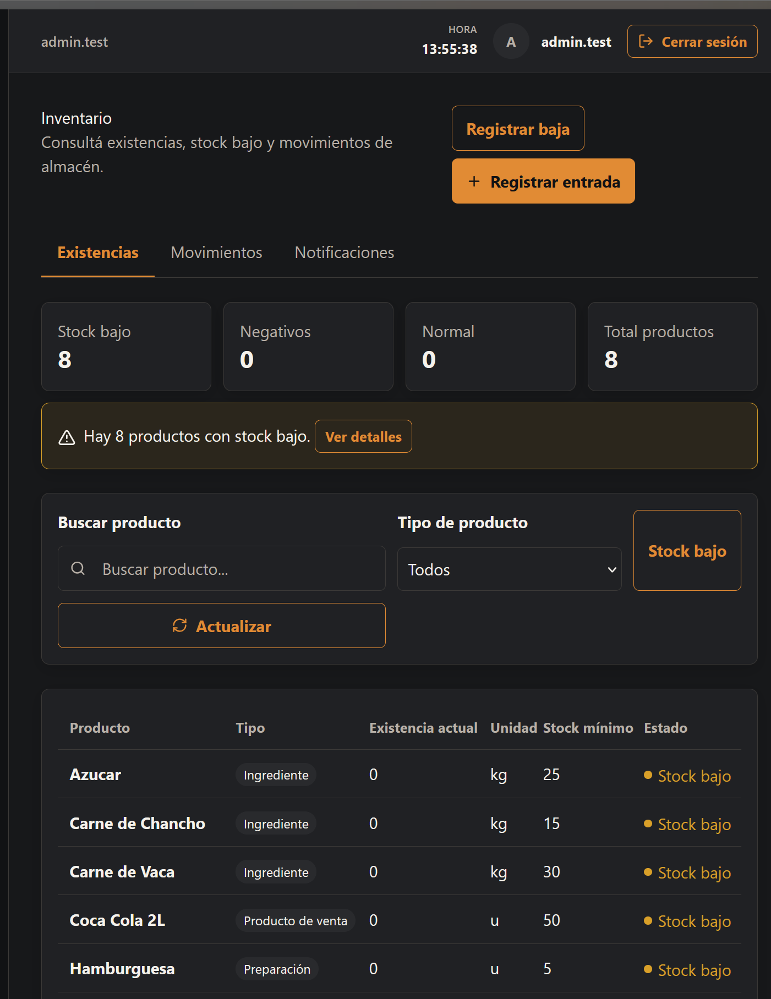
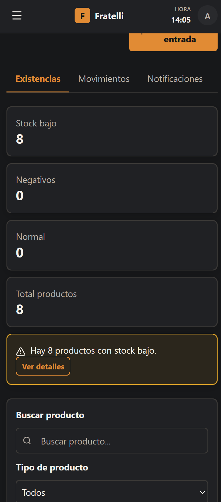
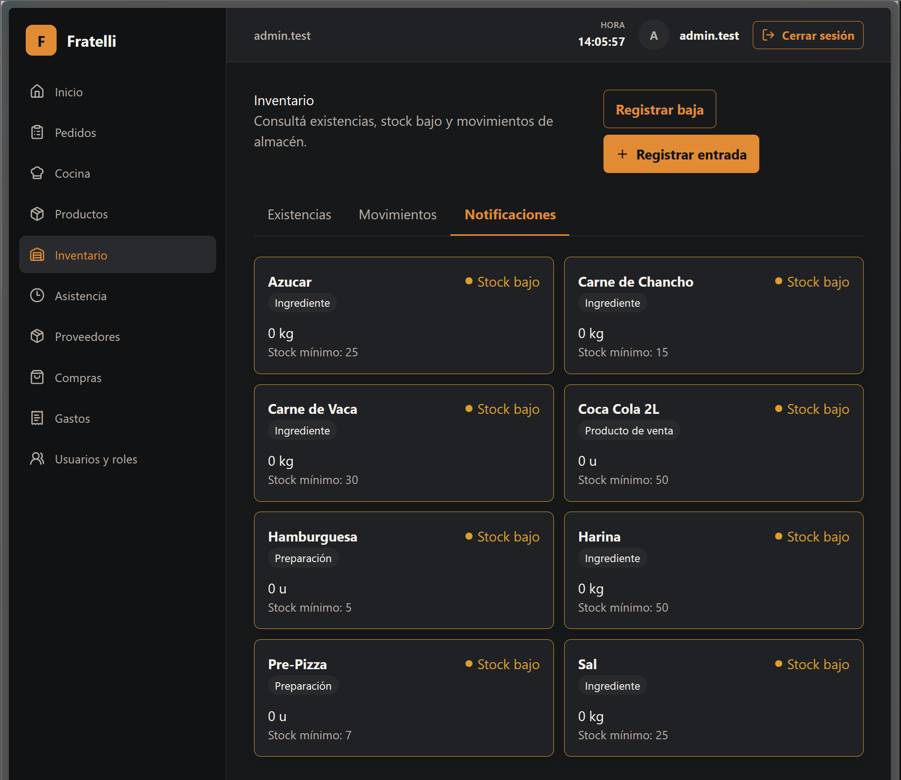

# HU-006 — Visibilidad de stock bajo y resumen de inventario

## Resultado

**ENTREGADA** HU-006 extiende `/inventario` con un resumen global y una vista derivada de Notificaciones, sin crear un módulo paralelo.

## Alcance entregado

- Único endpoint añadido: `GET /api/v1/inventory/summary`, de solo lectura y protegido por `InventoryRead`.
- El resumen devuelve `totalProducts`, `lowStockCount`, `negativeStockCount`, `normalStockCount` y `lowStockItems`.
- Existencias incorpora alerta global, tarjetas de Stock bajo, Negativos, Normal y Total productos, y filtro Stock bajo basado en el conjunto completo del Summary.
- Notificaciones muestra las tarjetas derivadas de `lowStockItems`; `Ver detalles` activa esa pestaña.
- OpenAPI runtime y `frontend/src/types/api.generated.ts` están sincronizados.

## Reglas y seguridad

- El universo es el de productos activos de Inventory; un producto sin balance materializado se trata como cantidad `0`.
- Stock bajo incluye cantidad negativa o cantidad menor o igual al mínimo configurado. Negativos es un subconjunto informativo de Stock bajo; `normalStockCount = totalProducts - lowStockCount`.
- Los saldos negativos se conservan, sin clamping. Los conteos son de productos, no una suma de cantidades heterogéneas.
- `InventoryRead` e `InventoryHistory` permiten ADMINISTRADOR, ENCARGADO, MESERO, COCINA y CONTADORA; EMPLEADO-only y anónimo no tienen acceso. Los movimientos manuales conservan `InventoryManage` para ADMINISTRADOR/ENCARGADO.
- Existencias, Movimientos y Notificaciones reutilizan una sola navegación; Notificaciones muestra el `lowStockCount` global solo cuando es mayor que cero.
- No hay migración, persistencia de notificaciones, segunda UI de MinStock, cambio de escritura Inventory ni ruptura de rutas existentes.

## Frontend y validación

- Release publish: **PASS**.
- Backend: **58/58 PASS** (1 domain, 1 application, 56 integration), incluida PostgreSQL real mediante Testcontainers.
- Runtime OpenAPI y TypeScript generado: **PASS** y sincronizados.
- Frontend scoped Prettier, typecheck, lint y build: **PASS**; suite frontend: **68 tests PASS**.
- El `format:check` global queda bloqueado exclusivamente por **17 archivos preexistentes y sin tocar**; no es una regresión de HU-006.
- La evidencia automatizada cubre semántica negativa, autorización, estados de error/reintento y demás regresiones de comportamiento. Las capturas visuales no pretenden probar esos casos.

## Baseline

La baseline local revalidada no tenía Summary, ruta generada, pestaña Notificaciones ni consulta global. La entrega conserva `/inventario`, balances, movimientos, permisos y foundations existentes.

## Manifest exacto del diff actual

Salida de `git diff --name-only` al preparar este cierre:

```text
backend/src/RestaurantSystem.Api/Program.cs
backend/src/RestaurantSystem.Application/Inventory/InventoryContracts.cs
backend/src/RestaurantSystem.Infrastructure/Inventory/InventoryService.cs
backend/tests/RestaurantSystem.IntegrationTests/InventoryExpensesPostgresIntegrationTests.cs
docs/historias/HU-006-sprint-2.md
frontend/src/features/inventory/api.test.ts
frontend/src/features/inventory/api.ts
frontend/src/features/inventory/pages.tsx
frontend/src/lib/api/endpoints.ts
frontend/src/routes/AppRoutes.test.tsx
frontend/src/types/api.generated.ts
```

## Evidencia visual real



`docs/capturas/HU-006-low-stock.png` muestra Existencias desktop con tarjetas de resumen, alerta global de stock bajo, filtro Stock bajo y pestaña Notificaciones.



`docs/capturas/HU-006-mobile-page.png` muestra el layout estrecho/móvil de resumen, tarjetas y alerta de Inventory.



`docs/capturas/HU-006-notifications.png` muestra la pestaña Notificaciones y las tarjetas de stock bajo.

## Estado de entrega

Completo, con posibles cambios visuales posteriores.
