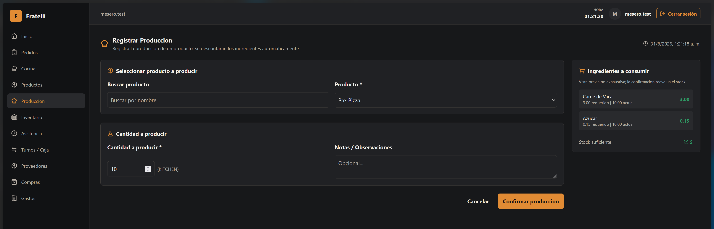
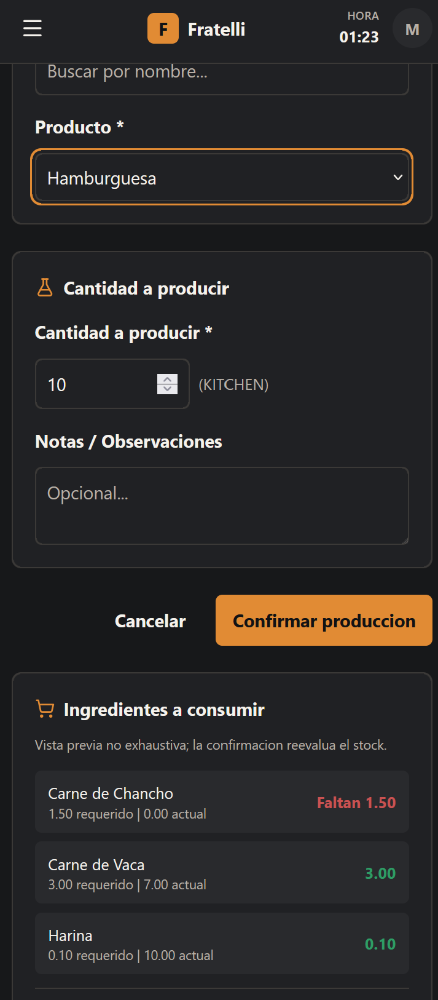
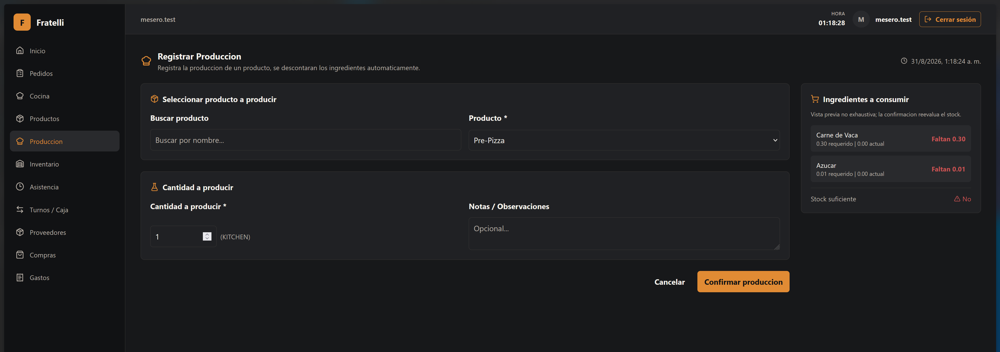
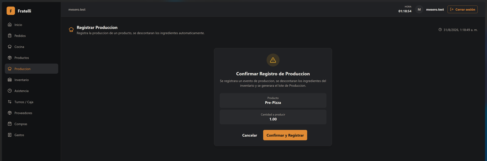
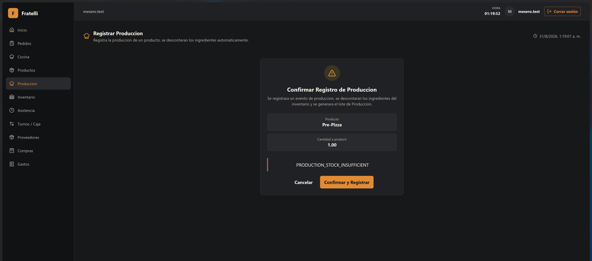
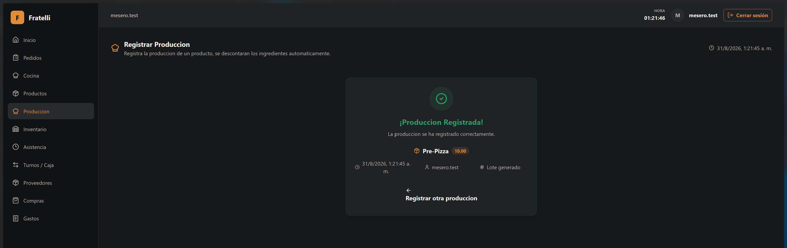

# HU-007 — Registrar produccion y generar lote

## Resultado

**FRONTEND IMPLEMENTADO**.

La implementacion backend ya existia en develop (endpoints `GET /products/{id}/production-requirements` y `POST /productions`). El frontend agrega la pagina de registro de produccion con formulario, modal de confirmacion y pantalla de exito.

## Reglas implementadas

Ver el mapa contractual especifico de esta HU en [handoff Sprint 2](../handoffs/sprint-2-backend-frontend-handoff.md). Las reglas de negocio, actor autenticado, importes/cantidades calculadas en servidor e inventario unico se mantienen en backend.

## Seguridad

Las rutas requieren autenticacion y politicas backend (`KitchenManage`); los identificadores de actor se obtienen de los claims, no del request. Solo COCINA, ENCARGADO y ADMINISTRADOR pueden acceder.

## Frontend y validacion

El frontend agrega la pagina **Registrar Produccion** (`RegisterProductionPage`) sobre `http-client` y React Query (`api.ts`), con:

- Selector de producto tipo PREPARATION con busqueda
- Campo de cantidad y notas
- Vista previa de ingredientes a consumir con stock actual vs requerido
- Modal de confirmacion con warning icon y resumen
- Pantalla de exito con check verde, nombre, cantidad, fecha y responsable
- Responsive con Tailwind CSS y lucide-react
- Ruta `/produccion/registrar` protegida por roles COCINA/ENCARGADO/ADMINISTRADOR

## Visibilidad y roles

La vista de Produccion solo es visible en la navegacion y accesible por ruta (`RequireAnyRole`) para `COCINA`, `ENCARGADO` y `ADMINISTRADOR`. Los demas roles (MESERO, CONTADORA, etc.) no ven esta pagina.

## Baseline revalidado

- Branch/HEAD: `develop` / `9cec685`.

## Evidencia real de esta reconciliación

- `pnpm test -- src/features/navigation.test.ts src/features/inventory/pages.test.tsx src/routes/AppRoutes.test.tsx`: PASS, 83 tests.
- `pnpm typecheck`: PASS.
- `dotnet test tests/RestaurantSystem.IntegrationTests/RestaurantSystem.IntegrationTests.csproj --filter FullyQualifiedName~OperationsAuthorizationMatrixPostgresIntegrationTests`: PASS, 1 test.

## Manifest factual

### Backend

- `backend/src/RestaurantSystem.Domain/Operations/OperationalEntities.cs`
- `backend/src/RestaurantSystem.Application/Operations/OperationalContracts.cs`
- `backend/src/RestaurantSystem.Infrastructure/Operations/OperationsService.cs`
- `backend/src/RestaurantSystem.Api/OperationsEndpoints.cs`
- `backend/src/RestaurantSystem.Infrastructure/Migrations/20260828093655_AddSprint2OperationalWorkflows.cs`
- `backend/tests/RestaurantSystem.IntegrationTests/OperationsAuthorizationMatrixPostgresIntegrationTests.cs`

### Frontend y contrato generado

- `frontend/src/features/production/api.ts`
- `frontend/src/features/production/index.ts`
- `frontend/src/features/production/pages.tsx`
- `frontend/src/routes/AppRoutes.tsx`
- `frontend/src/features/navigation.tsx`
- `frontend/src/types/api.generated.ts`

### Documentación

- `docs/historias/HU-007-spri.md`
- `docs/openspec/changes/finalize-sprint-2-routing-permissions-and-documentation/`

## Evidencias

### Registrar Produccion (Desktop)

El formulario de producción en escritorio muestra el producto, la cantidad, la vista previa de ingredientes, disponibilidad suficiente y la acción de confirmar.

### Registrar Produccion (Mobile)

La vista responsive muestra el producto seleccionado, la cantidad, la acción disponible y el aviso de faltantes de ingredientes.

### Registrar producción (Stock insuficiente)

La vista previa de ingredientes en escritorio informa existencias insuficientes e identifica los faltantes.

### Registrar Produccion (Modal de confirmación)

El modal identifica Pre-Pizza, la cantidad `1.00` y la acción de confirmar el registro.

### Registrar Produccion (Advertencia bajo stock)

El diálogo de confirmación presenta el código `PRODUCTION_STOCK_INSUFFICIENT`; esta captura no acredita por sí sola la atomicidad del backend.

### Registrar Produccion (Confirmación)

El estado exitoso indica que la producción fue registrada para Pre-Pizza, cantidad `10.00`, y muestra el lote generado.

## Estado de entrega

La implementación técnica, el manifest, la evidencia visual manual, la documentación y la validación end-to-end están completos.
