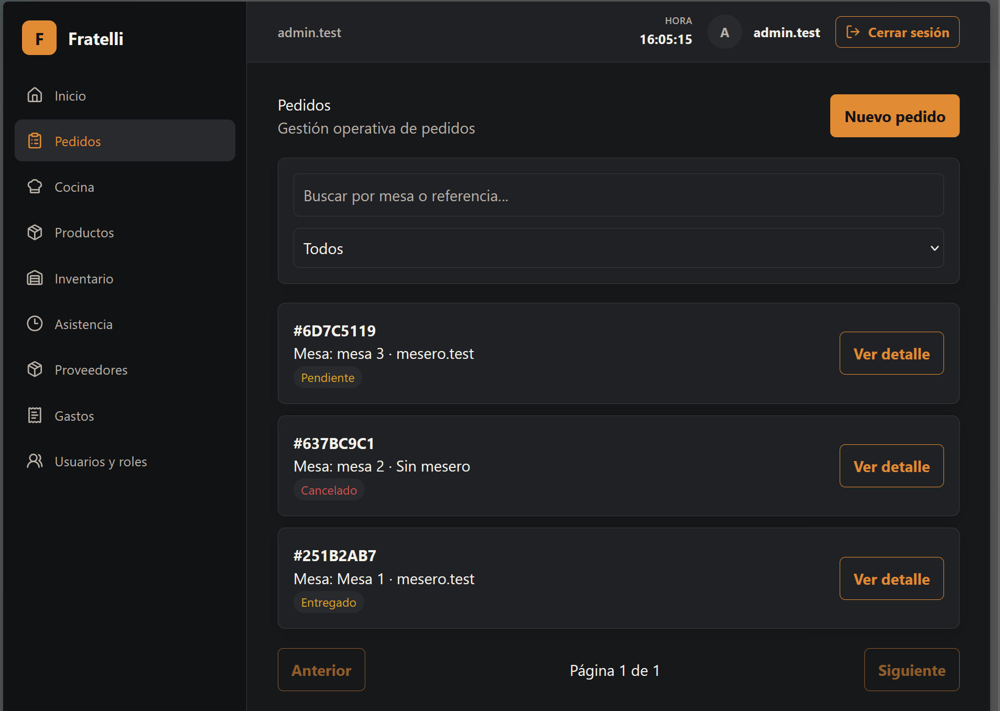
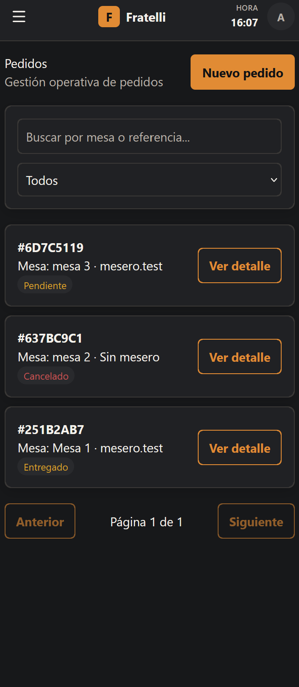
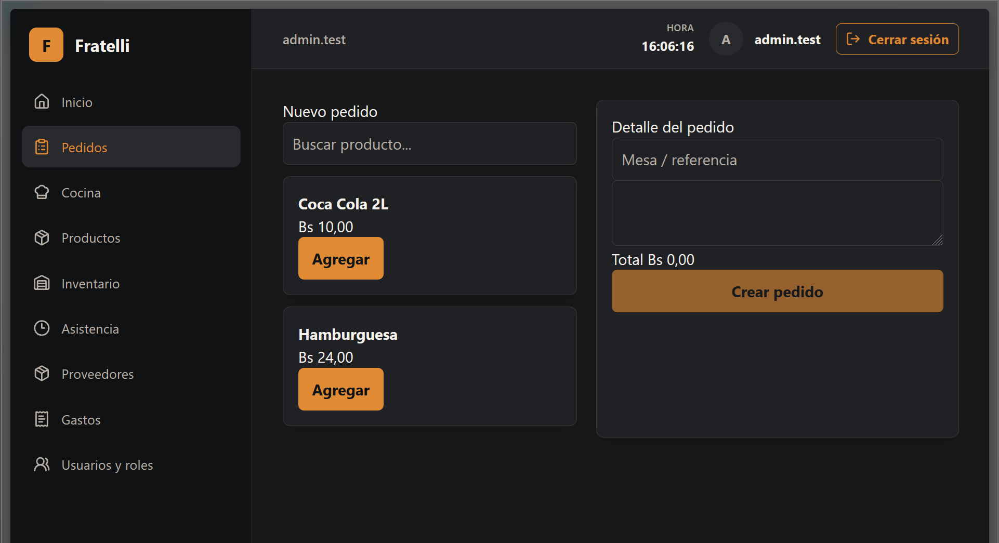
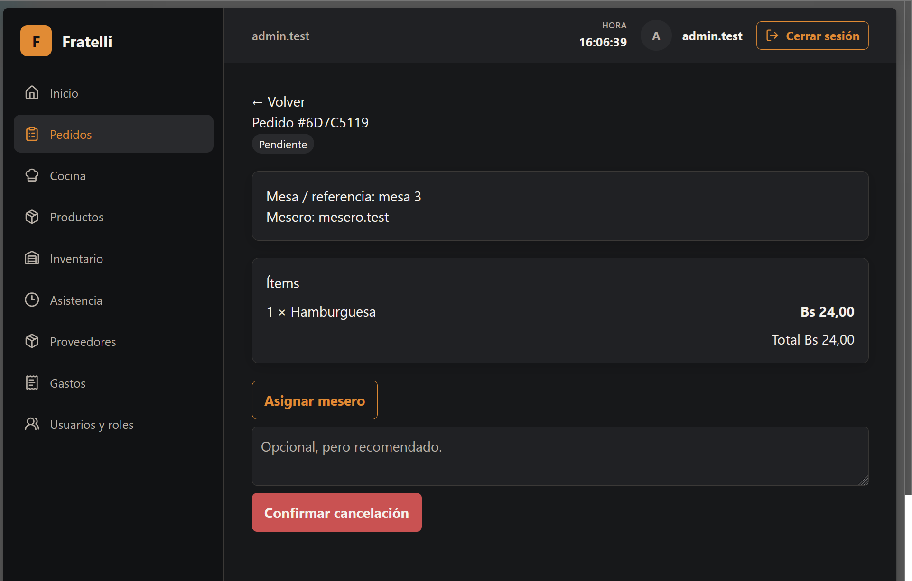

# HU-009 — Pedidos

## Resultado

Implementada la gestión de pedidos en `/pedidos`, `/pedidos/nuevo` y `/pedidos/:id`.

## Reglas implementadas

- Acceden `ADMINISTRADOR`, `ENCARGADO` y `MESERO`; asignar es solo de administrador y las acciones operativas del mesero se limitan a su empleado.
- El servidor toma snapshots de precio y solo acepta productos activos, vendibles, con precio y área `KITCHEN`, `BAR` o `NONE`; rechaza líneas duplicadas.
- Líneas de cocina crean `PENDIENTE`; sin ellas el pedido queda `LISTO`. No muta inventario.

## Seguridad

REST es la autoridad; SignalR invalida consultas y existe polling de respaldo. ADR-005 documenta la decisión.

## Frontend y validación

Las rutas usan contrato OpenAPI generado, `httpClient` y TanStack Query.

## Baseline revalidado

`develop` revalidado en `bb2fd04a48bddce1b608bb1639308528daefcfc1`.

## Evidencia real

No se modifica ni incorpora evidencia técnica durante esta normalización.

## Manifest de archivos del change

### Backend

| Archivo |
| --- |
| `backend/src/RestaurantSystem.Api/Program.cs` |
| `backend/src/RestaurantSystem.Application/Orders/OrderContracts.cs` |
| `backend/src/RestaurantSystem.Infrastructure/Orders/OrderServices.cs` |

### Frontend y contrato generado

| Archivo |
| --- |
| `frontend/src/features/orders/api.ts` |
| `frontend/src/features/orders/pages.tsx` |
| `frontend/src/types/api.generated.ts` |

### Documentación

| Archivo |
| --- |
| `docs/adr/ADR-005-signalr-kds.md` |
| `docs/historias/HU-009-pedidos.md` |

## Estado de entrega

Implementada para MVP; no incluye venta ni movimientos de inventario.

## Evidencias

### Captura de la pantalla pricipal de Pedidos

---

### Captura de vista para celulares

---

### Captura de pantalla para agregar pedidos

---

### Captura de pantalla de detalle de pedido

---

## Estado de entrega

Completado para MVP, cambios visuales se harán posteriormente
