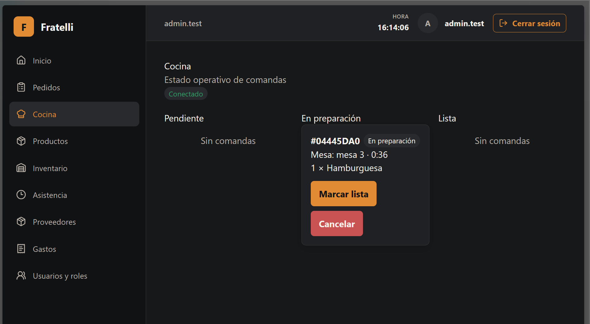
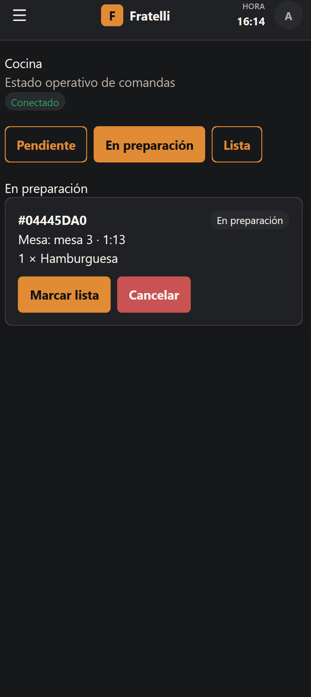
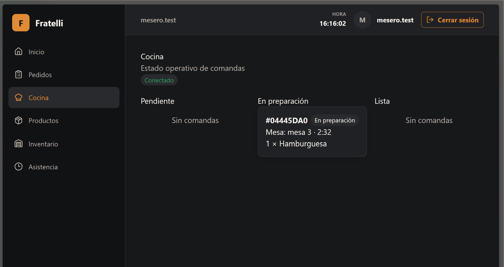

# HU-010 — Comandas de cocina

## Resultado

Implementada la pantalla `/cocina` y el ciclo operativo de comandas.

## Reglas implementadas

- Lectura y hub: `ADMINISTRADOR`, `ENCARGADO`, `MESERO` y `COCINA`; iniciar, lista y cancelar: `ADMINISTRADOR`, `ENCARGADO` y `COCINA`.
- Solo incluye líneas `KITCHEN` y excluye campos financieros.
- Los cambios de estado son transaccionales y bloqueados; SignalR se emite después del commit.

## Seguridad

`KitchenHub` está en `/hubs/kitchen`; REST mantiene la autoridad. ADR-005 aplica al tiempo real.

## Frontend y validación

`/cocina` usa contrato generado, SignalR con fallback de polling y controles según rol.

## Baseline revalidado

`develop` revalidado en `bb2fd04a48bddce1b608bb1639308528daefcfc1`.

## Evidencia real

No se modifica ni incorpora evidencia técnica durante esta normalización.

## Manifest de archivos del change

### Backend

| Archivo |
| --- |
| `backend/src/RestaurantSystem.Api/Program.cs` |
| `backend/src/RestaurantSystem.Application/Orders/OrderContracts.cs` |
| `backend/src/RestaurantSystem.Infrastructure/Orders/OrderServices.cs` |

### Frontend y contrato generado

| Archivo |
| --- |
| `frontend/src/features/kitchen/api.ts` |
| `frontend/src/features/kitchen/pages.tsx` |
| `frontend/src/features/kitchen/realtime.tsx` |

### Documentación

| Archivo |
| --- |
| `docs/adr/ADR-005-signalr-kds.md` |
| `docs/historias/HU-010-comandas-cocina.md` |

## Estado de entrega

Implementada para MVP.

## Evidencias

### Captura de la pantalla pricipal de Cocina

---

### Captura de vista para celulares

---

### Captura de pantalla de cocina de meseros

---
