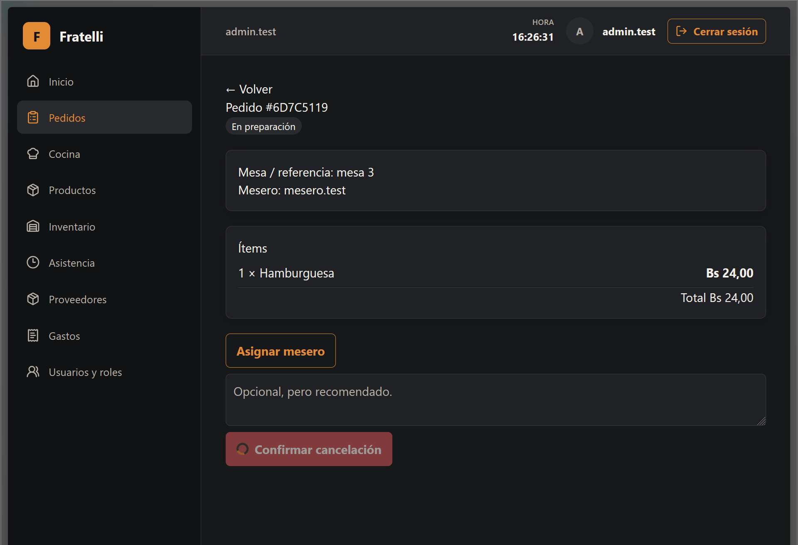

# HU-011 — Cancelar pedido

## Resultado

Implementada end-to-end la cancelación de pedidos y comandas vinculadas.

## Reglas implementadas

- Un mesero cancela solo sus pedidos; encargado y administrador pueden cancelar pedidos. Cocina, encargado y administrador pueden cancelar comandas.
- El motivo es opcional y admite hasta 500 caracteres.
- Solo se cancelan pares coherentes en `PENDIENTE` o `EN_PREPARACION`; pedido y comanda se cancelan atómicamente.
- La repetición autorizada es idempotente solo para una cancelación coherente y conserva actor, motivo y marcas de tiempo.

## Seguridad

El actor se deriva del JWT; el cliente no controla actor, estados ni importes. `KitchenHub` notifica después del commit.

## Frontend y validación

Las rutas de pedidos y cocina usan la API y rutas protegidas; el motivo de cancelación es opcional.

## Baseline revalidado

`develop` revalidado en `bb2fd04a48bddce1b608bb1639308528daefcfc1`.

## Evidencia real

No se modifica ni incorpora evidencia técnica durante esta normalización.

## Manifest de archivos del change

### Backend

| Archivo | Propósito |
| --- | --- |
| `backend/src/RestaurantSystem.Api/Program.cs` | Endpoints y autorización. |
| `backend/src/RestaurantSystem.Application/Orders/OrderContracts.cs` | Contratos de cancelación. |
| `backend/src/RestaurantSystem.Infrastructure/Orders/OrderServices.cs` | Cancelación atómica e idempotencia. |
| `backend/tests/RestaurantSystem.IntegrationTests/OrdersKitchenPostgresIntegrationTests.cs` | Integración de pedidos y cocina. |

### Frontend y contrato generado

| Archivo | Propósito |
| --- | --- |
| `frontend/src/features/orders/api.ts` | API de pedidos. |
| `frontend/src/features/orders/pages.tsx` | Pantallas de pedidos. |
| `frontend/src/features/kitchen/api.ts` | API de comandas. |
| `frontend/src/features/kitchen/pages.tsx` | Pantalla de cocina. |
| `frontend/src/routes/AppRoutes.tsx` | Rutas protegidas. |

### Documentación

| Archivo | Propósito |
| --- | --- |
| `docs/adr/ADR-005-signalr-kds.md` | Decisión de tiempo real. |
| `docs/historias/HU-011-cancelar-pedido.md` | Historia y evidencia. |

## Estado de entrega

Implementada para MVP.

## Evidencias

### Captura de la pantalla para cancelar pedido

---
