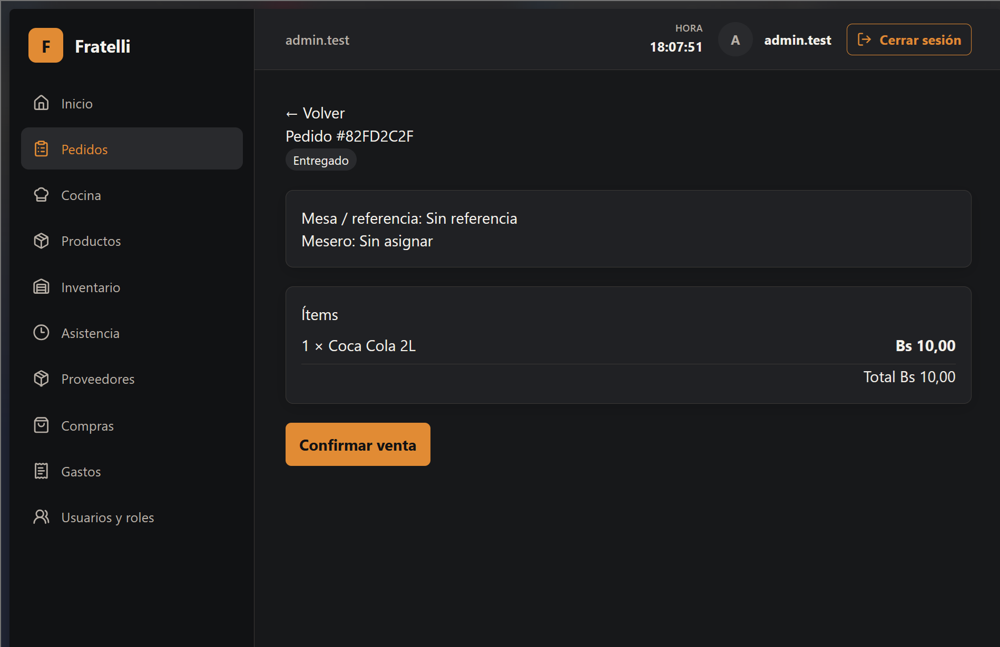
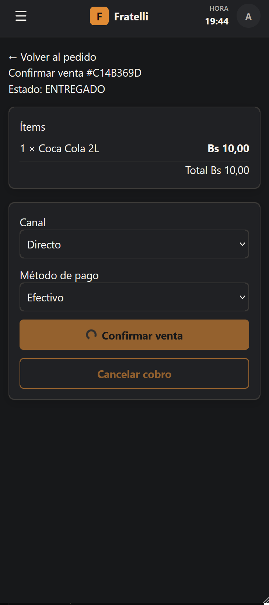

# HU-012 — Registrar y confirmar una venta

## Estado: finalizado

El checkout está vinculado a un pedido `ENTREGADO` y usa el endpoint existente `POST /api/v1/sales`. No incorpora Cliente, NIT, descuentos, Caja 1, venta libre, comprobante, impresión ni facturación. **HU-025 permanece fuera de alcance.**

Baseline factual: `develop` / `HEAD` `185e8e3ae07c712e68d6de64c2de11c23b4a7018`.

## Evidencia visual manual

*Detalle de un pedido `ENTREGADO` con el CTA **Confirmar venta**.*

*Checkout desktop con canal Directo, pago Efectivo, CTA **Confirmar venta**, cancelar cobro y el diálogo «Venta confirmada» con **Volver a pedidos**.*

*Vista móvil (~360 px) de **Confirmar venta** para un pedido `ENTREGADO`, con el ítem, canal Directo, pago Efectivo y los controles **Confirmar venta** y **Cancelar cobro** visibles.*

El mantenedor confirmó la validación manual básica de desktop y ~360 px, incluida usabilidad y accesibilidad básica. Esta validación no constituye certificación WCAG.

## Hechos técnicos verificables

| Área | Evidencia |
| --- | --- |
| Elegibilidad | PostgreSQL rechaza `PENDIENTE`, `EN_PREPARACION`, `LISTO` y `CANCELADO`; `ENTREGADO` confirma. |
| Pago/canal | Acepta Directo+Efectivo, Directo+QR y PedidosYa+Externo; rechaza las combinaciones restantes. |
| Integridad | Una Sale por Order; total, timestamp y actor son del servidor; usa el Shift operativo actual, movimiento `SALE` y rollback sin Sale parcial. |
| Preparaciones | Se descuenta el producto `PREPARATION` vendido, no sus ingredientes otra vez. |
| CTA y éxito | Tras 201, el diálogo usa datos reales de Sale y la acción principal es **Volver a pedidos**; no ofrece «Nueva venta» ni declara receipt/comprobante generado. |
| Receipt readiness | Sale conserva Order/Shift, canal, pago, actor/hora e ítems con producto, cantidad, precio unitario y total de línea. Esta HU no crea `Receipt`, renderizado, impresión ni facturación. |

## Salvaguarda excepcional en Sale

La advertencia normal de HU-013 sucede al crear el pedido. Si un pedido sin acknowledgement previo queda corto recién antes del cobro, `POST /api/v1/sales` responde `409 application/problem+json` con `code: SALE_STOCK_CONFIRMATION_REQUIRED` y `shortages` autoritativos. Sólo **Continuar** reenvía `acknowledgeStockShortage: true`; **Volver** no reintenta. El retry revalida bajo el lock normal y, si procede, persiste acknowledgement, una Sale y un movimiento `SALE`.

## Evidencia técnica registrada

- `dotnet test RestaurantSystem.slnx -c Release --no-restore`: PASS, 59 tests, 0 failures (PostgreSQL/Testcontainers).
- `Hu012_sale_matrix_enforces_eligibility_channel_payment_server_values_and_atomic_inventory`: PASS.
- `Hu013_sale_time_new_shortage_requires_acknowledged_retry_and_rolls_back_first_attempt`: PASS.
- `pnpm test`: PASS, 18 files / 78 tests.
- `pnpm lint`, `pnpm typecheck`, `pnpm build`: PASS.
- `pnpm format:check` mantiene 16 archivos preexistentes fuera de alcance (`PREEXISTING_OUT_OF_SCOPE`).

## Manifest HU-012

- `backend/src/RestaurantSystem.Infrastructure/Operations/OperationsService.cs`: transacción Sale, elegibilidad, canal/pago, Shift e inventario.
- `backend/tests/RestaurantSystem.IntegrationTests/OperationsConcurrencyPostgresIntegrationTests.cs`: matriz PostgreSQL real de Sale y carrera de faltante.
- `frontend/src/features/sales/api.ts`, `frontend/src/features/sales/pages.tsx`: mutación, checkout, fallback y éxito.
- `frontend/src/features/sales/checkout.test.tsx`, `frontend/src/features/sales/pages.test.tsx`: assertions de checkout y diálogo.
- `frontend/src/features/orders/pages.tsx`, `frontend/src/routes/AppRoutes.tsx`: CTA y ruta anclada al Order.
- `frontend/src/types/api.generated.ts`: contrato generado desde OpenAPI runtime, sin edición manual.
