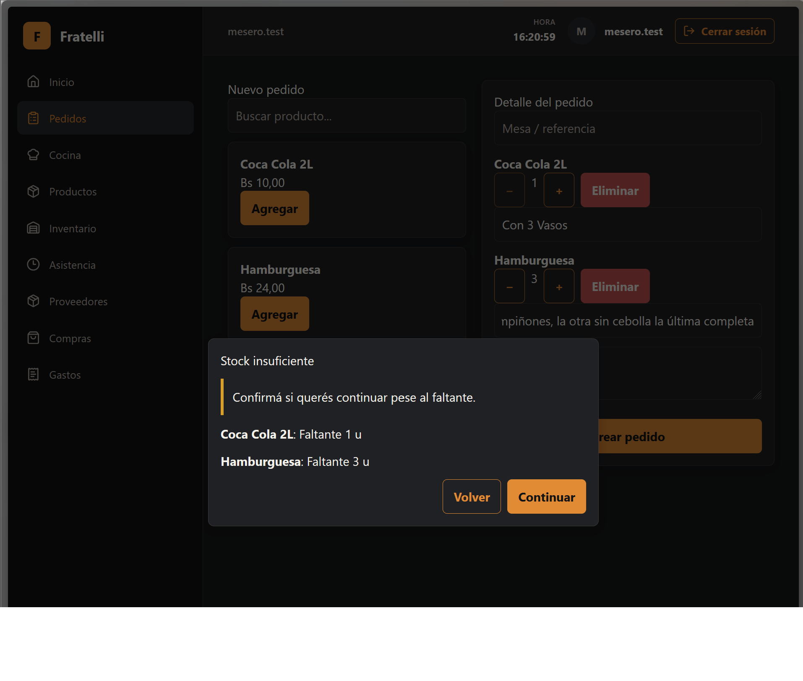
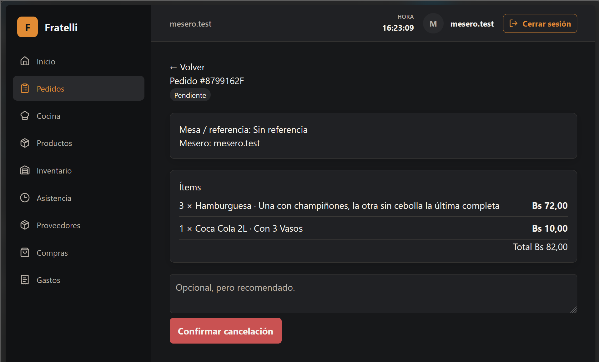
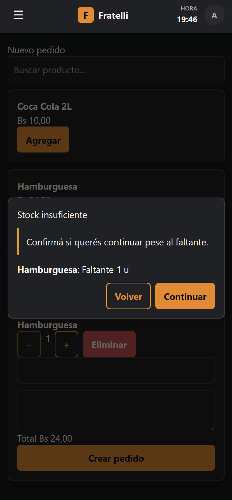

# HU-013 — Venta con stock bajo

## Estado: finalizado

La decisión normal de faltante ocurre en `POST /api/v1/orders`: el servidor devuelve `409` con `ORDER_STOCK_ACKNOWLEDGEMENT_REQUIRED` y shortages estructurados. El retry acknowledged revalida stock, conserva un pedido único y no mueve inventario. Sale conserva un fallback excepcional para una carrera posterior. **HU-025 permanece fuera de alcance.**

Baseline factual: `develop` / `HEAD` `185e8e3ae07c712e68d6de64c2de11c23b4a7018`.

## Evidencia visual manual

*Modal desktop de Nuevo pedido con dos faltantes positivos —Coca Cola 2L: 1 u y Hamburguesa: 3 u— y los CTA **Volver** y **Continuar**.*

*Detalle de un pedido creado en estado `PENDIENTE`, con sus ítems, notas y total.*

*Vista móvil (~360 px) de Nuevo pedido con el diálogo **Stock insuficiente**, el faltante de Hamburguesa y los CTA **Volver** y **Continuar**.*

El mantenedor confirmó la validación manual básica de desktop y ~360 px, incluida usabilidad y accesibilidad básica. Esta validación no constituye certificación WCAG.

## Hechos técnicos verificables

| Área | Evidencia |
| --- | --- |
| Autoridad | Evaluación Inventory read-only; CreateOrder no reserva ni decrementa stock. |
| Faltante normal | `POST /api/v1/orders` responde 409 con todos los shortages; `shortageQuantity` es positivo; el primer intento no persiste Order, Kitchen ni Movement. |
| Acknowledgement | El retry manda acknowledgement explícito, reevalúa el estado actual, registra actor/hora del servidor sólo si aún hay faltante y crea un único Order. |
| Migration | `20260830190630_AddOrderStockShortageAcknowledgement` agrega sólo dos columnas nullable de acknowledgement, índice y FK Restrict a `identity.AspNetUsers(Id)`; la suite PostgreSQL disposable aplica la cadena. |
| Fallback Sale | Si un pedido antes suficiente queda corto al cobrar, el primer Sale responde `409 application/problem+json` con `code: SALE_STOCK_CONFIRMATION_REQUIRED` y `shortages` bajo lock; no hay Sale parcial. Sólo el retry acknowledged puede continuar tras revalidación. |

## Evidencia técnica registrada

- `dotnet test RestaurantSystem.slnx -c Release --no-restore`: PASS, 59 tests, 0 failures.
- `Hu013_order_shortage_matrix_is_read_only_revalidated_and_audited`: PASS.
- `Hu013_sale_time_new_shortage_requires_acknowledged_retry_and_rolls_back_first_attempt`: PASS.
- `pnpm test`: PASS, 18 files / 78 tests; NewOrder cubre modal, draft y retry.
- `pnpm lint`, `pnpm typecheck`, `pnpm build`: PASS.
- `pnpm format:check` mantiene 16 archivos preexistentes fuera de alcance (`PREEXISTING_OUT_OF_SCOPE`).

## Manifest HU-013

- `backend/src/RestaurantSystem.Application/Inventory/InventoryContracts.cs`, `backend/src/RestaurantSystem.Application/Orders/OrderContracts.cs`: shortage y acknowledgement contractuales.
- `backend/src/RestaurantSystem.Domain/Orders/OrderEntities.cs`, `backend/src/RestaurantSystem.Infrastructure/Migrations/20260830190630_AddOrderStockShortageAcknowledgement*`: audit nullable.
- `backend/src/RestaurantSystem.Infrastructure/Inventory/InventoryService.cs`, `backend/src/RestaurantSystem.Infrastructure/Orders/OrderServices.cs`, `backend/src/RestaurantSystem.Api/Program.cs`: disponibilidad, persistencia y ProblemDetails.
- `backend/tests/RestaurantSystem.IntegrationTests/OrdersKitchenPostgresIntegrationTests.cs`, `backend/tests/RestaurantSystem.IntegrationTests/OperationsConcurrencyPostgresIntegrationTests.cs`: matrices PostgreSQL.
- `frontend/src/features/orders/pages.tsx`, `frontend/src/features/orders/pages.test.tsx`, `frontend/src/features/sales/pages.tsx`: diálogo, retry y fallback.
