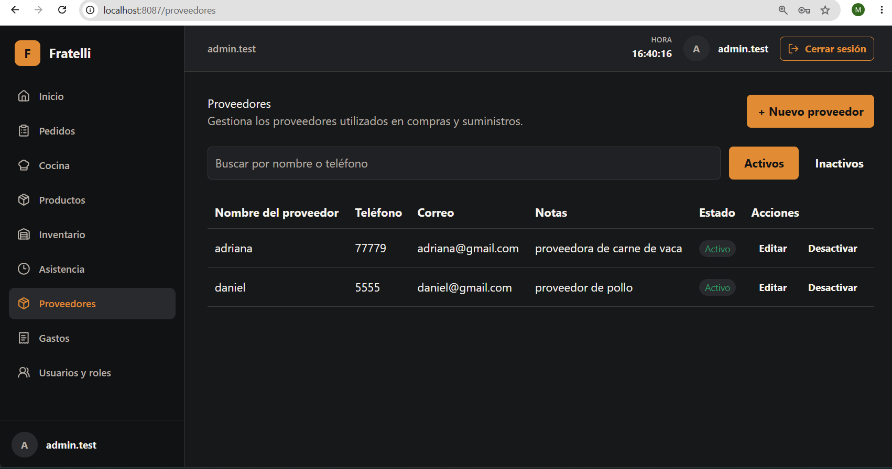
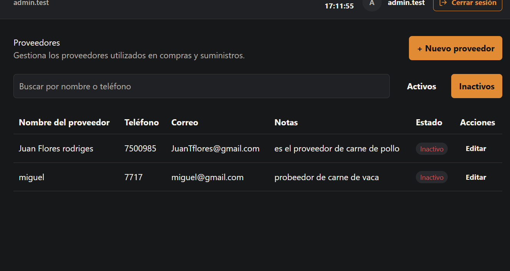
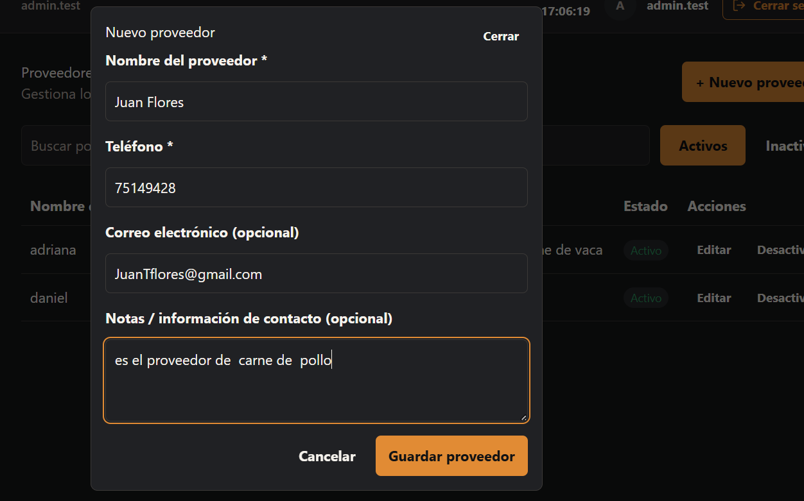
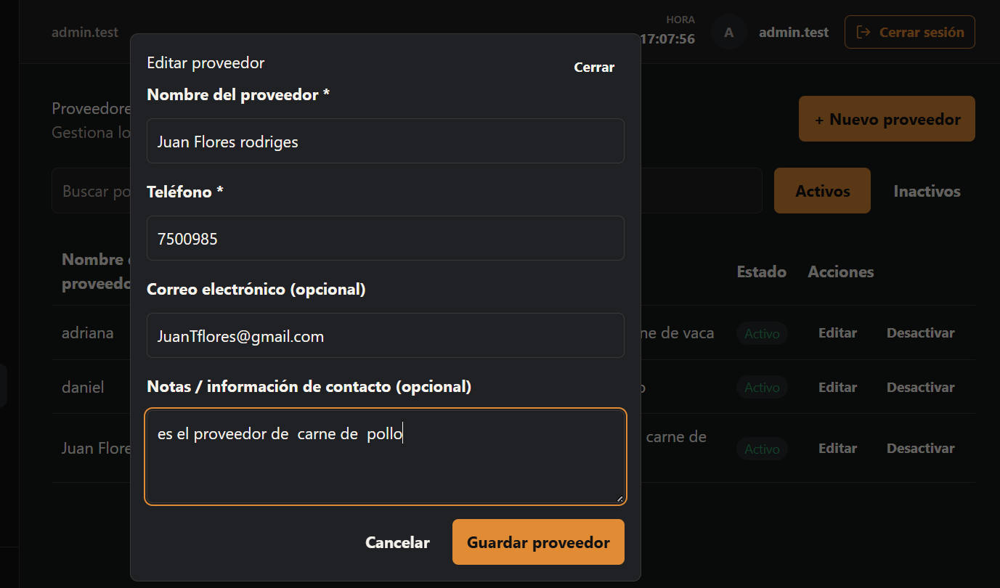
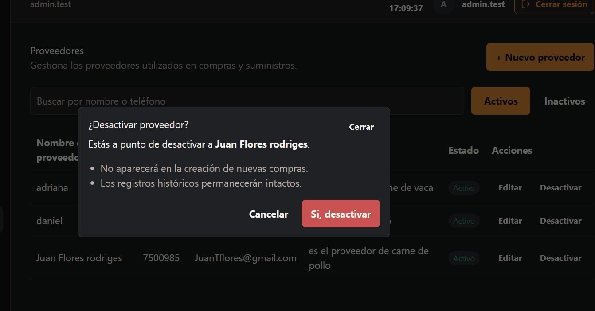

# HU-016 — Proveedores

## Estado de implementación

**Backend:** COMPLETE ✅  
**Frontend:** COMPLETE ✅  
**Validación automatizada:** COMPLETE ✅  
**Validación manual:** COMPLETE ✅

## Rutas y roles

Los endpoints requieren Bearer. Lectura: `GET /api/v1/suppliers` y `GET /api/v1/suppliers/{id}` para `ADMINISTRADOR`, `ENCARGADO`, `COCINA` y `CONTADORA`. Escritura: `POST`, `PUT` y `DELETE /api/v1/suppliers/{id}` para `ADMINISTRADOR` y `ENCARGADO`.

`Supplier` devuelve:

```json
{
  "id": "uuid",
  "name": "Verdulería Norte",
  "phoneNumber": "70000000",
  "email": "north@example.test|null",
  "notes": "Entrega AM|null",
  "isActive": true,
  "createdAt": "2026-08-25T12:00:00+00:00",
  "createdByUserId": "identity-string-id",
  "updatedAt": "2026-08-25T12:00:00+00:00",
  "updatedByUserId": "identity-string-id"
}

POST y PUT reciben {name,phoneNumber,email,notes}. Nombre y teléfono son obligatorios; email, si se suministra, debe tener formato válido; los opcionales ausentes se serializan como null. Teléfono y email no tienen unicidad de negocio.

GET /api/v1/suppliers acepta search, isActive, page y pageSize; busca en nombre o teléfono. La respuesta es el sobre común {items,page,pageSize,totalCount,totalPages} con page desde 1 y pageSize entre 1 y 100. Sin isActive solo se listan proveedores activos. DELETE es baja lógica, no borrado físico.

Interfaz Sprint 1
La ruta /proveedores conserva tabla en desktop y usa cards en mobile. Las cards muestran solo nombre, contacto real, estado y notas cuando existen. ADMINISTRADOR y ENCARGADO ven CTA y acciones; COCINA y CONTADORA no reciben controles mutantes.

Errores y evidencia
La evidencia automatizada del frontend actual incluye format, typecheck, lint, build y 48 pruebas Vitest en verde. Evidencia visual manual: completada.

Los contratos de error son ProblemDetails: 400 para validación/binding, 401 sin Bearer, 403 sin política, 404 para un id inexistente y 409 para conflictos de regla de negocio. La integración PostgreSQL cubre la matriz de roles, campos opcionales, email inválido, búsqueda/paginación y baja lógica.

Resultado
IMPLEMENTADA END-TO-END. Un ADMINISTRADOR o ENCARGADO administra proveedores en /proveedores: lista paginada, búsqueda por nombre/teléfono, filtro por estado (activo/inactivo), creación, edición y baja lógica. COCINA y CONTADORA tienen acceso de solo lectura.

Reglas implementadas
Roles canónicos: ADMINISTRADOR, ENCARGADO, COCINA y CONTADORA tienen acceso de lectura. Solo ADMINISTRADOR y ENCARGADO pueden escribir (crear, editar, desactivar).

Baja lógica: DELETE no elimina físicamente, solo cambia isActive = false. El historial permanece intacto.

Validación: Nombre y teléfono son obligatorios. Email, si se suministra, debe tener formato válido. Campos opcionales vacíos se serializan como null.

Sin unicidad: Teléfono y email no tienen unicidad de negocio.

Paginación: page desde 1, pageSize entre 1 y 100. Sin isActive solo se listan activos.

Seguridad
Los endpoints requieren Bearer token. Las políticas de autorización validan el rol del usuario autenticado antes de permitir cualquier operación. Los intentos de acceso no autorizado devuelven 403 Forbidden con ProblemDetails. Los campos de auditoría (createdByUserId, updatedByUserId) se llenan automáticamente desde el usuario autenticado.

Frontend y validación
La feature usa tipos OpenAPI generados, endpoints centralizados en endpoints.ts, httpClient compartido y TanStack Query para caché e invalidación. La UI ofrece tabla en desktop, cards en mobile, filtros combinados backend-driven y diálogos accesibles.

Detalles de implementación:

Listado: useSuppliers consulta GET /api/v1/suppliers con search, isActive, page y pageSize=10. Mantiene el dato anterior visible mientras carga la página siguiente (placeholderData). Filtro de estado resetea página a 1 al cambiar.

Tabla desktop: Columnas: Nombre, Teléfono, Correo, Notas, Estado (badge verde/rojo). Acciones "Editar" y "Desactivar" solo para roles de escritura.

Cards mobile: Muestran ícono, nombre, contacto, badge de estado y notas. Acciones en menú contextual (⋮) para roles de escritura.

Alta y edición: SupplierFormFields reutilizable dentro de Modal. Validación en cliente: nombre y teléfono obligatorios, email válido si se completa. Errores del servidor (400/403/404/409) traducidos a español.

Desactivar: Diálogo modal ConfirmDeactivateDialog con advertencia clara. Refresca lista automáticamente.

Estados de carga: Skeleton, estado vacío con CTA, estado de error con botón reintento.

Invalidación de caché: Crear, editar y desactivar invalidan la consulta de listado automáticamente.

Baseline revalidado
El baseline develop inspeccionado fue 9f5e51bd3451e91bab48d75afef318539ecd8e66. Los endpoints de proveedores comparten el ApplicationDbContext scoped y las políticas de autorización están integradas con el sistema de autenticación existente.

Evidencia real
Backend: dotnet test backend/RestaurantSystem.slnx --no-restore — tests de integración PostgreSQL PASS.

Frontend: format, typecheck, lint, build PASS. 48 pruebas Vitest en verde.

OpenAPI: Contrato generado y verificado.

Validación manual: Realizada en rutas, autorización, CRUD, filtros, paginación y viewports desktop/403px/360px. Aceptada para MVP.

Manifest de archivos del change
Frontend
Archivo	Propósito
frontend/src/features/navigation.tsx	Menú lateral con proveedores
frontend/src/features/proveedores/api.ts	Queries y mutations de proveedores
frontend/src/features/proveedores/hooks.ts	Hooks personalizados (useSuppliers)
frontend/src/features/proveedores/types.ts	Tipos TypeScript de proveedores
frontend/src/features/proveedores/components/SupplierFormFields.tsx	Formulario reutilizable
frontend/src/features/proveedores/components/SupplierListStates.tsx	Estados de carga/vacío/error
frontend/src/pages/proveedores/SuppliersPage.tsx	Página principal de proveedores
frontend/src/lib/api/endpoints.ts	Rutas de la API de proveedores
frontend/src/lib/api/http-client.ts	Soporte DELETE en httpClient
frontend/src/routes/AppRoutes.tsx	Ruta /proveedores y guards
Documentación
Archivo	Propósito
docs/historias/HU-016-proveedores.md	Historia, evidencia y manifest final
docs/capturas/HU-016-*.png	Evidencia visual
## Evidencias

### Listado de proveedores (Desktop)


### Listado de proveedores inactivos


### Crear proveedor


### Editar proveedor


### Desactivar proveedor (baja lógica)
