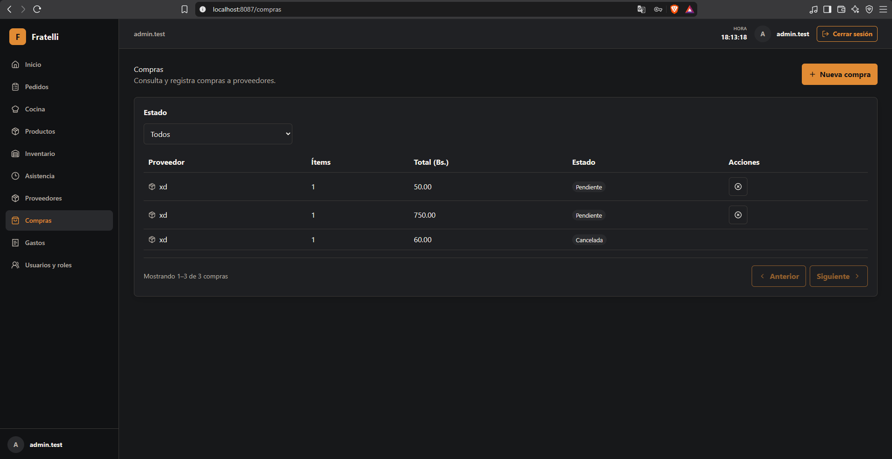
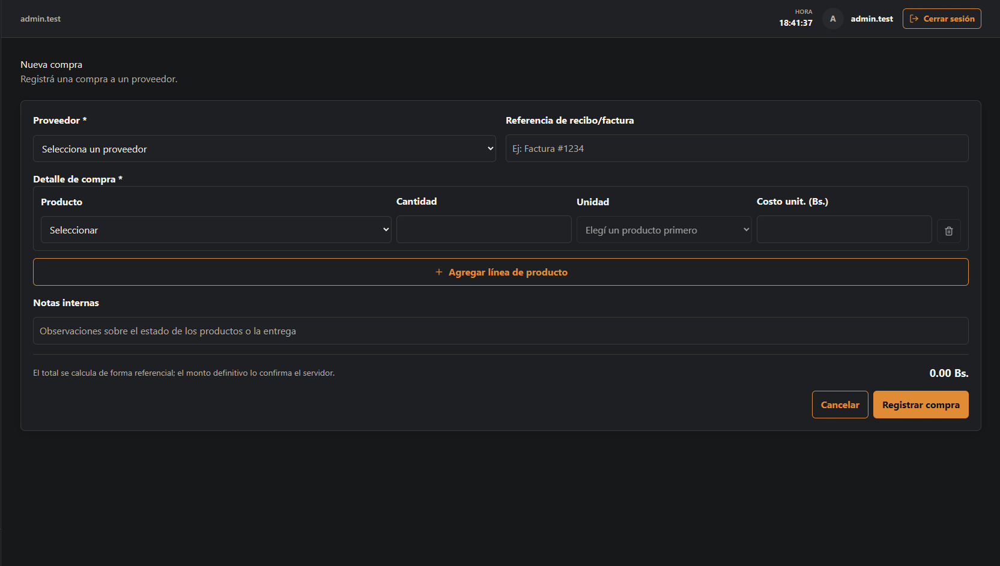

# HU-017 — Registrar compras a proveedores

## Resultado

Implementada end-to-end: listado de compras con filtro por estado, registro de nueva compra con líneas de detalle, y cancelación de compras pendientes.

## Reglas implementadas

- `GET /api/v1/purchases`, `GET /api/v1/purchases/{id}`, `POST /api/v1/purchases` y `POST /api/v1/purchases/{id}/cancel` conforman el flujo.
- Lectura de compras usa el rol `SupplierRead` del backend (incluye `CONTADORA`); escritura (crear/cancelar/recibir) usa `OperationsPurchase`, que excluye a `CONTADORA`.
- Solo se puede cancelar una compra en estado `PENDIENTE`; la cancelación exige un motivo y no genera movimientos de inventario.
- El total de una compra nueva se calcula en el cliente solo de forma referencial: el monto definitivo lo confirma el servidor.
- Cada línea de compra exige producto, unidad, cantidad (> 0) y costo unitario (≥ 0) antes de habilitar el envío.

## Frontend y validación

El frontend agrega la sección **Compras** (`PurchasesPage`, `NewPurchasePage`) sobre `http-client` y React Query (`api.ts`), con listado paginado, filtro por estado, modal de cancelación con motivo obligatorio y formulario de alta con líneas dinámicas de producto/cantidad/unidad/costo. Los nombres de proveedor, producto y unidad se resuelven vía queries auxiliares (`useSuppliersForPurchase`, `useProductsForPurchase`, `useUnitsForPurchase`), ya que `PurchaseDto` solo trae IDs.

## Visibilidad y roles

La vista de Compras solo es visible en la navegación y accesible por ruta (`RequireAnyRole`) para `ADMINISTRADOR`, `ENCARGADO` y `COCINA` (`PURCHASE_WRITE_ROLES`). `CONTADORA` puede consultar compras vía API (policy `SupplierRead` del backend) pero no ve esta pantalla; tendrá su propia pantalla de historial más adelante.

## Baseline revalidado

_Pendiente de completar con el hash de `develop` correspondiente._

## Evidencia real

No se modifica ni incorpora evidencia técnica durante esta normalización.

## Manifest de archivos del change

### Frontend

| Archivo |
| --- |
| `src/features/purchases/api.ts` |
| `src/features/purchases/pages.tsx` |
| `src/features/navigation.tsx` |
| `src/routes/AppRoutes.tsx` |

### Documentación

| Archivo |
| --- |
| `docs/historias/HU-017-registrar-compras-proveedores.md` |

## Estado de entrega

Implementada; esta normalización no añade validación ni evidencia nueva.

## Evidencias

### Captura del listado de compras

---

### Captura de registro de nueva compra

## Resultado

**BACKEND IMPLEMENTADO / FRONTEND PENDIENTE**.

La implementación backend pertenece al change `implement-sprint-2-backend-operational-workflows`. No se modificó frontend ni se generaron contratos TypeScript.

## Reglas implementadas

Ver el mapa contractual específico de esta HU en [handoff Sprint 2](../handoffs/sprint-2-backend-frontend-handoff.md). Las reglas de negocio, actor autenticado, importes/cantidades calculadas en servidor e inventario único se mantienen en backend.

## Seguridad

Las rutas requieren autenticación y políticas backend; los identificadores de actor se obtienen de los claims, no del request.

## Frontend y validación

Frontend Sprint 2: **PENDIENTE**. No hay capturas ni cambios de `frontend/` en este change.

## Baseline revalidado

- Branch/HEAD: `develop` / `8a8e3f6a82356020edd7a8b0d0508e259c68c287`.
- Docker/Testcontainers disponible durante la validación final.

## Evidencia real

- `dotnet restore RestaurantSystem.slnx`: PASS.
- `dotnet build RestaurantSystem.slnx --no-restore`: PASS.
- `dotnet test RestaurantSystem.slnx --no-build`: PASS, 43/43 (incluye OperationsContractPostgresIntegrationTests).
- La cadena EF se ejercitó sobre PostgreSQL disposable por la suite de integración; el script idempotente se generó correctamente.
- `/openapi/v1.json` se sirvió en runtime y contiene las rutas Sprint 2 aplicables y las respuestas explícitas 400/401/403/404/409 de las mutaciones relevantes.

## Manifest de archivos del change

### Backend

- `backend/src/RestaurantSystem.Domain/Operations/OperationalEntities.cs`
- `backend/src/RestaurantSystem.Application/Operations/OperationalContracts.cs`
- `backend/src/RestaurantSystem.Infrastructure/Operations/OperationsService.cs`
- `backend/src/RestaurantSystem.Api/OperationsEndpoints.cs`
- `backend/src/RestaurantSystem.Infrastructure/Migrations/20260828093655_AddSprint2OperationalWorkflows.cs`

### Frontend y contrato generado

Ninguno.

### Documentación

- `docs/historias/HU-017-sprint-2-backend.md`
- `docs/handoffs/sprint-2-backend-frontend-handoff.md`

## Evidencias

No se incorporaron screenshots ni capturas.

## Estado de entrega

**BACKEND IMPLEMENTADO / FRONTEND PENDIENTE**. La verificación SDD y el archive no se ejecutaron.

### Revalidación posterior

El 2026-08-28 se revalidaron `dotnet restore`, `dotnet build`, la suite backend completa (53/53, 0 fallos), la cadena de migraciones PostgreSQL y OpenAPI. La matriz PostgreSQL de autorización cubre cada ruta Sprint 2 para anónimo y los seis roles; no se modificó frontend, contratos generados ni capturas.
