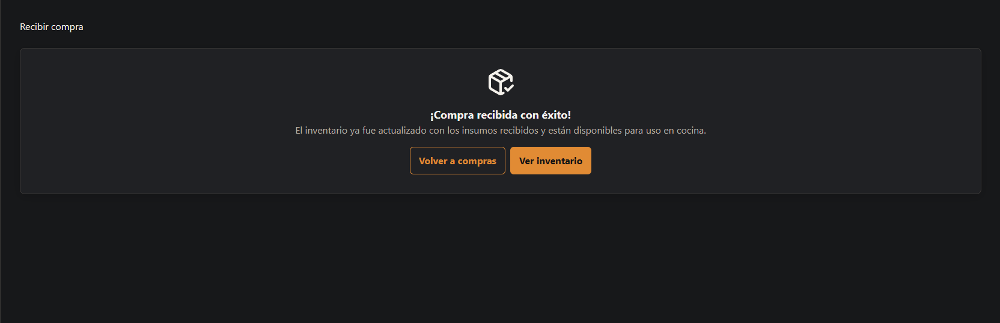

# HU-018 — Sprint 2 operational workflow

# HU-018 — Recibir compra e incrementar inventario

## Resultado

Implementada end-to-end: confirmación de recepción de una compra `PENDIENTE`, con edición de cantidad/unidad recibida por línea, incremento de inventario delegado íntegramente al backend, y rechazo mediante cancelación con motivo cuando la entrega no se acepta.

## Reglas implementadas

- `POST /api/v1/purchases/{id}/receive` conforma el flujo, sobre el mismo contrato ya estabilizado en el handoff de Sprint 2.
- Solo una compra en estado `PENDIENTE` acepta recepción; en cualquier otro estado (`RECIBIDA` o `CANCELADA`, sin distinción) el backend responde `409` con `PURCHASE_ALREADY_RECEIVED`.
- La recepción exige enviar **todas** las líneas de la compra exactamente una vez (una por cada `PurchaseItem`); cada `receivedQuantity` debe ser mayor a cero, pero **no** tiene que coincidir con la cantidad ordenada — se admite recibir menos de lo pedido.
- La unidad recibida por línea se restringe en el frontend a la misma dimensión (`MASS`/`VOLUME`/`COUNT`) que la unidad ordenada de esa línea, evitando que el cliente pueda disparar `INVALID_UNIT_CONVERSION`.
- No existe rechazo parcial estructurado en esta versión: no aceptar una compra implica cancelarla por completo con motivo, reutilizando el flujo de cancelación existente de HU-017.
- El total y la actualización de inventario son calculados y aplicados exclusivamente por el servidor; el frontend no envía montos ni deltas de stock.

## Seguridad

`POST /purchases/{id}/receive` requiere la policy `OperationsPurchase` (`ADMINISTRADOR`, `ENCARGADO`, `COCINA`), la misma que crear y cancelar compras. El identificador del actor responsable de la recepción se resuelve en el backend a partir de los claims de la sesión, no del body enviado por el cliente.

## Frontend y validación

El frontend agrega `ReceivePurchasePage` (`/compras/:id/recibir`) sobre `usePurchaseDetail`, `useReceivePurchase` y las queries auxiliares ya existentes de HU-017 (`useProductsForPurchase`, `useUnitsForPurchase`, `useSuppliersForPurchase`). La pantalla muestra el detalle de la orden con cantidad/costo ordenados como referencia, permite editar cantidad y unidad recibidas por línea, incluye un checklist de verificación que debe completarse antes de habilitar la confirmación, y un modal de confirmación que advierte que la acción es irreversible. El botón **Recibir** aparece en el listado de compras (`PurchasesPage`) únicamente para compras `PENDIENTE` y usuarios con rol de escritura.

## Limitación de datos conocida

`PurchaseDto` no expone fecha de creación ni usuario que registró la compra; por lo tanto la pantalla de recepción no muestra "Fecha orden" ni "Registrado por" pese a estar presentes en el mockup de referencia. Se documenta como pendiente de decisión de backend, no como omisión de frontend.

## Baseline revalidado

Construido sobre el backend estabilizado en `implement-sprint-2-backend-operational-workflows`, revalidado el 2026-08-28 (`develop`, suite completa 53/53 PASS, matriz de autorización PostgreSQL por rol). Esta normalización no modifica backend ni contratos generados.

## Evidencia real

No se ejecutó todavía suite de tests de frontend específica para este flujo ni captura de evidencia visual; ambas quedan pendientes de validación manual antes del cierre de Sprint.

## Manifest de archivos del change

### Frontend

| Archivo |
| --- |
| `frontend/src/features/purchases/api.ts` |
| `frontend/src/features/purchases/pages.tsx` |
| `frontend/src/routes/AppRoutes.tsx` |

### Documentación

| Archivo |
| --- |
| `docs/historias/HU-018-recibir-compra.md` |
| `docs/handoffs/sprint-2-backend-frontend-handoff.md` |

## Estado de entrega

Implementada para MVP; validación visual humana y captura de evidencia pendientes de Sprint Review.

## Evidencias

### Captura de la pantalla de recepción

---

### Captura del estado final tras confirmar recepción

## Resultado

**BACKEND IMPLEMENTADO / FRONTEND PENDIENTE**.

La implementación backend pertenece al change `implement-sprint-2-backend-operational-workflows`. No se modificó frontend ni se generaron contratos TypeScript.

## Reglas implementadas

Ver el mapa contractual específico de esta HU en [handoff Sprint 2](../handoffs/sprint-2-backend-frontend-handoff.md). Las reglas de negocio, actor autenticado, importes/cantidades calculadas en servidor e inventario único se mantienen en backend.

## Seguridad

Las rutas requieren autenticación y políticas backend; los identificadores de actor se obtienen de los claims, no del request.

## Frontend y validación

Frontend Sprint 2: **PENDIENTE**. No hay capturas ni cambios de `frontend/` en este change.

## Baseline revalidado

- Branch/HEAD: `develop` / `8a8e3f6a82356020edd7a8b0d0508e259c68c287`.
- Docker/Testcontainers disponible durante la validación final.

## Evidencia real

- `dotnet restore RestaurantSystem.slnx`: PASS.
- `dotnet build RestaurantSystem.slnx --no-restore`: PASS.
- `dotnet test RestaurantSystem.slnx --no-build`: PASS, 43/43 (incluye OperationsContractPostgresIntegrationTests).
- La cadena EF se ejercitó sobre PostgreSQL disposable por la suite de integración; el script idempotente se generó correctamente.
- `/openapi/v1.json` se sirvió en runtime y contiene las rutas Sprint 2 aplicables y las respuestas explícitas 400/401/403/404/409 de las mutaciones relevantes.

## Manifest de archivos del change

### Backend

- `backend/src/RestaurantSystem.Domain/Operations/OperationalEntities.cs`
- `backend/src/RestaurantSystem.Application/Operations/OperationalContracts.cs`
- `backend/src/RestaurantSystem.Infrastructure/Operations/OperationsService.cs`
- `backend/src/RestaurantSystem.Api/OperationsEndpoints.cs`
- `backend/src/RestaurantSystem.Infrastructure/Migrations/20260828093655_AddSprint2OperationalWorkflows.cs`

### Frontend y contrato generado

Ninguno.

### Documentación

- `docs/historias/HU-018-sprint-2-backend.md`
- `docs/handoffs/sprint-2-backend-frontend-handoff.md`

## Evidencias

No se incorporaron screenshots ni capturas.

## Estado de entrega

**BACKEND IMPLEMENTADO / FRONTEND PENDIENTE**. La verificación SDD y el archive no se ejecutaron.

### Revalidación posterior

El 2026-08-28 se revalidaron `dotnet restore`, `dotnet build`, la suite backend completa (53/53, 0 fallos), la cadena de migraciones PostgreSQL y OpenAPI. La matriz PostgreSQL de autorización cubre cada ruta Sprint 2 para anónimo y los seis roles; no se modificó frontend, contratos generados ni capturas.
