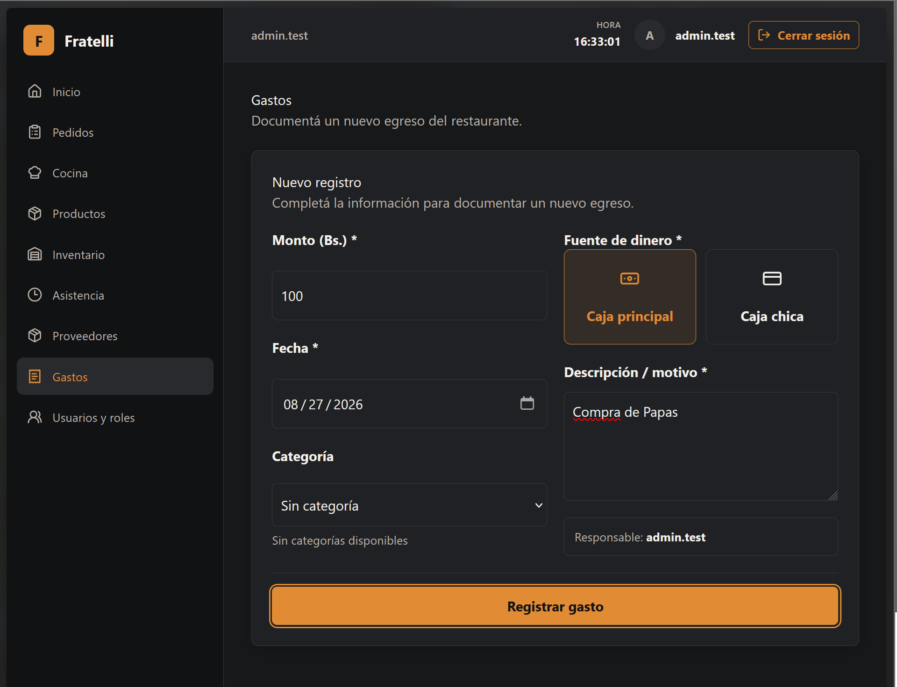
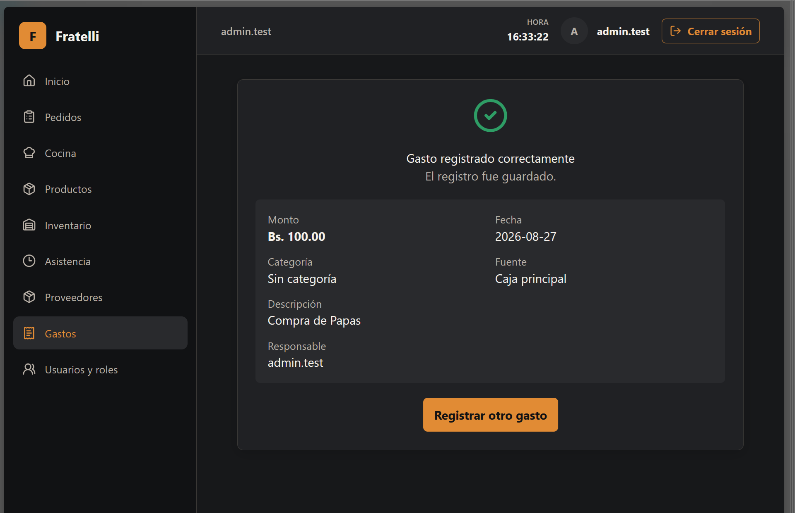

# HU-020 — Registrar gastos diarios

## Resultado

Implementado el registro de gastos en `/gastos`; la validación manual permanece pendiente.

## Reglas implementadas

- Crear gastos y consultar categorías requiere `ADMINISTRADOR` o `ENCARGADO`; `CONTADORA` no puede leer categorías.
- El monto debe ser mayor que cero; la fuente de efectivo es un enum.
- La descripción se recorta, es obligatoria y tiene máximo 500 caracteres.
- La fecha no puede ser futura según `BusinessClock`; la categoría debe estar activa.
- No hay integración con turnos ni saldos de caja.

## Seguridad

El actor se deriva de la sesión JWT y las políticas protegen categorías y creación.

## Frontend y validación

La página usa API, rutas y navegación de gastos. La zona horaria predeterminada del backend (`America/Argentina/Buenos_Aires`) difiere de la usada por frontend (`America/La_Paz`); el comportamiento operativo depende de configuración y existe ese desajuste. Validación manual pendiente.

## Baseline revalidado

`develop` revalidado en `bb2fd04a48bddce1b608bb1639308528daefcfc1`.

## Evidencia real

No se modifica ni incorpora evidencia técnica durante esta normalización.

## Manifest de archivos del change

### Backend

| Archivo | Propósito |
| --- | --- |
| `backend/src/RestaurantSystem.Api/Program.cs` | Endpoints y políticas. |
| `backend/src/RestaurantSystem.Application/Expenses/ExpenseContracts.cs` | Contratos de gastos. |
| `backend/src/RestaurantSystem.Infrastructure/Expenses/ExpenseService.cs` | Reglas de gastos y fecha. |
| `backend/src/RestaurantSystem.Domain/Expenses/ExpenseEntities.cs` | Entidad gasto. |
| `backend/src/RestaurantSystem.Infrastructure/Migrations/20260826224941_AddInventoryAndExpenses.cs` | Migración de gastos. |
| `backend/tests/RestaurantSystem.IntegrationTests/InventoryExpensesPostgresIntegrationTests.cs` | Integración de gastos. |

### Frontend y contrato generado

| Archivo | Propósito |
| --- | --- |
| `frontend/src/features/expenses/api.ts` | API de gastos. |
| `frontend/src/features/expenses/pages.tsx` | Página de gastos. |
| `frontend/src/features/navigation.tsx` | Navegación autorizada. |
| `frontend/src/routes/AppRoutes.tsx` | Ruta protegida. |

### Documentación

| Archivo | Propósito |
| --- | --- |
| `docs/historias/HU-020-registrar-gastos.md` | Historia y evidencia. |

## Estado de entrega

Implementada para MVP; validación manual pendiente.

## Evidencias

### Captura de la pantalla para registrar gastos

---

### Captura de gasto registrado

## Estado de entrega

Completado para MVP, cambios visuales se harán posteriormente
