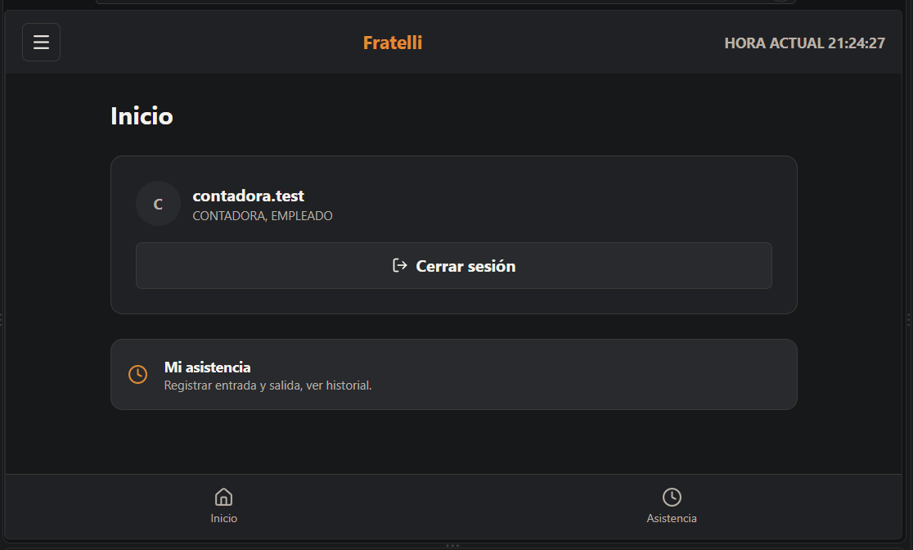
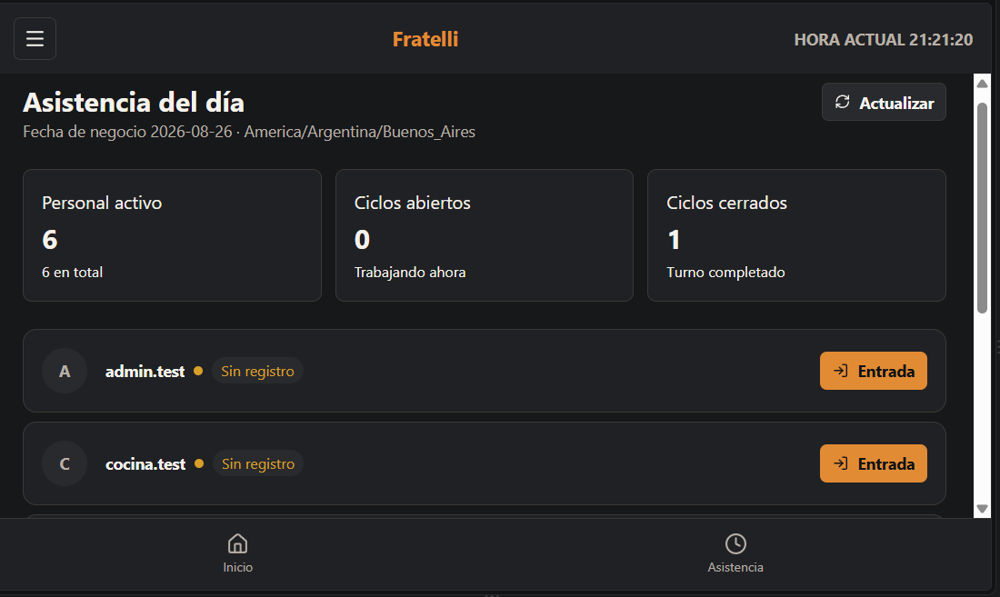
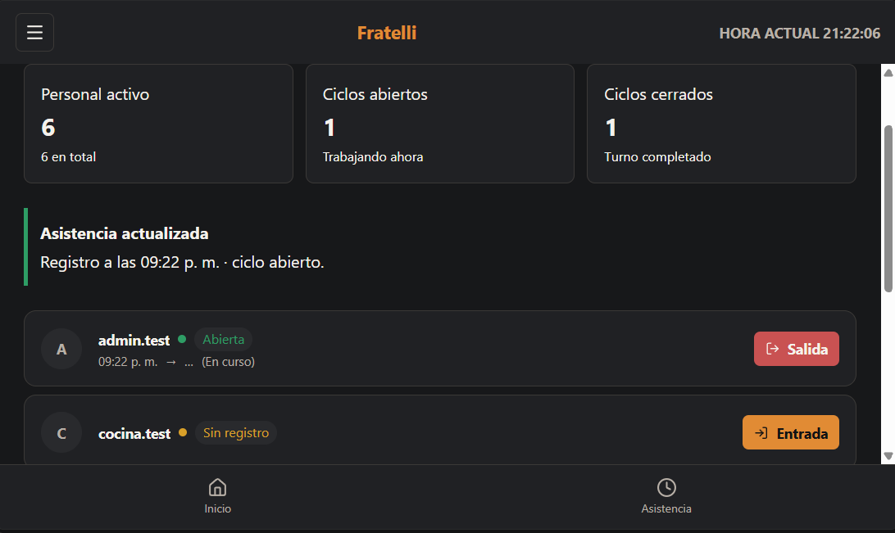
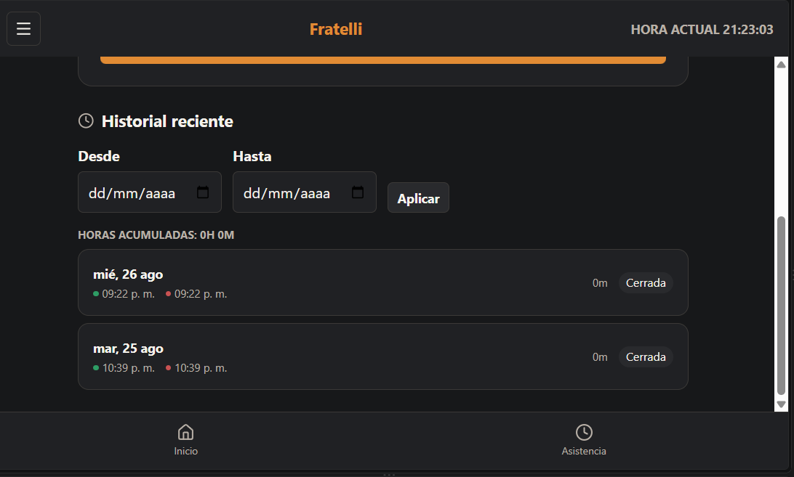
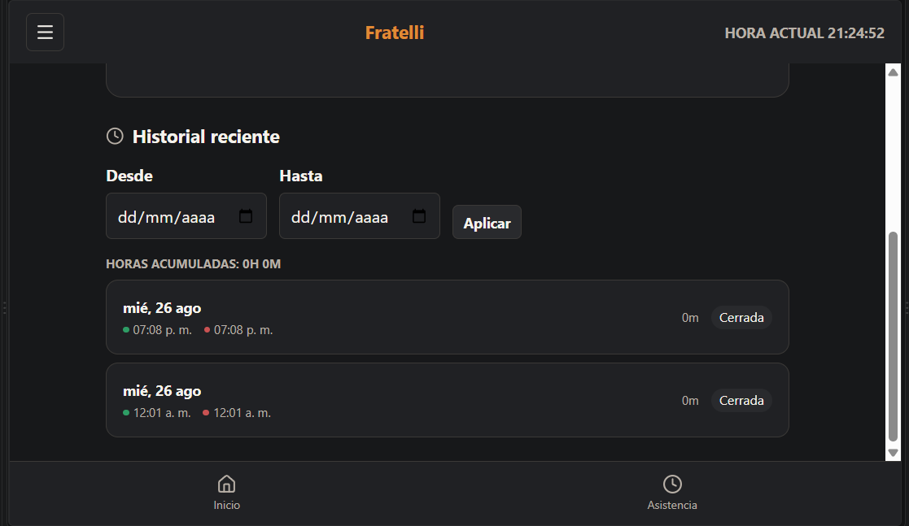

# HU-022 — Registrador de entrada y salida de asistencia

## Resultado

Implementada end-to-end la gestión de asistencia y el historial propio.

## Reglas implementadas

- `/asistencia` y el hub son para `ADMINISTRADOR` y `ENCARGADO`; toda persona autenticada con Employee consulta su historial en `/mi-asistencia`.
- El servidor calcula hora y fecha de negocio.
- El servicio y un índice parcial único permiten un solo registro abierto por empleado; se admiten múltiples ciclos cerrados.
- La vista de hoy incluye registros de la fecha de negocio y abiertos arrastrados.

## Seguridad

El actor se deriva del JWT. El notifier se ejecuta best-effort después de guardar y no revierte el registro persistido.

## Frontend y validación

Las páginas de asistencia, API, hooks, rutas y navegación separan gestión e historial propio.

## Baseline revalidado

`develop` revalidado en `bb2fd04a48bddce1b608bb1639308528daefcfc1`.

## Evidencia real

No se modifica ni incorpora evidencia técnica durante esta normalización.

## Manifest de archivos del change

### Backend

| Archivo | Propósito |
| --- | --- |
| `backend/src/RestaurantSystem.Api/Program.cs` | Endpoints y autorización. |
| `backend/src/RestaurantSystem.Application/Attendance/AttendanceContracts.cs` | Contratos de asistencia. |
| `backend/src/RestaurantSystem.Infrastructure/Attendance/AttendanceServices.cs` | Reglas, hora de negocio y notificación. |
| `backend/src/RestaurantSystem.Domain/Attendance/AttendanceRecord.cs` | Registro de asistencia. |
| `backend/src/RestaurantSystem.Infrastructure/Migrations/20260825045324_AddAttendance.cs` | Migración e índice parcial. |
| `backend/tests/RestaurantSystem.IntegrationTests/AttendancePostgresIntegrationTests.cs` | Integración de asistencia. |

### Frontend y contrato generado

| Archivo | Propósito |
| --- | --- |
| `frontend/src/features/attendance/api.ts` | API de asistencia. |
| `frontend/src/features/attendance/hooks.ts` | Consultas y mutaciones. |
| `frontend/src/features/attendance/AttendanceTodayPage.tsx` | Gestión diaria. |
| `frontend/src/pages/MyAttendancePage.tsx` | Historial propio. |
| `frontend/src/features/navigation.tsx` | Navegación autorizada. |
| `frontend/src/routes/AppRoutes.tsx` | Rutas protegidas. |

### Documentación

| Archivo | Propósito |
| --- | --- |
| `docs/historias/HU-022-registrar-asistencia.md` | Historia y evidencia. |

## Estado de entrega

Implementada para MVP.

## Evidencias

### Captura de la pantalla de inicio

---

### Captura de la pantalla para registrar asistencia

---

### Captura de la pantalla de historial de asistencia

---

## Decisiones técnicas

- Minimal APIs en lugar de controllers, consistente con el resto del Sprint 1.
- `businessDate` calculado en servidor con zona horaria configurable (`BusinessTime:TimeZoneId`); el cliente nunca envía fechas.
- Integridad del "único abierto" garantizada en base de datos, no solo en aplicación.
- Notificación SignalR best-effort post-commit: nunca bloquea ni revierte la operación.
- Frontend feature-based (`features/attendance`) alineado al patrón de `features/auth`, reutilizando guards, cliente HTTP y design system existentes.
