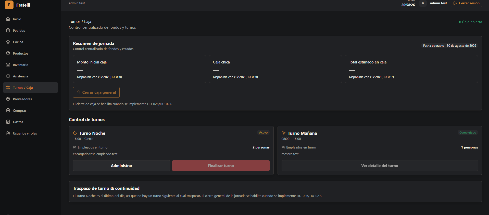
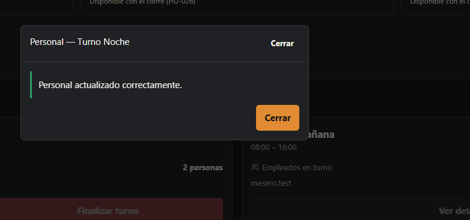
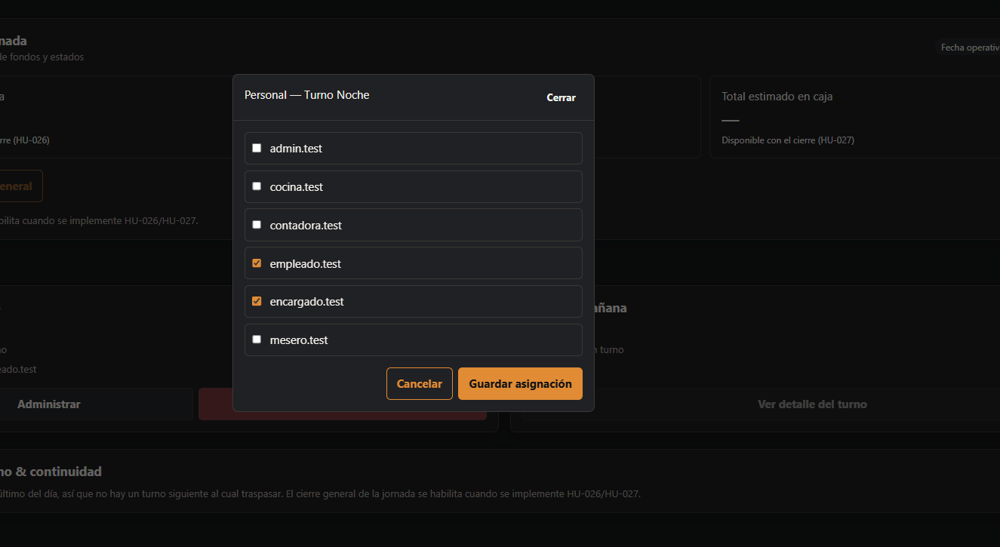
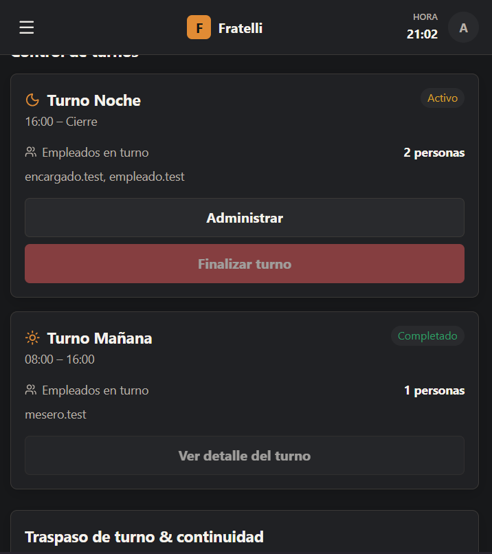

# HU-025 — Gestionar y operar turnos

## Estado actual

HU-025 figura como implementada end-to-end en el cierre de [Sprint 2](../sprints/sprint-02.md). La [verificación final de Sprint 2](../openspec/changes/finalize-sprint-2-routing-permissions-and-documentation/verify-report.md) aprobó los gates técnicos; no declara una Sprint Review ni aceptación de Product Owner.

## Registro de handoff frontend (histórico)

Implementado end-to-end el flujo operativo de turnos y caja compartida: /turnos (ADMINISTRADOR/ENCARGADO) y /mi-turno (ADMINISTRADOR/ENCARGADO/MESERO). El backend ya estaba completo desde el change implement-sprint-2-backend-operational-workflows; este trabajo agrega el consumidor frontend que quedaba pendiente según HU-025-sprint-2.md.

Reglas implementadas
Gestión completa del contexto operativo (GET /shifts/current, POST /shifts/open): ADMINISTRADOR y ENCARGADO. Lectura del turno propio (GET /shifts/me/current): ADMINISTRADOR, ENCARGADO y MESERO mediante `OrdersAccess`.
Los dos turnos fijos (MORNING/NIGHT) comparten una sola caja (CashSession); la interfaz nunca representa dos cajas independientes.
El traspaso (POST /shifts/{id}/handover) solo aplica de Turno Mañana (ACTIVE) hacia Turno Noche (PENDING). El turno Noche no tiene una acción de "finalizar" propia porque el contrato actual no expone un segundo endpoint de cierre — el cierre general queda reservado para HU-026/HU-027, consistente con RN-035 y con flujo-ux-turno-cierre.puml, que no contempla un paso de finalización para el segundo turno.
El monto/fondo de continuidad (efectivo, QR, PedidosYa) y las observaciones se envían dentro del campo note de HandoverRequest, porque el contrato generado desde OpenAPI no expone campos numéricos separados todavía (aunque el diseño original los contemplaba).
Asignar personal (PUT /shifts/{id}/assignments) reemplaza la lista completa de empleados del turno (no suma de a uno) y admite guardar una lista vacía.
MESERO consulta únicamente su propio turno vía /mi-turno; no administra turnos ajenos ni accede a /turnos (bloqueado por RequireAnyRole + redirección a "sin permiso").
No se implementa cierre de caja final ni montos calculados de cierre: "Monto inicial caja", "Caja chica" y "Total estimado en caja" se muestran deshabilitados con la leyenda "Disponible con HU-026/HU-027".
Seguridad

Los endpoints requieren JWT Bearer y derivan el actor desde los claims, no del request. Las mutaciones (open, assignments, handover) están limitadas a ADMINISTRADOR/ENCARGADO; GET /shifts/me/current es de solo lectura para ADMINISTRADOR, ENCARGADO y MESERO sobre su propio turno; COCINA, CONTADORA y EMPLEADO no acceden a `/mi-turno`. La ruta /turnos está protegida en el router (RequireAnyRole); un MESERO que intente acceder por URL directa es redirigido a la página de "sin permiso" (403).

Frontend y validación
ShiftsPage reacciona al estado real del backend: cargando → "Cargando jornada…"; 404 → botón "Iniciar jornada"; error → mensaje de error; datos → resumen de jornada + tarjetas de turno + traspaso.
AssignmentsModal carga el personal con asistencia registrada hoy, permite tildar/destildar empleados, y confirma explícitamente el guardado ("Personal actualizado correctamente") en vez de cerrarse en silencio.
HandoverSection pide confirmación explícita ("esta acción no se puede deshacer") antes de enviar el traspaso, y muestra una tarjeta de confirmación ("Traspaso registrado") al terminar.
El botón "Finalizar turno" del Turno Noche aparece deshabilitado con tooltip explicativo, en vez de abrir un formulario que terminaría en un error 409 — validado contra el flujo UX oficial.
MyShiftPage muestra tipo, horario, estado y cantidad de compañeros del turno propio; si el usuario no tiene turno asignado hoy, muestra un estado vacío explicativo.

Este snapshot no declara validación manual adicional. El estado vigente se respalda en la [verificación final de Sprint 2](../openspec/changes/finalize-sprint-2-routing-permissions-and-documentation/verify-report.md), que registra PASS para backend y para `pnpm typecheck`, `pnpm lint`, `pnpm test` y `pnpm build`.

Baseline y evidencia revalidados

La referencia vigente es el [informe de verificación final de Sprint 2](../openspec/changes/finalize-sprint-2-routing-permissions-and-documentation/verify-report.md). Los placeholders de hash y de ejecución de calidad pertenecían al handoff histórico y quedan resueltos por ese informe.

## Manifest de archivos del change

### Backend

| Archivo                                                                                                   | Propósito                                                       |
| --------------------------------------------------------------------------------------------------------- | --------------------------------------------------------------- |
| `backend/src/RestaurantSystem.Domain/Operations/OperationalEntities.cs`                                   | Entidades de dominio: CashSession, Shift, ShiftAssignment.      |
| `backend/src/RestaurantSystem.Application/Operations/OperationalContracts.cs`                             | Contratos (DTOs y requests) del módulo operativo.               |
| `backend/src/RestaurantSystem.Infrastructure/Operations/OperationsService.cs`                             | Reglas de negocio: apertura de jornada, asignaciones, traspaso. |
| `backend/src/RestaurantSystem.Api/OperationsEndpoints.cs`                                                 | Los 5 endpoints de `/shifts`.                                   |
| `backend/src/RestaurantSystem.Infrastructure/Migrations/20260828093655_AddSprint2OperationalWorkflows.cs` | Migración de las tablas de turnos/caja.                         |

### Frontend y contrato generado

| Archivo                                       | Propósito                                                                       |
| --------------------------------------------- | ------------------------------------------------------------------------------- |
| `frontend/src/features/shifts/api.ts`         | Tipos y hooks de React Query para los 5 endpoints de turnos.                    |
| `frontend/src/features/shifts/format.ts`      | Etiquetas, formato de fecha operativa y mensajes de error.                      |
| `frontend/src/features/shifts/ShiftsPage.tsx` | Página `/turnos`: resumen de jornada, tarjetas de turno, asignación y traspaso. |
| `frontend/src/pages/MyShiftPage.tsx`          | Página `/mi-turno` para cualquier rol autenticado.                              |
| `frontend/src/features/navigation.tsx`        | Ítem de menú "Turnos / Caja", ruteo según rol.                                  |
| `frontend/src/routes/AppRoutes.tsx`           | Rutas `/turnos` (protegida) y `/mi-turno`.                                      |

### Documentación

| Archivo                                  | Propósito                                                                      |
| ---------------------------------------- | ------------------------------------------------------------------------------ |
| `docs/historias/HU-025-sprint-2.md`      | Historia y evidencia original del backend (estado previo: FRONTEND PENDIENTE). |
| `docs/historias/HU-025-turnos-y-caja.md` | Esta historia: consumidor frontend completo.                                   |

## Estado de entrega

El estado de este handoff fue sustituido por el cierre de [Sprint 2](../sprints/sprint-02.md) y su [verificación final](../openspec/changes/finalize-sprint-2-routing-permissions-and-documentation/verify-report.md). La verificación técnica está aprobada; la ausencia de Sprint Review o aceptación de Product Owner continúa siendo una limitación documental.

## Evidencias

### Resumen de turnos

### Mensaje de confirmación

### Administrar turnos

### Vista responsiva

