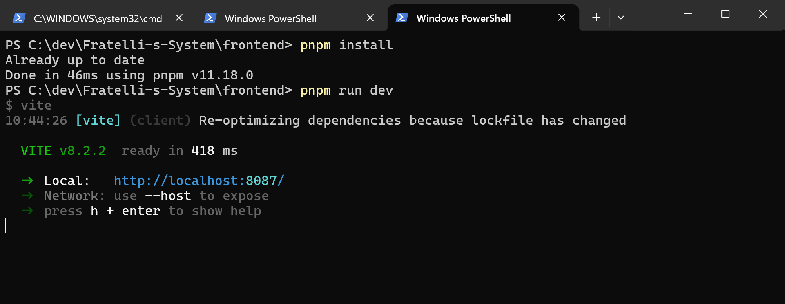
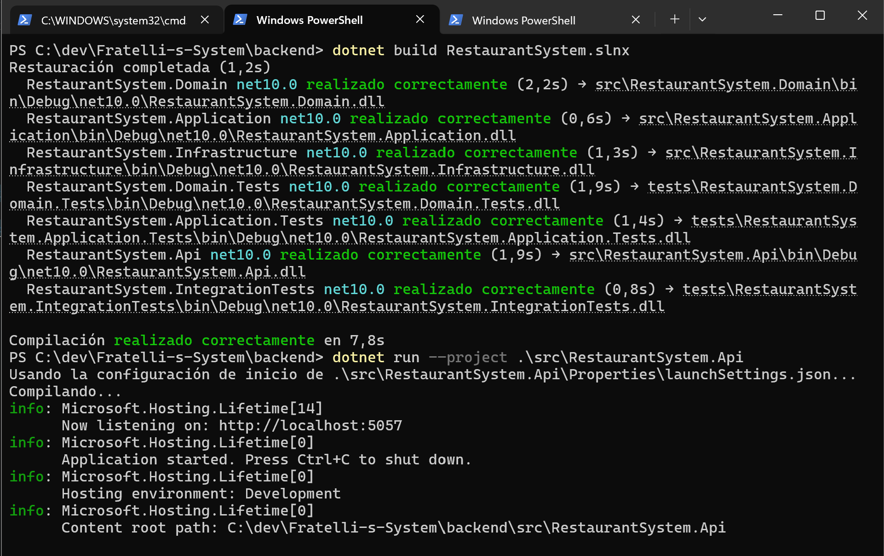
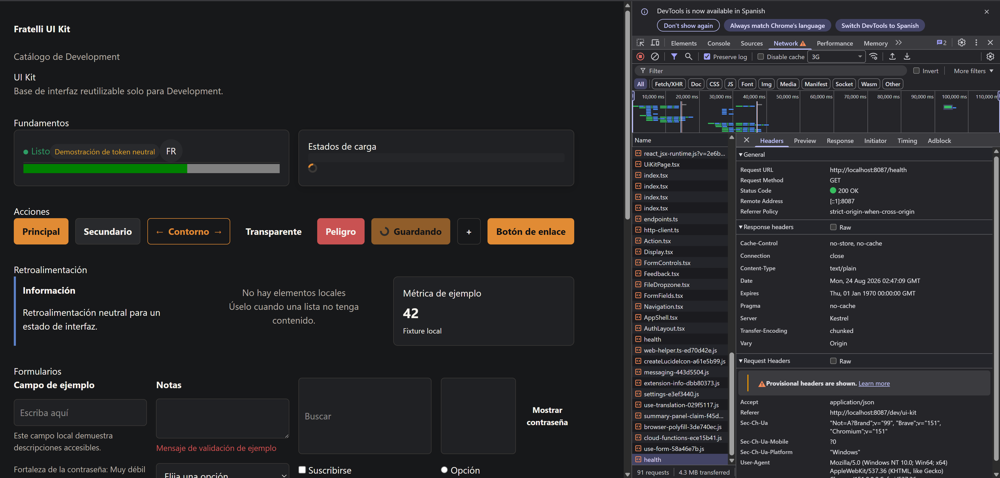

# Sprint 00 — base de desarrollo

## Resultado

Sprint 0 contiene únicamente infraestructura técnica. No se agregó ninguna HU de negocio, endpoint/tabla/seed de negocio, flujo de autenticación ni comportamiento de KDS.

**Estado: COMPLETADO (25/25).** La base técnica quedó cerrada; no incluye HUs ni trabajo Post-MVP.

## Base implementada

- Solución .NET 10 Clean Architecture con Domain, Application, Infrastructure, API y tres proyectos xUnit.
- API en `http://localhost:5057`: ProblemDetails, CORS de desarrollo, health, OpenAPI/Swagger solo de desarrollo, hub técnico vacío de SignalR para cocina, persistencia Identity con EF/Npgsql e infraestructura JWT.
- Frontend React/TypeScript/Vite en `8087`: providers de router/query, cliente HTTP y proxy centralizados, tipos OpenAPI generados, tokens Fratelli ajustables, componentes base, plantilla de feature y comprobación de health del UI Kit solo de desarrollo. La gama explícita de `@tanstack/react-query` es `^5.101.4`: sustituye `^5.102.1`, cuya resolución no cumplía la edad mínima de publicación; `5.101.4` fue publicada el 2026-07-21 y permite resolver transitivamente una versión permitida de `@tanstack/query-core`.
- Flujo mínimo de GitHub Actions y documentación de onboarding de backend/frontend.
- Artefactos OpenSpec canónicos en `docs/openspec/`; la ruta de compatibilidad del runtime local de Windows es una unión ignorada en la raíz, documentada en `docs/openspec/README.md`.

## Validación de reanudación

| Comprobación                                                                                                                                                   | Resultado                                                                                      |
| -------------------------------------------------------------------------------------------------------------------------------------------------------------- | ---------------------------------------------------------------------------------------------- |
| Configuración segura de `ConnectionStrings:RestaurantSystem`                                                                                                   | PASS — ASP.NET Core inició en Development mediante User Secrets; el valor no se mostró.        |
| Servicio PostgreSQL                                                                                                                                            | PASS — acepta conexiones locales en el puerto 5432.                                            |
| `dotnet ef database update --project src/RestaurantSystem.Infrastructure --startup-project src/RestaurantSystem.Api --no-build` contra la DB local configurada | PASS — la base de datos ya estaba en el estado de migration técnico.                           |
| Validación de migration PostgreSQL limpia                                                                                                                      | PASS — `InitialIdentity` se aplicó a una base de datos temporal aislada, que luego se eliminó. |
| `dotnet restore backend/RestaurantSystem.slnx`                                                                                                                 | PASS                                                                                           |
| `dotnet build backend/RestaurantSystem.slnx --no-restore`                                                                                                      | PASS — 0 advertencias, 0 errores                                                               |
| `dotnet test backend/RestaurantSystem.slnx --no-build`                                                                                                         | PASS — 3 tests                                                                                 |
| `/health`, `/openapi/v1.json` y `/swagger` de Development                                                                                                      | PASS — health devolvió `Healthy`; OpenAPI 200; redirección de Swagger.                         |
| `npm --prefix frontend run api:generate`                                                                                                                       | PASS histórico previo a la migración de gestor                                                 |
| `npm --prefix frontend run lint`, `build` y `test`                                                                                                             | PASS histórico previo a la migración de gestor — 1 test de Vitest                              |
| Importación del lockfile a `pnpm-lock.yaml` + `pnpm --prefix frontend install --frozen-lockfile`                                                               | PASS — instalación reproducible validada con el lockfile canónico de pnpm                      |
| Proxy de desarrollo frontend `/health` y `/dev/ui-kit`                                                                                                         | PASS — health redirigido devolvió `Healthy`; UI Kit respondió.                                 |
| Protecciones de OpenAPI y Swagger en Production                                                                                                                | PASS — `/openapi/v1.json` y `/swagger` devolvieron 404.                                        |

## Evidencias

### Ejecución de Frontend y Backend en sus respectivas carpetas

---

### Muestra de la página de demostración del frontend

---

## Cierre del Sprint 0

- **Gate final:** PASS. Se confirmó la frontera de fundación técnica: sin HUs, funcionalidades de producto ni alcance Post-MVP.
- **CI remoto de GitHub Actions:** **No aplica** por decisión de alcance aprobada; no pertenece al flujo adoptado y no constituye una validación pendiente.
- **Validación reproducible local:** completada correctamente, según confirmación explícita del equipo de clone limpio y checklist.
- **Validación en otra máquina:** completada correctamente, según confirmación explícita del equipo.

## Protección de seguridad y alcance

La configuración backend versionada no contiene ninguna connection string ni clave JWT utilizable. `ConnectionStrings:RestaurantSystem` se resolvió desde User Secrets locales sin revelarla; la validación de producción proporcionó únicamente configuración de proceso no versionada. Las migrations de EF siguen siendo la única fuente del esquema y la migration actual contiene solo tablas de Identity. OpenAPI genera solo tipos; el cliente HTTP sigue siendo manual. La revisión de fuente y migration no encontró rutas API de negocio, flujo de autenticación, feature de producto frontend, persistencia de tokens, seed de negocio ni tabla de negocio.
